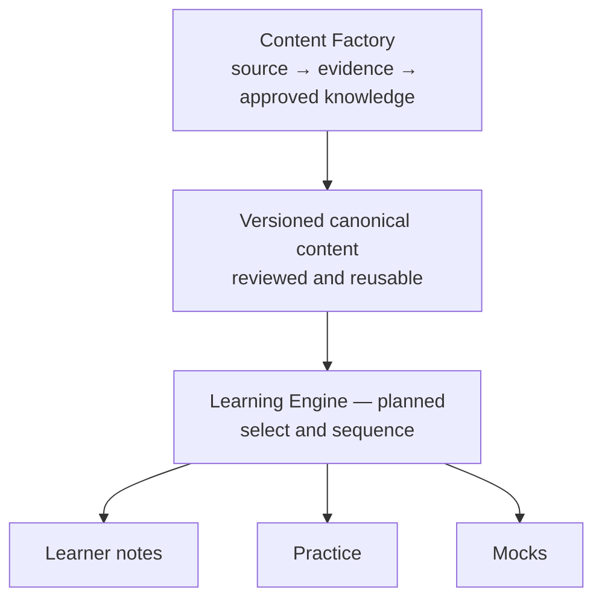
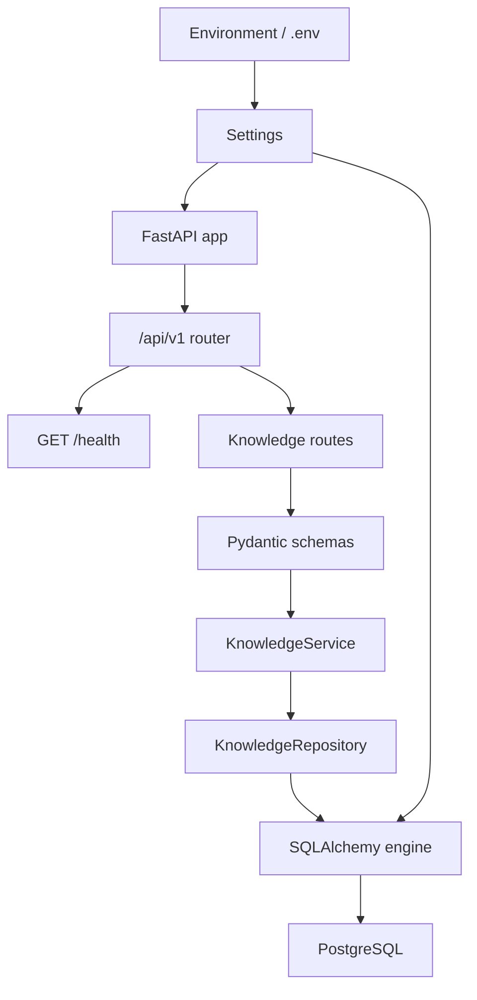
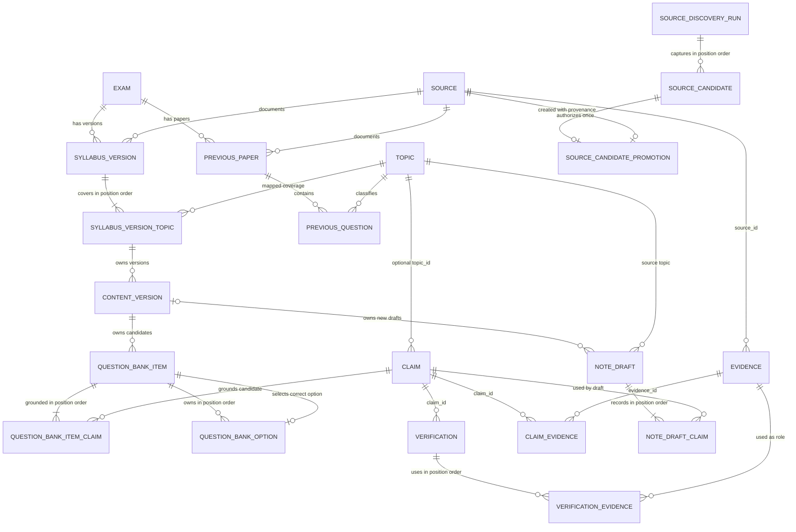
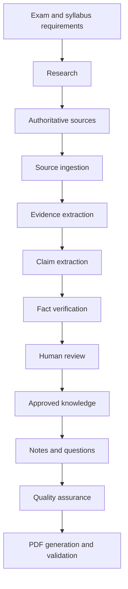

# Assam Exam AI — Living Architecture

## Purpose and trust rule

Assam Exam AI is intended to become a content-production and verification platform for Assam competitive examinations, including ADRE and Assam Government recruitment examinations. Its intended outputs include exam-oriented notes, questions, revision material, and downloadable PDFs.

The complete trust rule is:

> AI proposes → evidence supports → verification evaluates → humans approve where required.

An AI response is not verified merely because it is confident. Important factual claims must remain traceable to evidence, and insufficient or conflicting evidence must be surfaced rather than hidden.

## Canonical content ownership principle

Core educational content belongs to the platform, not to an individual learner. It will be created for an exact Exam, SyllabusVersion, and Topic context; versioned; grounded in approved knowledge; reviewed; and stored once for reuse. Future learner preparation will reference, sequence, and assemble approved canonical content instead of regenerating equivalent notes or questions for every learner.

The two long-term boundaries are:

The Content Factory is being built incrementally. The Learning Engine, user profiles, learner progress, weakness analysis, personalized sequencing, and mock assembly are planned and not implemented. ContentVersion now provides retained version identity for an exact SyllabusVersion and Topic; its current API is create/read-only and has no update endpoint.

## Current confirmed implementation

This section describes only the repository inspected on 2026-09-11 in Asia/Kolkata (UTC+05:30). Test results recorded in `workflow.md` and `task_log.md` were run against dedicated PostgreSQL test databases.

| Area | Confirmed state |
| --- | --- |
| Project | Python `>=3.12,<3.13`, managed with `uv` |
| API | FastAPI app with health, internal knowledge creation/retrieval/review routes, and a read-only deterministic Topic-priority assessment under `/api/v1` |
| Configuration | Pydantic Settings loading `.env`; tracked `.env.example` |
| Logging | Root stdout handler with duplicate-handler protection |
| Database access | Synchronous SQLAlchemy engine, session factory, and `get_db()` dependency |
| Local database | Docker Compose defines PostgreSQL 17 using a pgvector image |
| Migrations | Alembic is connected to application settings and `Base.metadata`; twenty-seven migrations exist, including Topic classification, provenance and approval foundations, sourced exam inputs, ContentVersion identity, versioned NoteDraft ownership, complete internal MCQ candidates, independent review and controlled release for candidates and drafts, immutable ContentPackage membership/review/release, immutable render-ready ContentDocument snapshots with independent review and controlled release, deterministic PDF artifact persistence with independent review and controlled release, immutable source-discovery audit snapshots, independent SourceCandidate review, and controlled candidate-to-Source promotion provenance |
| Persistence model | `Exam`, sourced `SyllabusVersion`, ordered syllabus/Topic mappings, `ContentVersion` identity, `QuestionBankItem`, ordered `QuestionBankOption` records, sourced `PreviousPaper` and Topic-linked `PreviousQuestion` occurrences, `Topic`, trusted `Source`, untrusted `SourceDiscoveryRun` and ordered `SourceCandidate` audit records, immutable `SourceCandidatePromotion` provenance, `Evidence`, `Claim`, `Verification`, `VerificationEvidence`, `NoteDraft`, `ContentPackage`, `ContentPackageNoteDraft`, `ContentPackageQuestionBankItem`, `ContentDocument`, `PdfArtifact`, and ordered provenance associations |
| Application layers | Pydantic knowledge schemas, a transactional knowledge service, and a SQLAlchemy knowledge repository |
| Tests | Four hundred six tests cover the foundation, immutable source-discovery run/candidate snapshots, target-only candidate review, the approved-candidate read boundary, controlled candidate-to-Source promotion, and bounded official-site sitemap discovery; ContentVersion ownership and complete internal MCQ-candidate constraints; sourced exam inputs; deterministic Topic priority; provenance; knowledge APIs; independent approval/release boundaries; version-scoped released-asset manifests; ContentPackage membership/review/release/read boundaries; deterministic ContentDocument rendering/checksums, individual retrieval, independent document review/release and released reads; deterministic PDF bytes/checksums, exact ownership, read-only internal and released-only retrieval/download, independent artifact review and controlled artifact release; PostgreSQL constraints; stored snapshots; locking; transactional failure atomicity; and the complete internal deliverable workflow |
| Agents | Package placeholders only; no agent behavior is implemented |

### Current runtime flow

### Current data model

The diagram shows the database foreign keys and association structures currently defined. Typed ORM traversal is implemented for `Claim → relevant Evidence` and `Verification → VerificationEvidence → Evidence`; the Source/Evidence link still exposes only foreign-key columns.

`SourceDiscoveryRun` is an immutable audit record for one already-completed discovery attempt. A successful run stores zero or more normalized, position-ordered `SourceCandidate` leads; a failed run stores an error and no candidates. PostgreSQL enforces lifecycle consistency, candidate normalization, per-run position and location uniqueness, and a composite same-run `SUCCEEDED` invariant. Create persists the run and all candidates with one commit and rolls back the whole aggregate on failure; retrieval returns the stored order without writes. Candidates are untrusted leads and have no relationship to curated `Source` rows. No external discovery adapter, network request, fetching, ingestion, approval, or Source promotion exists.

Every SourceCandidate begins in independent review state `DRAFT`. Its API contract uses the dedicated `SourceCandidateApprovalStatus` vocabulary (`DRAFT`, `APPROVED`, `REJECTED`) rather than a Claim-specific enum. `APPROVED` or `REJECTED` records the current UTC decision time and optional reviewer note; resetting to `DRAFT` clears both. The approval operation locks and updates only the requested candidate, commits once, and reloads it without a lock. Run ownership, discovery position/content/timestamps, parent runs, trusted Sources, and all other domain state remain unchanged. Candidate approval accepts an untrusted lead only for possible future controlled processing; it does not create a Source, verify facts, fetch content, authorize ingestion, or confer trust.

`GET /api/v1/source-candidates/approved` is a read-only selection boundary over each candidate's own current review state. A single SourceCandidate-only PostgreSQL query filters exactly `APPROVED` rows and orders them by ascending candidate ID under `no_autoflush`; it does not join or inspect parent runs or other domain state, acquire locks, or write. Responses reuse the stored immutable candidate snapshot and review metadata. Returned candidates remain untrusted discovery leads: inclusion does not fetch content, create or promote a trusted Source, authorize ingestion, or establish factual trust.

`POST /api/v1/source-candidates/{source_candidate_id}/promote` is the separate controlled trust-intake decision. It locks one candidate, requires its current review state to be APPROVED, creates one new curated `Source` from explicit request metadata while copying only the candidate's exact stored location, and stores one immutable `SourceCandidatePromotion` snapshot of the authorizing review decision. Composite PostgreSQL references require the promotion location to agree with both records, and uniqueness permits each candidate and created Source in at most one promotion. Promotion commits the Source and provenance together, does not fetch content or establish factual correctness, and later candidate review changes cannot alter the retained Source or authorization snapshot.

`POST /api/v1/source-discovery-runs/official-site` is the first executable discovery adapter. It accepts one normalized query and allowlisted HTTPS origin, retrieves only that origin's robots policy and bounded sitemap documents through an IP-pinned, redirect-revalidated client, and deterministically selects URL-relevant candidates without fetching content pages. Network, policy, parser, and limit failures become sanitized terminal FAILED run snapshots; completed processing becomes SUCCEEDED, including zero results. All network work finishes before the existing one-commit aggregate persistence path. Candidate results remain untrusted leads and are neither promoted nor treated as factual evidence.

T-051 was independently reviewed after push at immutable commit `7bce1693003311dc3e9fcd0cda302aef71f592b0` and approved with no blocking finding. GitHub exposes no status contexts or workflow runs, so the approval relies on exact commit inspection and developer-recorded local PostgreSQL validation; no CI pass is claimed. T-052 is issued separately as a bounded official-site discovery adapter and does not change T-051 promotion semantics.

## Planned architecture — not implemented

The repository instructions describe this target flow:

None of the research, ingestion, general search/retrieval, AI verification, full human-review workflow, content-generation, question-generation, QA, or customer-facing PDF publication/delivery stages is currently implemented. The internal manual knowledge API now follows `route → schema → service/use case → repository → database`; it can create minimal Topics, optionally classify Claims by Topic, retrieve individual Evidence, link relevant Evidence to a Claim, retrieve the Claim with stable evidence IDs and separate verification/approval state, record a human approval decision, list only approved Claims in stable ID order, and retrieve a Verification with its Claim and ordered audit evidence provenance.

Claim-to-Evidence linking is idempotent under concurrent requests: PostgreSQL enforces the existing `(claim_id, evidence_id)` composite primary key, and the repository inserts with `ON CONFLICT DO NOTHING`. The service then freshly reloads the relationship before returning numerically sorted evidence IDs.

### Exam relevance and likelihood model

Exam relevance is a separate decision from factual correctness. A factual Claim or approved NoteDraft can be correct yet have low relevance to a particular exam.

The future model will use versioned, traceable inputs:

- an official syllabus version and its Topic mappings;
- legally usable previous-question records, each retaining exam, date/year, paper/level, source reference, and whether it is an exact prior question or an inferred Topic tag;
- human-reviewed mappings between Topics, Claims, NoteDrafts, and prior-question themes;
- current-affairs recency where relevant; and
- an explicit scoring-rule version and reviewer overrides.

It will output an explainable **exam-priority band** (`HIGH`, `MEDIUM`, or `LOW`) plus reasons such as “direct syllabus coverage” or “appeared in three tagged prior papers.” A future numeric score may be shown only as a calibrated priority estimate with its basis and validation record; it must never claim that a specific fact, NoteDraft, or AI-generated MCQ will appear in the actual exam.

The user-facing system must distinguish:

- **previous-year question** — a sourced historical record; from
- **AI-generated practice question** — a new question modeled on an exam pattern; and
- **exam-priority assessment** — an explainable recommendation, not a prediction or guarantee.

The fixed `topic-priority-v1` assessment is implemented. It combines one selected syllabus version with same-Exam previous-paper occurrences. Broader mappings, configurable scoring rules, calibration, likelihood prediction, and reviewer overrides remain planned.

## Current known gaps

- ORM relationships remain absent for the Source/Evidence link.
- Sources do not store publication or retrieval dates.
- Authority tiers, verdicts, confidence ranges, and license states lack database constraints.
- `Claim.verification_status` has a Python default but no server default.
- Cascading deletes can remove provenance history.
- The pgvector-capable image is configured, but no migration enables the extension and no vector column or Python pgvector dependency exists.
- The health route does not test database readiness.
- Docker Compose contains fixed development database credentials.
- There is no application Dockerfile or CI workflow, and the README is empty.

Evidence referenced by a `VerificationEvidence` audit row cannot be deleted. PostgreSQL restricts that deletion; deleting the Verification remains allowed and removes only its association rows.

Creating a Verification also updates its Claim's `verification_status`, `confidence`, and `last_verified_at` summary in the same transaction. The immutable Verification remains the audit record; these Claim fields represent only the latest verification result and are not human approval.

Every Claim begins with human approval state `DRAFT`. An `APPROVED` or `REJECTED` decision records the current UTC decision timestamp and supplied optional reviewer note. Setting the state to `DRAFT` clears both fields because there is no current human decision. Verification creation never changes approval state and does not publish a Claim. Reviewer identity, authentication, and decision history are not implemented.

`GET /api/v1/claims/approved` is the current safe read boundary for future content consumers. It returns only explicitly `APPROVED` Claims in ascending ID order with their existing verification summary, approval metadata, and relevant Evidence IDs; it does not generate content.

`GET /api/v1/topics/{topic_id}/claims/approved` narrows that safe boundary to one existing Topic. It returns only Claims matching both the Topic ID and `APPROVED` state in ascending Claim ID order, eagerly loading relevant Evidence; a missing Topic is distinct from an existing Topic with no approved Claims.

Topic classification is intentionally minimal: a Topic has only a unique name and timestamps/identity, and a Claim may reference one Topic or none. PostgreSQL sets `claims.topic_id` to null if its Topic is deleted. Ordered Topic coverage can now be recorded for a sourced SyllabusVersion, but Topic hierarchy, tags, Topic reads/lists, and search are not implemented.

Topic names are protected by the PostgreSQL unique constraint as the concurrency-safe authority. A duplicate Topic creation is rolled back and exposed as HTTP 409 with a stable conflict detail rather than leaking a database exception.

`POST /api/v1/topics/{topic_id}/note-draft-preview` is a deterministic, non-persistent internal preview. It reads the existing Topic-scoped approved-Claim boundary in ascending Claim ID order and renders only a Topic heading plus the Claims' unchanged statements as Markdown bullets. It returns 409 when the Topic has no approved Claims and does not mutate knowledge, create note storage, publish content, or use an LLM.

`POST /api/v1/topics/{topic_id}/note-drafts` requires one positive ContentVersion ID and persists that same deterministic Markdown contract as an internal draft together with the exact ordered approved Claims used. The service confirms the ContentVersion exists and belongs to the path Topic before loading approved Claims. PostgreSQL independently enforces the same-Topic pair and restricts deletion of a referenced ContentVersion. The draft and its links commit atomically. Legacy drafts retain null ContentVersion ownership rather than receiving an inferred version. PostgreSQL also requires non-negative, unique per-draft Claim positions and one link per draft/Claim pair; deleting a referenced Topic or Claim is restricted, while deleting a draft may remove only its association rows.

`GET /api/v1/note-drafts/{note_draft_id}` returns the stored ContentVersion ID, Markdown, and Claim IDs from the persisted position-ordered links. It eagerly loads the Topic and all links, does not infer ownership, query current approval eligibility, or regenerate Markdown, and therefore remains a stored snapshot when a linked Claim's approval state later changes. Legacy snapshots return a null ContentVersion ID.

Every NoteDraft begins in review state `DRAFT`. `APPROVED` or `REJECTED` records the current UTC decision time and optional reviewer note; resetting to `DRAFT` clears both. This decision is independent of its Claims and changes neither stored Markdown nor provenance. NoteDraft approval is not release or publication, and reviewer identity/history are not implemented. Independently, every new or migrated draft begins `UNRELEASED` with null release metadata. Only a version-owned, explicitly approved draft can move once to `RELEASED`, and only a released draft can move once to `WITHDRAWN`; the original release time is retained. PostgreSQL enforces status/metadata, approval, and ContentVersion-ownership invariants. Both release and approval decisions lock the target draft row, while service conflicts occur before mutation and successful decisions commit once. A currently released draft cannot be reset or rejected until withdrawal. Legacy drafts with null ContentVersion ownership remain readable and reviewable but cannot be released.

`GET /api/v1/note-drafts/approved` is the internal downstream boundary for reviewed drafts. It filters only on each NoteDraft's own `APPROVED` state, returns drafts in ascending ID order, and eagerly loads their Topic and stored ordered Claim links. It returns stored snapshots and release metadata without regenerating Markdown or reconsidering current Claim approval. This remains approval-only and may include approved UNRELEASED, RELEASED, or WITHDRAWN drafts; release eligibility is exposed through the separate released-draft boundary.

`GET /api/v1/note-drafts/released` is the separate internal release boundary. It filters exactly on each NoteDraft's current `RELEASED` state, orders drafts by ascending ID, and eagerly loads Topic and position-ordered Claim links. It returns the existing stored `NoteDraftResponse` snapshot without locks, writes, regeneration, provenance rebuilding, or current Claim/Verification/QuestionBankItem/priority evaluation. UNRELEASED and WITHDRAWN drafts are excluded, while an empty eligible set returns `[]`; this is not publication or learner delivery.

An Exam has unique code and name identifiers. Each SyllabusVersion belongs to one Exam, cites one existing Source, has a label unique within that Exam, and stores a non-empty ordered set of existing Topics. PostgreSQL restricts deletion of referenced Exams, Sources, Topics, and mapped SyllabusVersions so this syllabus provenance cannot be silently broken. SyllabusVersion itself records sourced coverage only. The separate deterministic `topic-priority-v1` assessment is implemented; numeric scoring, percentages, calibrated likelihood, and exam-appearance probability are not implemented.

A PreviousPaper belongs to one Exam, cites one Source, records a positive year, and has a label unique for that Exam/year. A PreviousQuestion records its exact paper, one Topic, non-negative unique position within the paper, non-blank source text, and optional source location reference. PostgreSQL restrictions protect the referenced Exam, Source, Paper, and Topic. These are historical occurrences only: answers, explanations, multi-Topic tags, configurable scoring, percentages, and probability are not implemented.

`GET /api/v1/syllabus-versions/{syllabus_version_id}/topics/{topic_id}/priority` combines one selected syllabus version with stored occurrences from that Exam only. The repository eagerly loads syllabus Topic links and uses one outer-join occurrence query, so counts do not use per-paper queries. The service counts question rows separately from distinct papers, returns sorted unique matched years, applies the fixed `topic-priority-v1` rule, and performs no writes. The result is an explainable priority aid, never an appearance probability. Configurable rules, calibration, percentages, likelihood prediction, and reviewer overrides remain planned.

A ContentVersion is retained version identity for one exact SyllabusVersion/Topic mapping and an explicitly supplied positive version number. The current API supports creation and retrieval only; it has no update endpoint. PostgreSQL enforces positive versions, unique mapping/version identity, composite membership through `syllabus_version_topics`, and restricted deletion of the referenced syllabus-topic mapping. Database-level prevention of direct ContentVersion updates or deletion is not implemented. Historical versions can coexist, and the service does not calculate the next number. ContentVersion has no content body, approval, publication, AI behavior, or learner personalization; it can own internal QuestionBankItem candidates and newly created same-Topic NoteDraft snapshots.

A QuestionBankItem is a manually supplied internal MCQ candidate owned by one ContentVersion. It stores non-blank question and explanation text, constrained difficulty, the exact approved same-Topic Claims used at creation, at least two ordered options for new API-created items, and one correct-option position. PostgreSQL enforces non-blank option text, unique non-negative option positions, a composite same-item correct-option reference, and independent review and release states. Existing T-021 rows migrate to DRAFT review and UNRELEASED status with null metadata; release is never inferred from approval. Only a complete, currently APPROVED stored candidate can move from UNRELEASED to RELEASED. RELEASED preserves its original release time until a one-way withdrawal; WITHDRAWN cannot be re-released in place. The database constrains every release status/timestamp combination and requires RELEASED rows to remain APPROVED. The approval endpoint therefore blocks DRAFT/REJECTED changes while RELEASED, but permits review changes after withdrawal. Release never re-evaluates current Claim, NoteDraft, or Verification state and changes no stored content or provenance. The approved-candidate read boundary remains based only on the QuestionBankItem's own APPROVED review state, including approved UNRELEASED or WITHDRAWN items. A separate released-candidate read boundary filters exactly on current RELEASED state and returns stored snapshots with ordered provenance; it excludes UNRELEASED and WITHDRAWN candidates. Release is not publication transport or learner access.

`GET /api/v1/content-versions/{content_version_id}/released-assets` is a computed internal manifest for one exact stored ContentVersion. It returns that ContentVersion identity plus only currently RELEASED NoteDraft and QuestionBankItem snapshots that explicitly reference it, with both asset lists ordered by ascending ID and nested provenance eagerly loaded in persisted position order. The endpoint reuses the existing stored serializers and performs no locks, writes, regeneration, ownership inference, or current-state re-evaluation. An existing version with no eligible assets returns empty lists; this response is not a persisted package, publication, or learner-delivery boundary.

A ContentPackage is a retained internal identity plus two independently position-ordered membership snapshots for one exact ContentVersion. Its API supports atomic creation, individual ID/content retrieval, independent review, controlled release, and a currently RELEASED collection. `POST /api/v1/content-packages/{content_package_id}/content-documents` locks one currently RELEASED package and persists at most one deterministic render-ready Markdown snapshot. The document uses retained membership order, stored asset content, A-Z option labels, one final newline, and a lowercase SHA-256 digest of its exact UTF-8 Markdown. `GET /api/v1/content-documents/{content_document_id}` returns that stored row exactly by document ID using one lock-free, no-autoflush query; it does not resolve members, regenerate Markdown, recalculate the digest, or inspect current related state. Every ContentDocument begins in independent review state DRAFT and release state UNRELEASED. The approval and release endpoints lock only the document row. APPROVED or REJECTED records a UTC review time and optional note, while DRAFT clears both; only an APPROVED UNRELEASED document can become RELEASED, and only RELEASED can become WITHDRAWN. A released document must be withdrawn before reset or rejection, and a withdrawn document cannot be re-released in place. `GET /api/v1/content-documents/released` filters only current RELEASED state in PostgreSQL, orders by document ID, and returns stored self-contained responses with one lock-free SELECT. `POST /api/v1/content-documents/{content_document_id}/pdf-artifacts` locks one exact RELEASED document and persists at most one immutable PDF byte snapshot rendered only from its stored title and Markdown. The dependency-free `deterministic-pdf-v1` renderer uses fixed A4 layout and metadata; identical supported input produces identical bytes, whose exact size and lowercase SHA-256 are stored. PostgreSQL enforces one artifact per document, exact document/package/ContentVersion agreement, PDF metadata and byte integrity, and restricted document deletion. `GET /api/v1/pdf-artifacts/{pdf_artifact_id}` returns stored metadata without raw bytes, while `/download` returns the exact stored bytes with stored media type, size, and attachment filename. Both use one lock-free, no-autoflush PdfArtifact-only query and ignore current related state. Every artifact begins independently in review state DRAFT and release state UNRELEASED. Review and release decisions lock only the artifact row. Only an APPROVED UNRELEASED artifact can become RELEASED, only RELEASED can become WITHDRAWN, and withdrawal is terminal. A currently released artifact must be withdrawn before reset or rejection. PostgreSQL enforces release status/metadata/approval consistency, while immutable payload, ownership, metadata retrieval, and ungated internal download remain unchanged. `GET /api/v1/pdf-artifacts/released` returns only current RELEASED metadata in ascending artifact-ID order, and `GET /api/v1/pdf-artifacts/released/{pdf_artifact_id}/download` returns exact stored bytes only while that artifact remains RELEASED. Each released boundary uses one PdfArtifact-only, lock-free, no-autoflush query and ignores related state. No general or approved artifact list, publication, external storage, public/learner delivery, or AI behavior exists.

The existing internal pipeline is covered by one PostgreSQL-backed API smoke workflow from authoritative Source and syllabus identity through Evidence, Verification, explicit Claim approval, version-owned canonical assets, independent review/release stages, immutable package/document/artifact snapshots, and exact stored-byte released PDF delivery. This is validation coverage only and adds no runtime capability.

## Architectural decisions recorded by repository instructions

- Build a modular FastAPI application backed by PostgreSQL, SQLAlchemy 2.x, Alembic, and eventually pgvector.
- Preserve the provenance chain among Source, Evidence, Claim, and Verification.
- Keep verification separate from human approval.
- Prefer small specialized components over a single general-purpose agent.
- Store structured, approved content before generating PDFs.
- Add entities only when their features are implemented.
- Change applied database history through new migrations rather than editing old migrations.

T-003 is approved at commit `603bddf260e9016e2db9215aec831ece7f018b50`. It implements the first manual internal vertical slice: create a source, attach evidence, create a claim, record a verification with ordered evidence, and retrieve that verification with its provenance. T-004, approved at commit `e2f9d170c335f5ab9037749654bba9edb77938ba`, synchronizes the Claim's latest verification summary in the same transaction. T-005, approved at commit `af76073a5ece57187f14540b519ec9606c2947a3`, adds direct Claim-summary retrieval. T-006, approved at commit `0a335483285835db8d9d3a76180c02ba4dad91e2`, adds concurrency-safe Claim-to-Evidence linking. Neither task performs automated research or factual verification.

## Working MVP approach

The immediate goal is a small working internal flow, not a full product. The first usable slice will be manual and API-driven:

Source → Evidence → Claim → Verification → Verification with provenance

It does not use an LLM, automatic ingestion, authentication, a learner UI, payments, or PDF generation. Those remain planned features.

T-007 is approved at commit `fbb1555acfecdc0942c032727684bce9d5e1e3a5`; individual Evidence can now be inspected through the internal API. The next required trust boundary is explicit human approval, kept separate from verification.

T-008 is approved at commit `64c143498af19c9dc120093c5544e00c92011ef8`. It establishes the explicit human approval boundary; only Claims explicitly marked `APPROVED` will be eligible for future content-generation input.

T-009 is approved at commit `262bb7db9226ef31f7d9e61e9c7323f9cbd512a8`. The approved-Claims endpoint is the first safe internal input boundary for future generation. Topic classification is the next missing prerequisite for topic-based notes and MCQs.

T-010 is approved at commit `1a8a1ed15a94c128c7fb89442aee605d3263cbf6`. Approved knowledge can now be classified by one minimal Topic; the next step is to retrieve approved Claims for one Topic as a focused future generation input.

T-011 is approved at commit `209ea1678136030ba340b243c3735d1a9f65ee67`. It provides the safe, Topic-scoped approved-Claim boundary that a future internal note or MCQ draft process may consume. It does not generate, publish, or alter knowledge.

T-012 is approved at commit `1c33a89056eda9b04db2c71c9b60d17d3e8ccd0f`. It proves the first internal notes-shaped output using only approved knowledge; the preview is deterministic, non-persistent, and never published. The next boundary is persistent draft storage with exact Claim provenance, before any LLM integration.

T-013 is approved at commit `3aacf3d2b76098092cfae072c7cfa4ca40c88e3f`. A stored internal NoteDraft now retains exact ordered Claim provenance and is protected from losing referenced Topics or Claims. It is still not approved or learner-ready. The next need is safe individual retrieval for internal review.

T-014 is approved at commit `c595da4e9ce8aedd60bf0f881d9bb59c6618881d`. Internal reviewers can now retrieve an immutable stored draft snapshot with exact input-Claim provenance. The next trust boundary is an explicit human decision on the draft itself, kept separate from approval of individual Claims.

T-015 is approved at commit `811f10af3ee63a22e253ff24e9450770e2cbbbc2`. A NoteDraft now has an explicit human-review decision separate from its Claims. `APPROVED` remains an internal eligibility state, not public release. The next small boundary is an internal read of approved drafts only.

T-016 is approved at commit `611fcb87b38b8506b1a509bea1c0abb4f581c5a7`. The system can now read only human-approved NoteDraft snapshots as an internal downstream boundary. It still has no syllabus or previous-paper data, so it cannot yet make evidence-based exam-priority assessments. T-017 begins that data foundation by recording sourced syllabus versions and their ordered Topics.

T-017 is approved at commit `e1aea55991671679d1666f4e472a6ad7425310df`. The repository now records Exams and immutable, sourced syllabus versions with ordered Topic coverage. This is provenance-backed exam-scope data only; it does not infer importance, likelihood, or probability. T-018 will add sourced previous-paper question occurrences so later relevance bands can use historical evidence.

T-018 is approved at commit `c7d7b9f18d68c9da1aeea5747b5925bf5922ead8`. The system can now retain sourced historical question occurrences with exact Exam, Paper, Topic, position, text, and source-location provenance. These records are evidence that a Topic appeared in stored past-paper data, not proof that it will appear again. T-019 will combine this history with one selected syllabus version through a deterministic, explainable priority rule.

T-019 is approved at commit `ff326dc5334dfc41ec298d10551f8c5801ae21b1`. The read-only `topic-priority-v1` endpoint exposes selected-syllabus coverage, same-Exam historical counts, sorted years, a deterministic band, and reason codes. It is a transparent preparation priority, not a probability. T-020 will introduce only the platform-owned ContentVersion identity needed before canonical question assets are stored.

T-020 is approved at commit `c5d2010da24731387162020accc9030d6fcca01e`. The platform now has create/read-only ContentVersion identity for an exact SyllabusVersion/Topic mapping, with database-enforced membership, positive explicit versions, scoped uniqueness, and mapping-deletion restriction. It contains no educational asset or review state. T-021 will add the first manually created, Claim-grounded QuestionBankItem candidate under a ContentVersion.

T-021 is approved at commit `3b1c425158ca0932b6c8ea9fb80dbf9efd9b8278`. It established internal QuestionBankItem candidates with exact ordered approved-Claim provenance under a ContentVersion; T-022 extends that stored candidate structure with options and an answer without changing its unreviewed status.

T-022 is approved at commit `4dc87a82a1d8695a6316debad03d7f3af43e28e2`. New QuestionBankItems now retain ordered options and exactly one same-item correct answer while preserving Claim provenance and atomicity. This completes only the internal MCQ structure; it adds no release, generation, or learner boundary. Independent candidate review is the next planned increment.

T-023 is approved at commit `1e84907906579c08d7218771669730b9855778d6`. QuestionBankItems now have an independent human decision with DRAFT reset semantics and an approval guard for incomplete legacy candidates. This decision is separate from Claim and NoteDraft approval and does not release or publish a question. The next bounded increment is an internal read boundary for approved QuestionBankItem snapshots; it must not add release or learner delivery.

T-024 is approved at commit `6dc8e9497fe55870173c584717e3ab78563baf3f`. The system exposes only explicitly approved QuestionBankItem snapshots through a stable, read-only internal collection. It does not regenerate content, re-evaluate Claim approval, publish questions, or provide learner access. The next bounded increment is a controlled release lifecycle kept separate from candidate approval and learner delivery.

T-025 is approved at commit `84e0b20fd81d9bf7b241a93686811db0ccd3e8dc`. QuestionBankItems now have a constrained UNRELEASED/RELEASED/WITHDRAWN lifecycle with explicit eligibility, retained release and withdrawal timestamps, and a review lock while released. Release remains separate from publication transport and learner-facing delivery.

T-026 is approved at commit `d5c3b484b8268ae745da491617c56c02a1be3853`. The read-only internal boundary returns only currently RELEASED QuestionBankItem snapshots in stable ID order, with ordered Claim and option provenance eagerly loaded. It performs no writes or regeneration and adds no public or learner-facing delivery.

T-027 is approved at commit `bcff4c54a04f6ec3cdcb094f71d64241e87a3622`. Every newly persisted NoteDraft records one exact same-Topic ContentVersion; legacy drafts remain readable and reviewable with null ownership rather than inferred data. This establishes versioned canonical-note identity without adding release or learner delivery.

T-028 is approved at commit `4974d87f90c08a5e39b3fe31a5cd1f7e1f9a4470`. NoteDrafts now have a constrained UNRELEASED/RELEASED/WITHDRAWN lifecycle requiring their own APPROVED review and non-null ContentVersion ownership before release. Release and approval decisions lock the stored draft, withdrawal retains release provenance, and legacy null-owned drafts remain reviewable but unreleasable.

T-029 is approved at commit `ee755cfc3a88700abababf2473bd8d615c16c871`. The read-only internal boundary returns only currently RELEASED NoteDraft snapshots in stable ID order with stored ContentVersion and ordered Claim provenance, while keeping approval eligibility separate and performing no writes or regeneration.

T-030 is approved at implementation commit `3a81ce6cefdcc3bd0abd7a17ecc1472d5bb1d4d4`; empty corrective commit `265f683b5180cde585d366fce17ffe53c11c1955` clarifies that the implementation is T-030, not T-031. The computed manifest returns one exact ContentVersion with only its currently RELEASED NoteDraft and QuestionBankItem snapshots in stable order, without persistence, writes, regeneration, or learner delivery.

T-031 is approved at implementation commit `a261a36a539c40b718e2185eaed794f700dd4b77`, with documentation correction commit `67e80c29928eb7e913bca99f899082562e4c2cb1`. The system can atomically persist immutable ContentPackage membership snapshots for one exact ContentVersion using currently RELEASED asset IDs and database-enforced ordered same-version provenance. T-032 is approved at commit `1a695d8a2335612ff4873df3a3c3bb51543d1591`; one retained ContentPackage can be retrieved by ID with both membership lists in stored association-position order. T-033 is approved at commit `673b4ae62c4d2dd102986f3144ed8e30dea9116f`; the package can be expanded read-only into exactly its retained asset snapshots. T-034 is approved at commit `8bdd96a1931be638ad4c5a40ab22a34382e66812`; packages have independent human review. T-035 is approved at commit `632fb01e6566d3270ef82c0a47788e8eabeac229`; packages have controlled release. T-036 is approved at commit `44446303944e946a1834b714ac02009bcd22e3b1`; the internal read boundary returns only currently RELEASED package snapshots with retained membership order. T-037 is approved at commit `e199b9b6b4698ad3df1c3bf60c7e82b1adc3e951`; one currently RELEASED package can produce at most one immutable deterministic Markdown ContentDocument with exact ContentVersion ownership and an exact-content SHA-256 digest. T-038 is approved at commit `4e3adcf4da0c6a29f6d7ba4556b77e47e28e353a`; one stored ContentDocument can be retrieved exactly by its own ID without regeneration, checksum recalculation, related-state evaluation, locking, or mutation. T-039 is approved at commit `5d954866cf18e5bbfeb89f0a465ce593645bdd45`; ContentDocuments have independent DRAFT/APPROVED/REJECTED human review. T-040 is approved at commit `9add651af5a8a07dd9d1a1739bbe90f6e6b19277`; documents now have a constrained UNRELEASED/RELEASED/WITHDRAWN lifecycle while their payload remains immutable. T-041 is approved at commit `210d3c7186ec8a5d344dfbbf99d669b7aa0d0292`; the internal read boundary returns only currently RELEASED ContentDocument snapshots in stable ID order using one ContentDocument-only query. T-042 is approved at implementation commit `e41ab090ee9b715e473a72c25474f8ca58deb424`; one exact currently RELEASED ContentDocument can produce at most one immutable deterministic database-backed PdfArtifact with copied document/package/ContentVersion ownership, exact stored PDF bytes, size, checksum, filename, media type, and creation time. T-043 is approved at implementation commit `b6ef5943536380ed8cf18a09133ad5cd68f603ad`; one PdfArtifact can be retrieved internally by its own ID as stored metadata or downloaded as its exact persisted bytes with stored content headers through PdfArtifact-only, lock-free, mutation-free reads that ignore later related-state changes. T-044 is approved across implementation commit `b8f519a1ed5adf017767562f78ae168226c300e6` and focused test-correction commit `592847b89b86bf0f9a744280dfa455562cefb70a`; PdfArtifact now has an independent database-enforced DRAFT/APPROVED/REJECTED human-review lifecycle whose decisions lock only the artifact and preserve its immutable payload, ownership, retrieval, and download behavior. T-045 is approved at implementation commit `72cb1316980e49444292744629276d7b513985f1`; PdfArtifact has a separate database-enforced UNRELEASED/RELEASED/WITHDRAWN lifecycle with explicit own-approval eligibility, target-only locking, terminal withdrawal, and unchanged immutable bytes/internal-download behavior. T-046 is approved across implementation commit `40c66d108b3c7b69ead420fd4e65a9de146f607d` and focused Verification-state test-correction commit `2f7e5c5ea7e50f9ee533d9ba8bf9485aae305ca2`. The read-only delivery boundary returns current-RELEASED PdfArtifact metadata in stable ID order and exact stored bytes only for a currently RELEASED artifact, using PdfArtifact-only lock-free queries that ignore later related state. T-047 is approved at implementation commit `38eb63189c66167258ad2cbc54b5d9d3d79f4fe8`; one PostgreSQL-backed API smoke test validates the complete existing internal pipeline from sourced knowledge and explicit human approval through independently released canonical assets, package, document, and exact-byte PdfArtifact delivery without adding runtime behavior. Publication records, external storage, public/learner authentication and delivery, AI, and personalization remain unimplemented.

T-048 is approved at implementation commit `f0590e414ed8386e755ced32dc2a508f2a53e35f`; completed SourceDiscoveryRuns now retain ordered immutable SourceCandidate audit snapshots while failed runs retain deterministic failure state. T-049 is approved across implementation commit `bfe846a2db4e2f089eb0734d64d065a740840f56` and focused correction commit `6467d11133da6e8e5d8d08c1da352b112233ef73`; SourceCandidates have independent target-only DRAFT/APPROVED/REJECTED human review using a dedicated status vocabulary. T-050 is approved at commit `7b0a7b423c705069fa27602944ef76bf58666438`; one read-only boundary selects only currently APPROVED untrusted candidates in stable ID order using one candidate-only query. T-051 is issued to promote one approved candidate into one trusted Source while retaining immutable candidate-to-Source promotion provenance. Network fetching, ingestion, extraction, AI, and learner delivery remain unimplemented.
