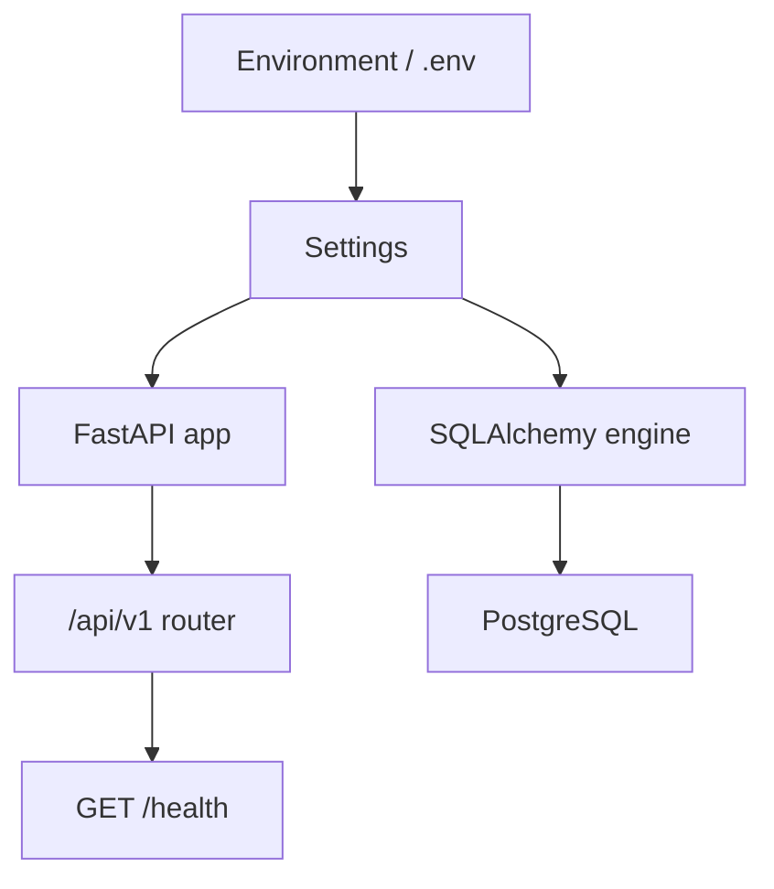
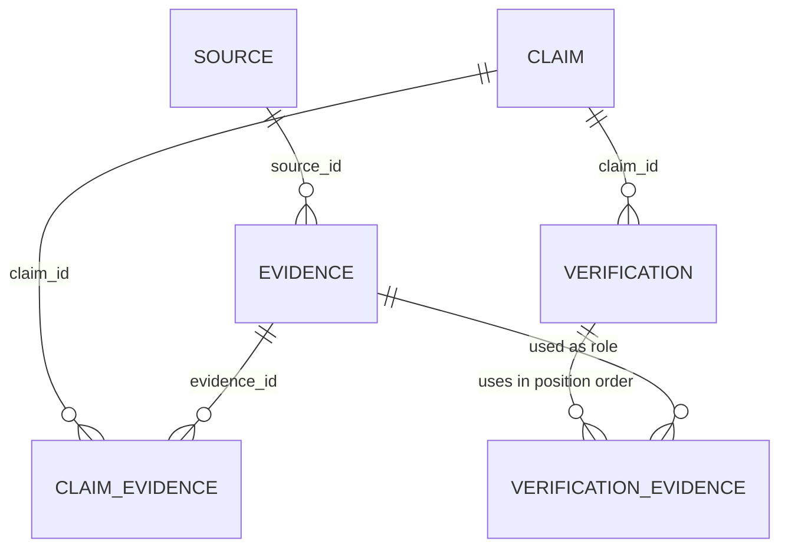
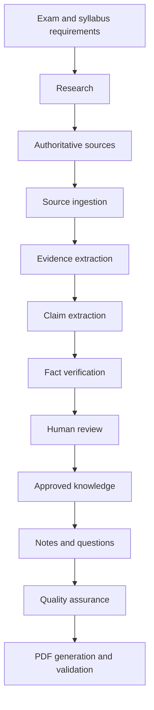

# Assam Exam AI — Living Architecture

## Purpose and trust rule

Assam Exam AI is intended to become a content-production and verification platform for Assam competitive examinations, including ADRE and Assam Government recruitment examinations. Its intended outputs include exam-oriented notes, questions, revision material, and downloadable PDFs.

The complete trust rule is:

> AI proposes → evidence supports → verification evaluates → humans approve where required.

An AI response is not verified merely because it is confident. Important factual claims must remain traceable to evidence, and insufficient or conflicting evidence must be surfaced rather than hidden.

## Current confirmed implementation

This section describes only the repository inspected on 2026-09-02 in Asia/Kolkata (UTC+05:30). The T-002 test results recorded in `workflow.md` and `task_log.md` were run against a dedicated PostgreSQL test database.

| Area | Confirmed state |
| --- | --- |
| Project | Python `>=3.12,<3.13`, managed with `uv` |
| API | FastAPI app with lifespan logging and `GET /api/v1/health` |
| Configuration | Pydantic Settings loading `.env`; tracked `.env.example` |
| Logging | Root stdout handler with duplicate-handler protection |
| Database access | Synchronous SQLAlchemy engine, session factory, and `get_db()` dependency |
| Local database | Docker Compose defines PostgreSQL 17 using a pgvector image |
| Migrations | Alembic is connected to application settings and `Base.metadata`; one initial migration exists |
| Persistence model | `Source`, `Evidence`, `Claim`, `Verification`, `VerificationEvidence`, and claim/evidence association tables |
| Tests | Seven tests cover settings, logging, health, database connectivity, ordered verification evidence, and invalid audit-link values |
| Agents | Package placeholders only; no agent behavior is implemented |

### Current runtime flow

### Current data model

The diagram shows the database foreign keys and association structures currently defined. Typed ORM traversal is implemented for `Verification → VerificationEvidence → Evidence`; the older model links still expose only foreign-key columns or a plain association table.

## Planned architecture — not implemented

The repository instructions describe this target flow:

None of the research, ingestion, retrieval, AI verification, human-review, content-generation, question-generation, QA, or PDF stages is currently implemented. The intended application layering is `route → schema → service/use case → repository → database`; only the health route and foundational database layer currently exist.

## Current known gaps

- ORM relationships remain absent for the original Source/Evidence, Claim/Evidence, and Claim/Verification links.
- Sources do not store publication or retrieval dates.
- Authority tiers, verdicts, confidence ranges, and license states lack database constraints.
- `Claim.verification_status` has a Python default but no server default.
- Cascading deletes can remove provenance history.
- The pgvector-capable image is configured, but no migration enables the extension and no vector column or Python pgvector dependency exists.
- No schemas, repositories, services, knowledge routes, or model persistence tests exist.
- The health route does not test database readiness.
- Docker Compose contains fixed development database credentials.
- There is no application Dockerfile or CI workflow, and the README is empty.

Evidence referenced by a `VerificationEvidence` audit row cannot be deleted. PostgreSQL restricts that deletion; deleting the Verification remains allowed and removes only its association rows.

## Architectural decisions recorded by repository instructions

- Build a modular FastAPI application backed by PostgreSQL, SQLAlchemy 2.x, Alembic, and eventually pgvector.
- Preserve the provenance chain among Source, Evidence, Claim, and Verification.
- Keep verification separate from human approval.
- Prefer small specialized components over a single general-purpose agent.
- Store structured, approved content before generating PDFs.
- Add entities only when their features are implemented.
- Change applied database history through new migrations rather than editing old migrations.

The next implementation milestone has not been implemented or approved by this documentation task. The most visible foundational concern is completing and testing the provenance model before building ingestion or AI behavior.
