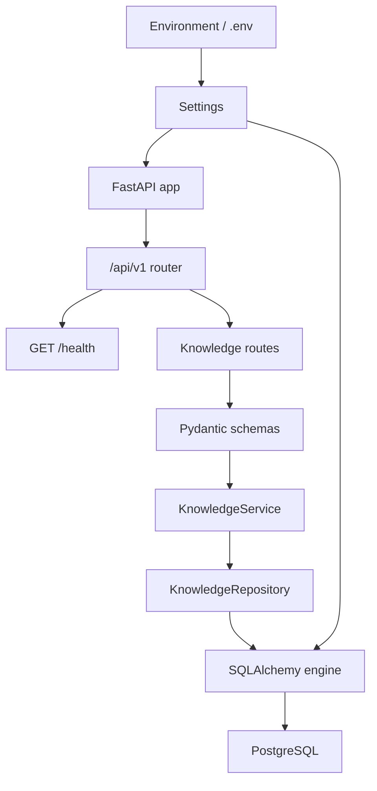
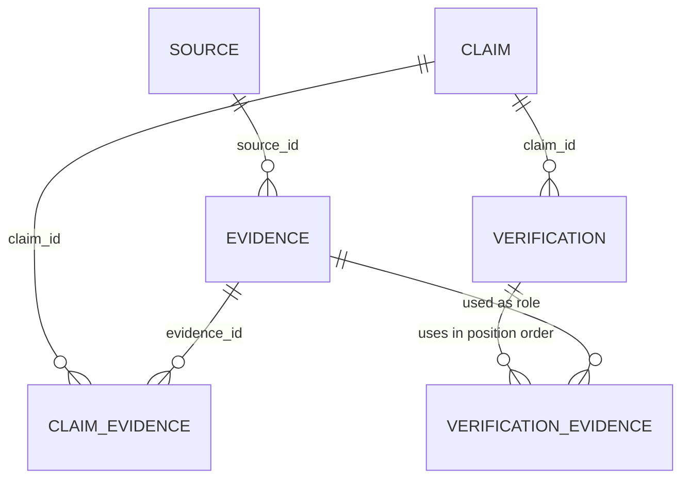
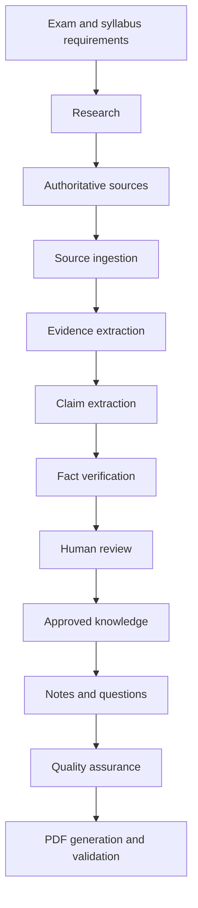

# Assam Exam AI — Living Architecture

## Purpose and trust rule

Assam Exam AI is intended to become a content-production and verification platform for Assam competitive examinations, including ADRE and Assam Government recruitment examinations. Its intended outputs include exam-oriented notes, questions, revision material, and downloadable PDFs.

The complete trust rule is:

> AI proposes → evidence supports → verification evaluates → humans approve where required.

An AI response is not verified merely because it is confident. Important factual claims must remain traceable to evidence, and insufficient or conflicting evidence must be surfaced rather than hidden.

## Current confirmed implementation

This section describes only the repository inspected on 2026-09-04 in Asia/Kolkata (UTC+05:30). Test results recorded in `workflow.md` and `task_log.md` were run against dedicated PostgreSQL test databases.

| Area | Confirmed state |
| --- | --- |
| Project | Python `>=3.12,<3.13`, managed with `uv` |
| API | FastAPI app with health, internal create Source/Evidence/Claim/Verification, Claim-to-Evidence linking, Claim approval decisions, individual retrieval, and an approved-Claims read boundary under `/api/v1` |
| Configuration | Pydantic Settings loading `.env`; tracked `.env.example` |
| Logging | Root stdout handler with duplicate-handler protection |
| Database access | Synchronous SQLAlchemy engine, session factory, and `get_db()` dependency |
| Local database | Docker Compose defines PostgreSQL 17 using a pgvector image |
| Migrations | Alembic is connected to application settings and `Base.metadata`; three migrations exist, including verification-evidence provenance and Claim approval state |
| Persistence model | `Source`, `Evidence`, `Claim` with separate verification-summary and human-approval fields, `Verification`, `VerificationEvidence`, and claim/evidence association tables |
| Application layers | Pydantic knowledge schemas, a transactional knowledge service, and a SQLAlchemy knowledge repository |
| Tests | Twenty-eight tests cover the foundation, provenance constraints, end-to-end knowledge API, retrieval/linking, Claim approval decisions and reset semantics, approved-Claim filtering, and failure atomicity |
| Agents | Package placeholders only; no agent behavior is implemented |

### Current runtime flow

### Current data model

The diagram shows the database foreign keys and association structures currently defined. Typed ORM traversal is implemented for `Claim → relevant Evidence` and `Verification → VerificationEvidence → Evidence`; the Source/Evidence link still exposes only foreign-key columns.

## Planned architecture — not implemented

The repository instructions describe this target flow:

None of the research, ingestion, general search/retrieval, AI verification, full human-review workflow, content-generation, question-generation, QA, or PDF stages is currently implemented. The internal manual knowledge API now follows `route → schema → service/use case → repository → database`; it can retrieve individual Evidence, link relevant Evidence to a Claim, retrieve the Claim with stable evidence IDs and separate verification/approval state, record a human approval decision, list only approved Claims in stable ID order, and retrieve a Verification with its Claim and ordered audit evidence provenance.

Claim-to-Evidence linking is idempotent under concurrent requests: PostgreSQL enforces the existing `(claim_id, evidence_id)` composite primary key, and the repository inserts with `ON CONFLICT DO NOTHING`. The service then freshly reloads the relationship before returning numerically sorted evidence IDs.

## Current known gaps

- ORM relationships remain absent for the Source/Evidence link.
- Sources do not store publication or retrieval dates.
- Authority tiers, verdicts, confidence ranges, and license states lack database constraints.
- `Claim.verification_status` has a Python default but no server default.
- Cascading deletes can remove provenance history.
- The pgvector-capable image is configured, but no migration enables the extension and no vector column or Python pgvector dependency exists.
- The health route does not test database readiness.
- Docker Compose contains fixed development database credentials.
- There is no application Dockerfile or CI workflow, and the README is empty.

Evidence referenced by a `VerificationEvidence` audit row cannot be deleted. PostgreSQL restricts that deletion; deleting the Verification remains allowed and removes only its association rows.

Creating a Verification also updates its Claim's `verification_status`, `confidence`, and `last_verified_at` summary in the same transaction. The immutable Verification remains the audit record; these Claim fields represent only the latest verification result and are not human approval.

Every Claim begins with human approval state `DRAFT`. An `APPROVED` or `REJECTED` decision records the current UTC decision timestamp and supplied optional reviewer note. Setting the state to `DRAFT` clears both fields because there is no current human decision. Verification creation never changes approval state and does not publish a Claim. Reviewer identity, authentication, and decision history are not implemented.

`GET /api/v1/claims/approved` is the current safe read boundary for future content consumers. It returns only explicitly `APPROVED` Claims in ascending ID order with their existing verification summary, approval metadata, and relevant Evidence IDs; it does not generate content.

## Architectural decisions recorded by repository instructions

- Build a modular FastAPI application backed by PostgreSQL, SQLAlchemy 2.x, Alembic, and eventually pgvector.
- Preserve the provenance chain among Source, Evidence, Claim, and Verification.
- Keep verification separate from human approval.
- Prefer small specialized components over a single general-purpose agent.
- Store structured, approved content before generating PDFs.
- Add entities only when their features are implemented.
- Change applied database history through new migrations rather than editing old migrations.

T-003 is approved at commit `603bddf260e9016e2db9215aec831ece7f018b50`. It implements the first manual internal vertical slice: create a source, attach evidence, create a claim, record a verification with ordered evidence, and retrieve that verification with its provenance. T-004, approved at commit `e2f9d170c335f5ab9037749654bba9edb77938ba`, synchronizes the Claim's latest verification summary in the same transaction. T-005, approved at commit `af76073a5ece57187f14540b519ec9606c2947a3`, adds direct Claim-summary retrieval. T-006, approved at commit `0a335483285835db8d9d3a76180c02ba4dad91e2`, adds concurrency-safe Claim-to-Evidence linking. Neither task performs automated research or factual verification.

## Working MVP approach

The immediate goal is a small working internal flow, not a full product. The first usable slice will be manual and API-driven:

Source → Evidence → Claim → Verification → Verification with provenance

It does not use an LLM, automatic ingestion, authentication, a learner UI, payments, or PDF generation. Those remain planned features.

T-007 is approved at commit `fbb1555acfecdc0942c032727684bce9d5e1e3a5`; individual Evidence can now be inspected through the internal API. The next required trust boundary is explicit human approval, kept separate from verification.

T-008 is approved at commit `64c143498af19c9dc120093c5544e00c92011ef8`. It establishes the explicit human approval boundary; only Claims explicitly marked `APPROVED` will be eligible for future content-generation input.
