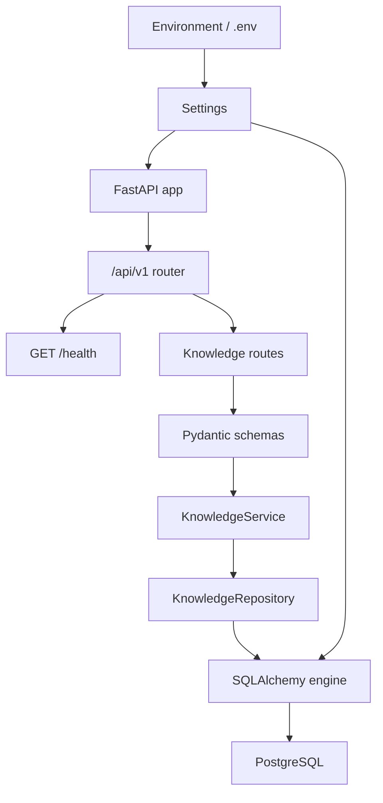
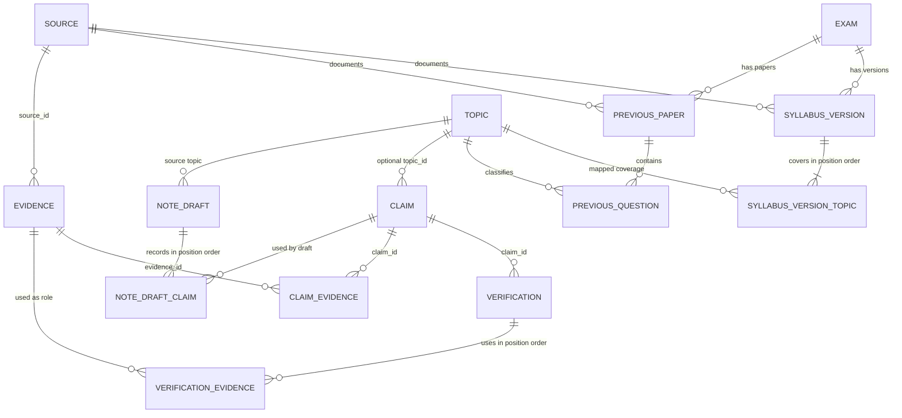
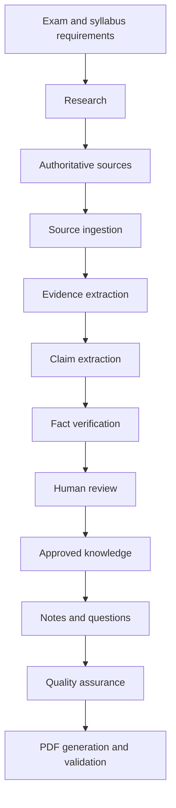

# Assam Exam AI — Living Architecture

## Purpose and trust rule

Assam Exam AI is intended to become a content-production and verification platform for Assam competitive examinations, including ADRE and Assam Government recruitment examinations. Its intended outputs include exam-oriented notes, questions, revision material, and downloadable PDFs.

The complete trust rule is:

> AI proposes → evidence supports → verification evaluates → humans approve where required.

An AI response is not verified merely because it is confident. Important factual claims must remain traceable to evidence, and insufficient or conflicting evidence must be surfaced rather than hidden.

## Current confirmed implementation

This section describes only the repository inspected on 2026-09-05 in Asia/Kolkata (UTC+05:30). Test results recorded in `workflow.md` and `task_log.md` were run against dedicated PostgreSQL test databases.

| Area | Confirmed state |
| --- | --- |
| Project | Python `>=3.12,<3.13`, managed with `uv` |
| API | FastAPI app with health, internal knowledge creation/retrieval/review routes, and a read-only deterministic Topic-priority assessment under `/api/v1` |
| Configuration | Pydantic Settings loading `.env`; tracked `.env.example` |
| Logging | Root stdout handler with duplicate-handler protection |
| Database access | Synchronous SQLAlchemy engine, session factory, and `get_db()` dependency |
| Local database | Docker Compose defines PostgreSQL 17 using a pgvector image |
| Migrations | Alembic is connected to application settings and `Base.metadata`; eight migrations exist, including Topic classification, verification-evidence provenance, approval states, stored note drafts, sourced syllabus versions, and sourced previous-paper questions |
| Persistence model | `Exam`, sourced `SyllabusVersion`, ordered syllabus/Topic mappings, sourced `PreviousPaper` and Topic-linked `PreviousQuestion` occurrences, `Topic`, `Source`, `Evidence`, `Claim`, `Verification`, `VerificationEvidence`, `NoteDraft`, and ordered provenance associations |
| Application layers | Pydantic knowledge schemas, a transactional knowledge service, and a SQLAlchemy knowledge repository |
| Tests | Ninety tests cover the foundation, sourced syllabus and previous-paper persistence/constraints, deterministic Topic priority, provenance constraints, end-to-end knowledge API, retrieval/linking, approval decisions, approved read boundaries, stored note-draft snapshots, and failure atomicity |
| Agents | Package placeholders only; no agent behavior is implemented |

### Current runtime flow

### Current data model

The diagram shows the database foreign keys and association structures currently defined. Typed ORM traversal is implemented for `Claim → relevant Evidence` and `Verification → VerificationEvidence → Evidence`; the Source/Evidence link still exposes only foreign-key columns.

## Planned architecture — not implemented

The repository instructions describe this target flow:

None of the research, ingestion, general search/retrieval, AI verification, full human-review workflow, content-generation, question-generation, QA, or PDF stages is currently implemented. The internal manual knowledge API now follows `route → schema → service/use case → repository → database`; it can create minimal Topics, optionally classify Claims by Topic, retrieve individual Evidence, link relevant Evidence to a Claim, retrieve the Claim with stable evidence IDs and separate verification/approval state, record a human approval decision, list only approved Claims in stable ID order, and retrieve a Verification with its Claim and ordered audit evidence provenance.

Claim-to-Evidence linking is idempotent under concurrent requests: PostgreSQL enforces the existing `(claim_id, evidence_id)` composite primary key, and the repository inserts with `ON CONFLICT DO NOTHING`. The service then freshly reloads the relationship before returning numerically sorted evidence IDs.

### Exam relevance and likelihood model

Exam relevance is a separate decision from factual correctness. A factual Claim or approved NoteDraft can be correct yet have low relevance to a particular exam.

The future model will use versioned, traceable inputs:

- an official syllabus version and its Topic mappings;
- legally usable previous-question records, each retaining exam, date/year, paper/level, source reference, and whether it is an exact prior question or an inferred Topic tag;
- human-reviewed mappings between Topics, Claims, NoteDrafts, and prior-question themes;
- current-affairs recency where relevant; and
- an explicit scoring-rule version and reviewer overrides.

It will output an explainable **exam-priority band** (`HIGH`, `MEDIUM`, or `LOW`) plus reasons such as “direct syllabus coverage” or “appeared in three tagged prior papers.” A future numeric score may be shown only as a calibrated priority estimate with its basis and validation record; it must never claim that a specific fact, NoteDraft, or AI-generated MCQ will appear in the actual exam.

The user-facing system must distinguish:

- **previous-year question** — a sourced historical record; from
- **AI-generated practice question** — a new question modeled on an exam pattern; and
- **exam-priority assessment** — an explainable recommendation, not a prediction or guarantee.

The fixed `topic-priority-v1` assessment is implemented. It combines one selected syllabus version with same-Exam previous-paper occurrences. Broader mappings, configurable scoring rules, calibration, likelihood prediction, and reviewer overrides remain planned.

## Current known gaps

- ORM relationships remain absent for the Source/Evidence link.
- Sources do not store publication or retrieval dates.
- Authority tiers, verdicts, confidence ranges, and license states lack database constraints.
- `Claim.verification_status` has a Python default but no server default.
- Cascading deletes can remove provenance history.
- The pgvector-capable image is configured, but no migration enables the extension and no vector column or Python pgvector dependency exists.
- The health route does not test database readiness.
- Docker Compose contains fixed development database credentials.
- There is no application Dockerfile or CI workflow, and the README is empty.

Evidence referenced by a `VerificationEvidence` audit row cannot be deleted. PostgreSQL restricts that deletion; deleting the Verification remains allowed and removes only its association rows.

Creating a Verification also updates its Claim's `verification_status`, `confidence`, and `last_verified_at` summary in the same transaction. The immutable Verification remains the audit record; these Claim fields represent only the latest verification result and are not human approval.

Every Claim begins with human approval state `DRAFT`. An `APPROVED` or `REJECTED` decision records the current UTC decision timestamp and supplied optional reviewer note. Setting the state to `DRAFT` clears both fields because there is no current human decision. Verification creation never changes approval state and does not publish a Claim. Reviewer identity, authentication, and decision history are not implemented.

`GET /api/v1/claims/approved` is the current safe read boundary for future content consumers. It returns only explicitly `APPROVED` Claims in ascending ID order with their existing verification summary, approval metadata, and relevant Evidence IDs; it does not generate content.

`GET /api/v1/topics/{topic_id}/claims/approved` narrows that safe boundary to one existing Topic. It returns only Claims matching both the Topic ID and `APPROVED` state in ascending Claim ID order, eagerly loading relevant Evidence; a missing Topic is distinct from an existing Topic with no approved Claims.

Topic classification is intentionally minimal: a Topic has only a unique name and timestamps/identity, and a Claim may reference one Topic or none. PostgreSQL sets `claims.topic_id` to null if its Topic is deleted. Ordered Topic coverage can now be recorded for a sourced SyllabusVersion, but Topic hierarchy, tags, Topic reads/lists, and search are not implemented.

Topic names are protected by the PostgreSQL unique constraint as the concurrency-safe authority. A duplicate Topic creation is rolled back and exposed as HTTP 409 with a stable conflict detail rather than leaking a database exception.

`POST /api/v1/topics/{topic_id}/note-draft-preview` is a deterministic, non-persistent internal preview. It reads the existing Topic-scoped approved-Claim boundary in ascending Claim ID order and renders only a Topic heading plus the Claims' unchanged statements as Markdown bullets. It returns 409 when the Topic has no approved Claims and does not mutate knowledge, create note storage, publish content, or use an LLM.

`POST /api/v1/topics/{topic_id}/note-drafts` persists that same deterministic Markdown contract as an internal draft together with the exact ordered approved Claims used. The draft and its links commit atomically. PostgreSQL requires non-negative, unique per-draft positions and one link per draft/Claim pair; deleting a referenced Topic or Claim is restricted, while deleting a draft may remove only its association rows. A stored draft has DRAFT meaning only: it has no approval or publication state and is not learner-ready content.

`GET /api/v1/note-drafts/{note_draft_id}` returns the stored Markdown and Claim IDs from the persisted position-ordered links. It eagerly loads the Topic and all links, does not query current approval eligibility or regenerate Markdown, and therefore remains an immutable snapshot when a linked Claim's approval state later changes.

Every NoteDraft begins in review state `DRAFT`. `APPROVED` or `REJECTED` records the current UTC decision time and optional reviewer note; resetting to `DRAFT` clears both. This decision is independent of its Claims and changes neither stored Markdown nor provenance. NoteDraft approval is not publication, and reviewer identity/history are not implemented.

`GET /api/v1/note-drafts/approved` is the internal downstream boundary for reviewed drafts. It filters only on each NoteDraft's own `APPROVED` state, returns drafts in ascending ID order, and eagerly loads their Topic and stored ordered Claim links. It returns stored snapshots without regenerating Markdown or reconsidering current Claim approval.

An Exam has unique code and name identifiers. Each SyllabusVersion belongs to one Exam, cites one existing Source, has a label unique within that Exam, and stores a non-empty ordered set of existing Topics. PostgreSQL restricts deletion of referenced Exams, Sources, Topics, and mapped SyllabusVersions so this syllabus provenance cannot be silently broken. SyllabusVersion itself records sourced coverage only. The separate deterministic `topic-priority-v1` assessment is implemented; numeric scoring, percentages, calibrated likelihood, and exam-appearance probability are not implemented.

A PreviousPaper belongs to one Exam, cites one Source, records a positive year, and has a label unique for that Exam/year. A PreviousQuestion records its exact paper, one Topic, non-negative unique position within the paper, non-blank source text, and optional source location reference. PostgreSQL restrictions protect the referenced Exam, Source, Paper, and Topic. These are historical occurrences only: answers, explanations, multi-Topic tags, configurable scoring, percentages, and probability are not implemented.

`GET /api/v1/syllabus-versions/{syllabus_version_id}/topics/{topic_id}/priority` combines one selected syllabus version with stored occurrences from that Exam only. The repository eagerly loads syllabus Topic links and uses one outer-join occurrence query, so counts do not use per-paper queries. The service counts question rows separately from distinct papers, returns sorted unique matched years, applies the fixed `topic-priority-v1` rule, and performs no writes. The result is an explainable priority aid, never an appearance probability. Configurable rules, calibration, percentages, likelihood prediction, and reviewer overrides remain planned.

## Architectural decisions recorded by repository instructions

- Build a modular FastAPI application backed by PostgreSQL, SQLAlchemy 2.x, Alembic, and eventually pgvector.
- Preserve the provenance chain among Source, Evidence, Claim, and Verification.
- Keep verification separate from human approval.
- Prefer small specialized components over a single general-purpose agent.
- Store structured, approved content before generating PDFs.
- Add entities only when their features are implemented.
- Change applied database history through new migrations rather than editing old migrations.

T-003 is approved at commit `603bddf260e9016e2db9215aec831ece7f018b50`. It implements the first manual internal vertical slice: create a source, attach evidence, create a claim, record a verification with ordered evidence, and retrieve that verification with its provenance. T-004, approved at commit `e2f9d170c335f5ab9037749654bba9edb77938ba`, synchronizes the Claim's latest verification summary in the same transaction. T-005, approved at commit `af76073a5ece57187f14540b519ec9606c2947a3`, adds direct Claim-summary retrieval. T-006, approved at commit `0a335483285835db8d9d3a76180c02ba4dad91e2`, adds concurrency-safe Claim-to-Evidence linking. Neither task performs automated research or factual verification.

## Working MVP approach

The immediate goal is a small working internal flow, not a full product. The first usable slice will be manual and API-driven:

Source → Evidence → Claim → Verification → Verification with provenance

It does not use an LLM, automatic ingestion, authentication, a learner UI, payments, or PDF generation. Those remain planned features.

T-007 is approved at commit `fbb1555acfecdc0942c032727684bce9d5e1e3a5`; individual Evidence can now be inspected through the internal API. The next required trust boundary is explicit human approval, kept separate from verification.

T-008 is approved at commit `64c143498af19c9dc120093c5544e00c92011ef8`. It establishes the explicit human approval boundary; only Claims explicitly marked `APPROVED` will be eligible for future content-generation input.

T-009 is approved at commit `262bb7db9226ef31f7d9e61e9c7323f9cbd512a8`. The approved-Claims endpoint is the first safe internal input boundary for future generation. Topic classification is the next missing prerequisite for topic-based notes and MCQs.

T-010 is approved at commit `1a8a1ed15a94c128c7fb89442aee605d3263cbf6`. Approved knowledge can now be classified by one minimal Topic; the next step is to retrieve approved Claims for one Topic as a focused future generation input.

T-011 is approved at commit `209ea1678136030ba340b243c3735d1a9f65ee67`. It provides the safe, Topic-scoped approved-Claim boundary that a future internal note or MCQ draft process may consume. It does not generate, publish, or alter knowledge.

T-012 is approved at commit `1c33a89056eda9b04db2c71c9b60d17d3e8ccd0f`. It proves the first internal notes-shaped output using only approved knowledge; the preview is deterministic, non-persistent, and never published. The next boundary is persistent draft storage with exact Claim provenance, before any LLM integration.

T-013 is approved at commit `3aacf3d2b76098092cfae072c7cfa4ca40c88e3f`. A stored internal NoteDraft now retains exact ordered Claim provenance and is protected from losing referenced Topics or Claims. It is still not approved or learner-ready. The next need is safe individual retrieval for internal review.

T-014 is approved at commit `c595da4e9ce8aedd60bf0f881d9bb59c6618881d`. Internal reviewers can now retrieve an immutable stored draft snapshot with exact input-Claim provenance. The next trust boundary is an explicit human decision on the draft itself, kept separate from approval of individual Claims.

T-015 is approved at commit `811f10af3ee63a22e253ff24e9450770e2cbbbc2`. A NoteDraft now has an explicit human-review decision separate from its Claims. `APPROVED` remains an internal eligibility state, not public release. The next small boundary is an internal read of approved drafts only.

T-016 is approved at commit `611fcb87b38b8506b1a509bea1c0abb4f581c5a7`. The system can now read only human-approved NoteDraft snapshots as an internal downstream boundary. It still has no syllabus or previous-paper data, so it cannot yet make evidence-based exam-priority assessments. T-017 begins that data foundation by recording sourced syllabus versions and their ordered Topics.

T-017 is approved at commit `e1aea55991671679d1666f4e472a6ad7425310df`. The repository now records Exams and immutable, sourced syllabus versions with ordered Topic coverage. This is provenance-backed exam-scope data only; it does not infer importance, likelihood, or probability. T-018 will add sourced previous-paper question occurrences so later relevance bands can use historical evidence.

T-018 is approved at commit `c7d7b9f18d68c9da1aeea5747b5925bf5922ead8`. The system can now retain sourced historical question occurrences with exact Exam, Paper, Topic, position, text, and source-location provenance. These records are evidence that a Topic appeared in stored past-paper data, not proof that it will appear again. T-019 will combine this history with one selected syllabus version through a deterministic, explainable priority rule.
