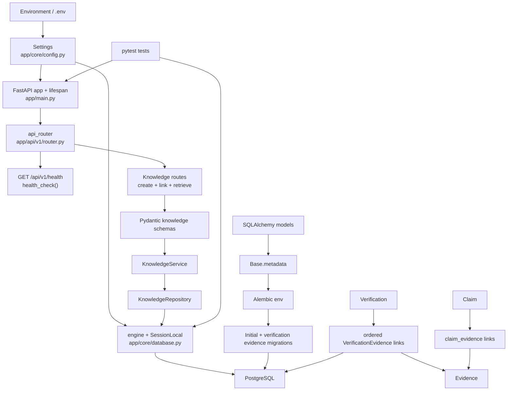
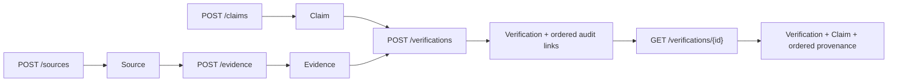
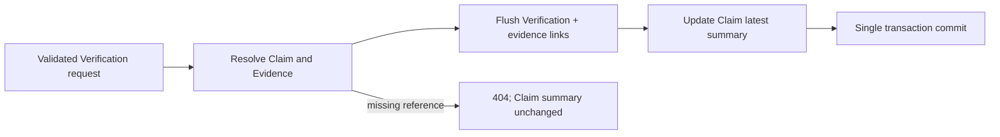
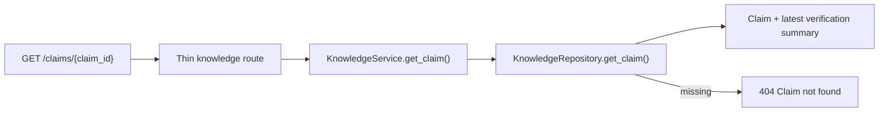
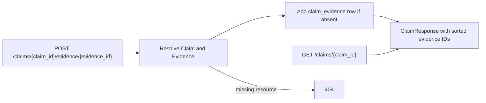
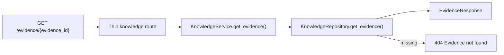
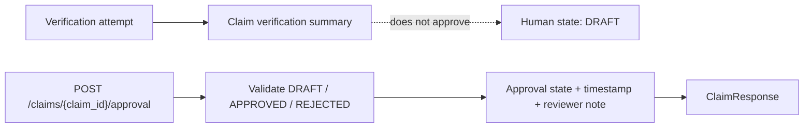
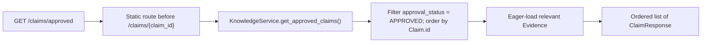
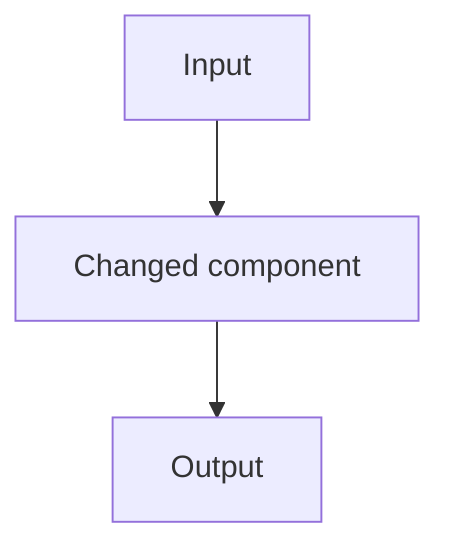

# Assam Exam AI — Workflow and Component Register

## Purpose

This file is a chronological register of committed components and their current responsibilities. Planned work is kept separate from the implemented register. The repository was inspected on 2026-09-04 in Asia/Kolkata (UTC+05:30).

## Current runtime and database flow



## Chronological commit register

| Commit | Date | Confirmed responsibility |
| --- | --- | --- |
| `80ffc262d81f85daf4f9a0fb34ab6aaf9e6bb648` | 2026-08-29 | Initial repository commit |
| `d61f88d018739f4b7f772aafe488c2e4ae3f91d7` | 2026-08-30 | FastAPI application foundation commit |
| `e31f71e3c2545ef9cf8fb552aba1a3eff858f994` | 2026-08-30 | FastAPI application foundation commit |
| `3c46b45580c2ddb259ef6801fd836f7d237b828d` | 2026-08-31 | PostgreSQL, SQLAlchemy models, and Alembic migration foundation |
| `bae213e1de35ee08d3788d7b9f42e9d0d36d503f` | 2026-09-01 | Repository operating instructions in `AGENTS.md` |
| `e8d553a8816ba5d3968b96998caa8d6e9e507f99` | 2026-09-02 | T-002 added ordered verification-evidence provenance with deletion protection |
| `603bddf260e9016e2db9215aec831ece7f018b50` | 2026-09-04 | T-003 added the minimal end-to-end internal knowledge API and atomic missing-Evidence rejection coverage |
| `e2f9d170c335f5ab9037749654bba9edb77938ba` | 2026-09-04 | T-004 synchronized each new Verification's latest result into its Claim summary atomically |
| `af76073a5ece57187f14540b519ec9606c2947a3` | 2026-09-04 | T-005 added direct Claim-summary retrieval with clear missing-Claim handling |
| `0a335483285835db8d9d3a76180c02ba4dad91e2` | 2026-09-04 | T-006 added concurrency-safe relevant Evidence linking to Claims |
| `fbb1555acfecdc0942c032727684bce9d5e1e3a5` | 2026-09-04 | T-007 added individual Evidence retrieval with clear missing-resource handling |

The register reports current responsibility based on the inspected tree. T-002 was reviewed against commit `e8d553a8816ba5d3968b96998caa8d6e9e507f99`, T-003 against `603bddf260e9016e2db9215aec831ece7f018b50`, and T-004 against `e2f9d170c335f5ab9037749654bba9edb77938ba`; their test results are recorded below.

## Routes

| Route | Callable | File | Responsibility |
| --- | --- | --- | --- |
| `GET /api/v1/health` | `health_check()` | `app/api/v1/routes/health.py` | Returns `{"status": "ok"}` without checking the database |
| `POST /api/v1/sources` | `create_source()` | `app/api/v1/routes/knowledge.py` | Validates and creates a Source |
| `POST /api/v1/evidence` | `create_evidence()` | `app/api/v1/routes/knowledge.py` | Validates and creates Evidence for an existing Source |
| `GET /api/v1/evidence/{evidence_id}` | `get_evidence()` | `app/api/v1/routes/knowledge.py` | Returns one Evidence record or a clear 404 |
| `POST /api/v1/claims` | `create_claim()` | `app/api/v1/routes/knowledge.py` | Validates and creates a Claim |
| `GET /api/v1/claims/approved` | `get_approved_claims()` | `app/api/v1/routes/knowledge.py` | Returns approved Claims in stable ID order; registered before the dynamic Claim route |
| `GET /api/v1/claims/{claim_id}` | `get_claim()` | `app/api/v1/routes/knowledge.py` | Returns a Claim and its current latest-verification summary |
| `POST /api/v1/claims/{claim_id}/evidence/{evidence_id}` | `link_claim_evidence()` | `app/api/v1/routes/knowledge.py` | Idempotently links relevant Evidence to a Claim |
| `POST /api/v1/claims/{claim_id}/approval` | `record_claim_approval()` | `app/api/v1/routes/knowledge.py` | Records a Claim's explicit human approval state, timestamp, and optional note |
| `POST /api/v1/verifications` | `create_verification()` | `app/api/v1/routes/knowledge.py` | Creates a Verification with ordered evidence audit links |
| `GET /api/v1/verifications/{verification_id}` | `get_verification()` | `app/api/v1/routes/knowledge.py` | Returns a Verification, its Claim, and ordered evidence provenance |

## Callable functions

| Callable | File | Responsibility |
| --- | --- | --- |
| `lifespan()` | `app/main.py` | Logs application startup and shutdown around the FastAPI lifespan |
| `setup_logging()` | `app/core/logging.py` | Configures an INFO-level stdout handler once |
| `get_db()` | `app/core/database.py` | Yields a SQLAlchemy session and closes it afterward |
| `health_check()` | `app/api/v1/routes/health.py` | Implements the health route response |
| `run_migrations_offline()` | `migrations/env.py` | Configures and runs Alembic without a live connection |
| `run_migrations_online()` | `migrations/env.py` | Connects to the configured database and runs Alembic migrations |
| `upgrade()` | `migrations/versions/774778a8bb78_create_knowledge_foundation.py` | Creates the initial knowledge tables and foreign keys |
| `downgrade()` | `migrations/versions/774778a8bb78_create_knowledge_foundation.py` | Drops the initial knowledge tables in dependency-safe order |
| `_not_found()` | `app/api/v1/routes/knowledge.py` | Converts a service missing-resource error to HTTP 404 |
| `create_source()` | `app/api/v1/routes/knowledge.py` | Delegates Source creation to `KnowledgeService` |
| `create_evidence()` | `app/api/v1/routes/knowledge.py` | Delegates Evidence creation and maps a missing Source to 404 |
| `get_evidence()` | `app/api/v1/routes/knowledge.py` | Delegates Evidence retrieval and maps missing Evidence to 404 |
| `create_claim()` | `app/api/v1/routes/knowledge.py` | Delegates Claim creation to `KnowledgeService` |
| `get_approved_claims()` | `app/api/v1/routes/knowledge.py` | Delegates the approved-knowledge read to `KnowledgeService` |
| `get_claim()` | `app/api/v1/routes/knowledge.py` | Delegates Claim retrieval and maps a missing Claim to 404 |
| `link_claim_evidence()` | `app/api/v1/routes/knowledge.py` | Delegates relevant-evidence linking and maps missing resources to 404 |
| `record_claim_approval()` | `app/api/v1/routes/knowledge.py` | Delegates the human decision and maps a missing Claim to 404 |
| `create_verification()` | `app/api/v1/routes/knowledge.py` | Delegates Verification creation and maps missing references to 404 |
| `get_verification()` | `app/api/v1/routes/knowledge.py` | Delegates provenance retrieval and maps a missing Verification to 404 |

## Models and persistent structures

| Model or structure | File | Responsibility |
| --- | --- | --- |
| `Base` | `app/models/base.py` | Declarative metadata root for SQLAlchemy models |
| `Source` | `app/models/source.py` | Stores basic source identity, authority, location, license status, hash, and creation time |
| `Evidence` | `app/models/evidence.py` | Stores text and an optional location reference belonging to a source |
| `Claim` | `app/models/claim.py` | Stores an atomic statement, verification summary, separate constrained human approval fields, and typed traversal to relevant Evidence |
| `Verification` | `app/models/verification.py` | Stores one verdict, confidence, reasoning, and timestamp for a claim |
| `VerificationEvidence` | `app/models/verification_evidence.py` | Records evidence used by a verification, its role, and its non-negative ordered position; referenced evidence is deletion-restricted |
| `claim_evidence` | `app/models/claim_evidence.py` | Associates claims and evidence with a composite primary key |

## T-003 schemas

| Schema | File | Responsibility |
| --- | --- | --- |
| `EvidenceRole` | `app/schemas/knowledge.py` | Restricts evidence roles to `SUPPORTS`, `CONTRADICTS`, or `CONTEXT` |
| `VerificationVerdict` | `app/schemas/knowledge.py` | Defines accepted verification verdict values |
| `ClaimApprovalStatus` | `app/schemas/knowledge.py` | Restricts human decisions to `DRAFT`, `APPROVED`, or `REJECTED` |
| `SourceCreate` / `SourceResponse` | `app/schemas/knowledge.py` | Validate Source input and serialize persisted Sources |
| `EvidenceCreate` / `EvidenceResponse` | `app/schemas/knowledge.py` | Validate Evidence input and serialize persisted Evidence |
| `ClaimCreate` / `ClaimResponse` | `app/schemas/knowledge.py` | Validate Claim input and serialize Claims with relevant Evidence IDs plus separate approval state |
| `ClaimApprovalCreate` | `app/schemas/knowledge.py` | Validates an approval state and optional reviewer note |
| `VerificationEvidenceCreate` | `app/schemas/knowledge.py` | Validates an evidence ID, role, and non-negative position |
| `VerificationCreate` | `app/schemas/knowledge.py` | Validates Verification input and rejects duplicate evidence IDs or positions |
| `VerificationEvidenceResponse` | `app/schemas/knowledge.py` | Serializes evidence content with its audit role and position |
| `VerificationResponse` | `app/schemas/knowledge.py` | Serializes Verification details, Claim details, and ordered provenance |

## T-003 repository and service

| Component | File | Responsibility |
| --- | --- | --- |
| `KnowledgeRepository` | `app/repositories/knowledge.py` | Encapsulates Source, Evidence, Claim, and Verification persistence queries |
| `add_source()` / `get_source()` | `app/repositories/knowledge.py` | Persist or retrieve Sources |
| `add_evidence()` / `get_evidence()` | `app/repositories/knowledge.py` | Persist or retrieve Evidence |
| `add_claim()` / `get_claim()` | `app/repositories/knowledge.py` | Persist Claims or retrieve them with relevant Evidence eagerly loaded |
| `get_approved_claims()` | `app/repositories/knowledge.py` | Selects only `APPROVED` Claims in ascending ID order with relevant Evidence eagerly loaded |
| `link_claim_evidence()` | `app/repositories/knowledge.py` | Uses PostgreSQL `INSERT ... ON CONFLICT DO NOTHING` against the composite key for concurrency-safe idempotency |
| `update_claim_approval()` | `app/repositories/knowledge.py` | Updates only the Claim's approval state and its nullable decision timestamp and reviewer note |
| `add_verification()` | `app/repositories/knowledge.py` | Persists a Verification and its audit links |
| `update_claim_verification_summary()` | `app/repositories/knowledge.py` | Copies a new Verification's verdict, confidence, and creation time into the Claim's latest summary |
| `get_verification()` | `app/repositories/knowledge.py` | Eagerly retrieves Claim and ordered evidence-link data |
| `ResourceNotFoundError` | `app/services/knowledge.py` | Carries the missing resource type and identifier |
| `KnowledgeService` | `app/services/knowledge.py` | Owns knowledge use cases and transaction boundaries |
| `create_source()` | `app/services/knowledge.py` | Creates and commits a Source |
| `create_evidence()` | `app/services/knowledge.py` | Verifies the Source exists, then creates Evidence |
| `get_evidence()` | `app/services/knowledge.py` | Retrieves Evidence through the repository or raises a missing-resource error |
| `create_claim()` | `app/services/knowledge.py` | Creates and commits a Claim |
| `get_approved_claims()` | `app/services/knowledge.py` | Serializes the repository's ordered approved Claims with the existing `ClaimResponse` builder |
| `get_claim()` | `app/services/knowledge.py` | Retrieves a Claim through the repository or raises a missing-resource error |
| `link_claim_evidence()` | `app/services/knowledge.py` | Validates both resources, performs the conflict-safe insert, commits, freshly reloads the Claim, and returns its response |
| `record_claim_approval()` | `app/services/knowledge.py` | Records APPROVED/REJECTED with the current UTC time and supplied note, or clears decision metadata for DRAFT, then commits |
| `_claim_response()` | `app/services/knowledge.py` | Serializes a Claim with sorted relevant Evidence IDs only |
| `create_verification()` | `app/services/knowledge.py` | Validates references, records ordered audit links, and synchronizes the Claim summary atomically |
| `get_verification()` | `app/services/knowledge.py` | Builds the nested verification-provenance response |
| `_commit()` | `app/services/knowledge.py` | Commits a use case and rolls back on failure |
| `_commit_verification()` | `app/services/knowledge.py` | Flushes the Verification, updates its Claim summary, and commits or rolls back both together |

## Migration functions

| Function | File | Responsibility |
| --- | --- | --- |
| `run_migrations_offline()` | `migrations/env.py` | Runs the configured migration context in offline mode |
| `run_migrations_online()` | `migrations/env.py` | Runs the configured migration context through a database connection |
| `upgrade()` | `migrations/versions/774778a8bb78_create_knowledge_foundation.py` | Creates `claims`, `sources`, `evidence`, `verifications`, and `claim_evidence` |
| `downgrade()` | `migrations/versions/774778a8bb78_create_knowledge_foundation.py` | Removes those five tables |
| `upgrade()` | `migrations/versions/92b13f7c4e61_add_verification_evidence.py` | Creates `verification_evidence` with role, position, ordering constraints, restricted Evidence deletion, and cascading association cleanup for Verification deletion |
| `downgrade()` | `migrations/versions/92b13f7c4e61_add_verification_evidence.py` | Removes `verification_evidence` |
| `upgrade()` | `migrations/versions/c31a8f4d2b90_add_claim_human_approval.py` | Adds constrained Claim approval state, decision timestamp, and reviewer note |
| `downgrade()` | `migrations/versions/c31a8f4d2b90_add_claim_human_approval.py` | Removes the Claim approval constraint and fields |

## Tests

| Test | File | Responsibility | Current result |
| --- | --- | --- | --- |
| `test_settings()` | `tests/test_config.py` | Checks baseline application setting values | Passed in full suite for T-002 |
| `test_database_connection()` | `tests/test_database.py` | Executes `SELECT 1` through the configured engine | Passed in full suite for T-002 |
| `test_health_check()` | `tests/test_health.py` | Checks health status code and JSON body | Passed in full suite for T-002 |
| `test_logging_setup()` | `tests/test_logging.py` | Checks an INFO log message is captured | Passed in full suite for T-002 |
| `test_verification_retains_ordered_evidence()` | `tests/test_verification_evidence.py` | Proves ORM traversal retains database-defined evidence order and roles | Passed for T-002 |
| `test_verification_evidence_rejects_invalid_values()` | `tests/test_verification_evidence.py` | Proves PostgreSQL rejects an invalid role and a negative position | Passed twice through parametrization for T-002 |
| `test_used_evidence_cannot_be_deleted()` | `tests/test_verification_evidence.py` | Proves PostgreSQL blocks deletion of referenced evidence and retains its audit link | Passed for T-002 |
| `test_verification_evidence_rejects_duplicate_position()` | `tests/test_verification_evidence.py` | Proves one verification cannot assign the same position to two evidence links | Passed for T-002 |
| `test_complete_knowledge_api_flow()` | `tests/test_knowledge_api.py` | Exercises the full flow and confirms direct Claim retrieval exposes the synchronized summary | Passed for T-005 |
| `test_create_evidence_returns_404_for_missing_source()` | `tests/test_knowledge_api.py` | Confirms a missing Source reference returns a clear 404 | Passed for T-003 |
| `test_get_evidence_returns_created_evidence()` | `tests/test_knowledge_api.py` | Confirms Evidence retrieval returns the existing response fields including location reference | Passed for T-007 |
| `test_get_evidence_returns_404_for_missing_evidence()` | `tests/test_knowledge_api.py` | Confirms retrieving missing Evidence returns the clear 404 format | Passed for T-007 |
| `test_claim_defaults_to_draft_approval()` | `tests/test_knowledge_api.py` | Confirms a new Claim defaults to `DRAFT` without a decision timestamp or note | Passed for T-008 |
| `test_record_claim_approval()` | `tests/test_knowledge_api.py` | Confirms APPROVED and REJECTED decisions persist with timestamp and reviewer note | Passed twice through parametrization for T-008 |
| `test_returning_claim_approval_to_draft_clears_decision()` | `tests/test_knowledge_api.py` | Confirms an approved Claim returned to DRAFT clears its decision timestamp and reviewer note | Passed for the T-008 correction |
| `test_record_claim_approval_rejects_invalid_status()` | `tests/test_knowledge_api.py` | Confirms an invalid approval state returns 422 | Passed for T-008 |
| `test_record_claim_approval_returns_404_for_missing_claim()` | `tests/test_knowledge_api.py` | Confirms approval of a missing Claim returns the clear 404 | Passed for T-008 |
| `test_database_rejects_invalid_claim_approval_status()` | `tests/test_knowledge_api.py` | Confirms PostgreSQL rejects approval values outside the constrained set | Passed for T-008 |
| `test_get_claim_returns_404_for_missing_claim()` | `tests/test_knowledge_api.py` | Confirms retrieving a missing Claim returns a clear 404 | Passed for T-005 |
| `test_get_approved_claims_returns_empty_list()` | `tests/test_knowledge_api.py` | Confirms the approved-Claims endpoint returns an empty list when none exist | Passed for T-009 |
| `test_get_approved_claims_filters_orders_and_retains_summaries()` | `tests/test_knowledge_api.py` | Confirms DRAFT/REJECTED exclusion, APPROVED inclusion in ID order, and retained evidence/verification/approval fields | Passed for T-009 |
| `test_link_claim_evidence_is_idempotent_and_retrievable()` | `tests/test_knowledge_api.py` | Confirms linking, duplicate idempotency, one association row per pair, and stable ID-only retrieval | Passed for T-006 |
| `test_link_claim_evidence_returns_404_for_missing_evidence()` | `tests/test_knowledge_api.py` | Confirms linking a missing Evidence resource returns the clear 404 format | Passed for T-006 |
| `test_repository_duplicate_claim_evidence_insert_is_conflict_safe()` | `tests/test_knowledge_api.py` | Executes the database insertion path twice and confirms both calls succeed with one association row | Passed for T-006 correction |
| `test_create_verification_rejects_invalid_evidence_role()` | `tests/test_knowledge_api.py` | Confirms an invalid evidence role returns validation status 422 | Passed for T-003 |
| `test_create_verification_returns_404_without_partial_record()` | `tests/test_knowledge_api.py` | Confirms missing Evidence creates no Verification/link and leaves the Claim summary unchanged | Passed for T-004 |

### T-002 verification results

- `uv run pytest tests/test_verification_evidence.py -q`: 5 passed in 0.61s on the final review run.
- `uv run pytest -q`: 9 passed in 0.87s with one Starlette deprecation warning from the installed FastAPI test client.
- Migration check on `assam_exam_ai_t002_test`: upgrade to head, downgrade to `774778a8bb78`, re-upgrade to head, and `alembic check` all exited 0; no new upgrade operations were detected.
- Changed-file Ruff check: passed.
- `uv run ruff check .`: failed with 12 pre-existing findings outside the T-002 changes.

### T-003 end-to-end flow and results



- `uv run pytest tests/test_knowledge_api.py -q`: 4 passed in 0.74s with one Starlette deprecation warning on the final review run.
- `uv run pytest -q`: 13 passed in 0.87s with one Starlette deprecation warning on the final review run.
- Changed-file Ruff check: passed.
- A fresh `assam_exam_ai_t003_test` database upgraded through both existing migrations to head; no database schema migration was required by T-003.
- Post-push architecture review: Approved. The API uses eager loading for the retrieval path, and the missing-Evidence test confirms no partial Verification or provenance row is written.

### T-004 Claim summary synchronization



- `update_claim_verification_summary()` copies the Verification verdict, confidence, and database creation time to the linked Claim.
- `_commit_verification()` commits the Verification, provenance links, and Claim summary together and rolls back on failure.
- `uv run pytest tests/test_knowledge_api.py -q`: 4 passed in 1.17s with one Starlette deprecation warning on the final run.
- `uv run pytest -q`: 13 passed in 1.35s with one Starlette deprecation warning on the final run.
- Changed-file Ruff check: passed.
- No database schema migration was required; a fresh `assam_exam_ai_t004_test` database upgraded to the existing migration head successfully.
- Post-push architecture review: Approved. The Claim summary is explicitly the latest verification result, never human approval.

### T-005 Claim summary retrieval



- `uv run pytest tests/test_knowledge_api.py -q`: 5 passed in 1.51s with one Starlette deprecation warning.
- `uv run pytest -q`: 14 passed in 1.01s with one Starlette deprecation warning.
- Changed-file Ruff check: passed.
- No database schema migration was required; a fresh `assam_exam_ai_t005_test` database upgraded through both existing migrations to head successfully.
- Post-push architecture review: Approved. This endpoint returns only the current Claim summary; it does not add history, search, or human approval.

### T-006 relevant Evidence linking



- Relevant Claim evidence is distinct from the evidence recorded for an individual Verification attempt.
- `uv run pytest tests/test_knowledge_api.py -q`: 8 passed in 1.04s with one Starlette deprecation warning on the concurrency-correction run.
- `uv run pytest -q`: 17 passed in 1.10s with one Starlette deprecation warning on the concurrency-correction run.
- Changed-file Ruff check: passed.
- No database schema migration was required; a fresh `assam_exam_ai_t006_test` database upgraded through both existing migrations to head, and `uv run alembic check` reported no new upgrade operations.
- Concurrency correction: the composite primary key plus PostgreSQL `ON CONFLICT DO NOTHING` guarantees duplicate inserts do not fail or create a second row; `populate_existing` refreshes the eagerly loaded relationship for the response.
- Correction migration check: `uv run alembic check` against `assam_exam_ai_t006_correction_test` exited 0 with no new upgrade operations detected.
- Post-push architecture review: Approved. Claim relevance and Verification audit evidence remain distinct; conflict-safe insertion preserves idempotency under concurrency.

### T-007 Evidence retrieval



- `uv run pytest tests/test_knowledge_api.py -q`: 10 passed in 0.93s with one Starlette deprecation warning.
- `uv run pytest -q`: 19 passed in 1.00s with one Starlette deprecation warning.
- Changed-file Ruff check: passed.
- No database schema migration was required; a fresh `assam_exam_ai_t007_test` database upgraded through both existing migrations to head, and `uv run alembic check` reported no new upgrade operations.

### T-008 Claim human approval boundary



- `uv run pytest tests/test_knowledge_api.py -q`: 16 passed in 1.02s with one Starlette deprecation warning.
- `uv run pytest -q`: 25 passed in 1.10s with one Starlette deprecation warning.
- Changed-file Ruff check: passed.
- Fresh `assam_exam_ai_t008_test` upgrade to `c31a8f4d2b90`, downgrade to `92b13f7c4e61`, and re-upgrade all exited 0.
- A Claim inserted at the prior revision migrated to `DRAFT` with null decision timestamp and reviewer note.
- `uv run alembic check` exited 0 with no new upgrade operations detected.
- Approval-state consistency correction: `APPROVED` and `REJECTED` retain the supplied note and receive a current UTC decision timestamp; `DRAFT` clears both decision fields regardless of the request note.
- Correction verification: `uv run pytest tests/test_knowledge_api.py -q` passed 17 tests in 1.29s with one Starlette deprecation warning; `uv run pytest -q` passed 26 tests in 1.23s with the same warning. Changed-file Ruff and `uv run alembic check` passed; Alembic reported no new upgrade operations after a fresh upgrade to `c31a8f4d2b90`.

### T-009 Approved knowledge read boundary



- Focused verification: `uv run pytest tests/test_knowledge_api.py -q` passed 19 tests in 1.23s with one Starlette deprecation warning.
- Full verification: `uv run pytest -q` passed 28 tests in 1.62s with one Starlette deprecation warning.
- Changed-file Ruff passed. No database schema migration is required; the endpoint reads the existing Claim approval fields, and `uv run alembic check` reported no new upgrade operations on the freshly upgraded `assam_exam_ai_t009_test` database.

## Template for future pushed changes

Copy and append this section after inspecting the pushed commit and its reported checks.

````markdown
### W-XXX — Short change title

| Field | Value |
| --- | --- |
| Task ID | `T-XXX` |
| Implementation commit | `<full SHA>` |
| Date | `<UTC date>` |
| Components changed | `<paths and concise description>` |
| Test result | Passed / Failed / Not run — `<exact command and result or blocker>` |
| Documentation review | Pending / Approved / Changes requested |

#### Changed flow



#### Component changes

| Component | File | Change | Responsibility | Tests |
| --- | --- | --- | --- | --- |
| `name()` | `path/to/file.py` | Added / changed / removed | Short responsibility | `test_name()` or Not applicable |
````

### T-007 post-push review

- Approved at `fbb1555acfecdc0942c032727684bce9d5e1e3a5`.
- The endpoint is intentionally a single-record read; no source details, lists, search, or history were introduced.

### T-008 post-push review

- Approved at `64c143498af19c9dc120093c5544e00c92011ef8`.
- Verification and approval remain intentionally separate. `DRAFT` clears decision metadata; it is not a decision.
