# Assam Exam AI — Workflow and Component Register

## Purpose

This file is a chronological register of committed components and their current responsibilities. Planned work is kept separate from the implemented register. The repository was inspected on 2026-09-05 in Asia/Kolkata (UTC+05:30).

## Current runtime and database flow

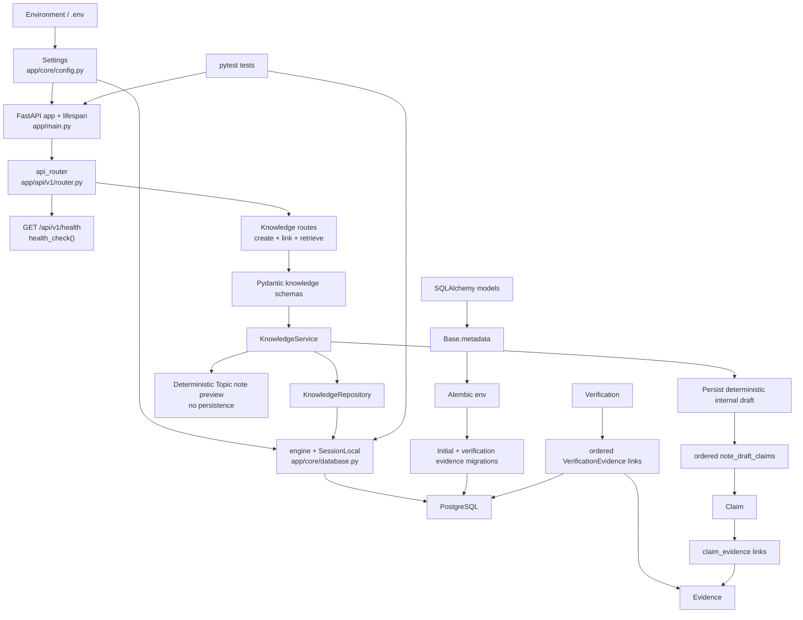

## Chronological commit register

| Commit | Date | Confirmed responsibility |
| --- | --- | --- |
| `80ffc262d81f85daf4f9a0fb34ab6aaf9e6bb648` | 2026-08-29 | Initial repository commit |
| `d61f88d018739f4b7f772aafe488c2e4ae3f91d7` | 2026-08-30 | FastAPI application foundation commit |
| `e31f71e3c2545ef9cf8fb552aba1a3eff858f994` | 2026-08-30 | FastAPI application foundation commit |
| `3c46b45580c2ddb259ef6801fd836f7d237b828d` | 2026-08-31 | PostgreSQL, SQLAlchemy models, and Alembic migration foundation |
| `bae213e1de35ee08d3788d7b9f42e9d0d36d503f` | 2026-09-01 | Repository operating instructions in `AGENTS.md` |
| `e8d553a8816ba5d3968b96998caa8d6e9e507f99` | 2026-09-02 | T-002 added ordered verification-evidence provenance with deletion protection |
| `603bddf260e9016e2db9215aec831ece7f018b50` | 2026-09-04 | T-003 added the minimal end-to-end internal knowledge API and atomic missing-Evidence rejection coverage |
| `e2f9d170c335f5ab9037749654bba9edb77938ba` | 2026-09-04 | T-004 synchronized each new Verification's latest result into its Claim summary atomically |
| `af76073a5ece57187f14540b519ec9606c2947a3` | 2026-09-04 | T-005 added direct Claim-summary retrieval with clear missing-Claim handling |
| `0a335483285835db8d9d3a76180c02ba4dad91e2` | 2026-09-04 | T-006 added concurrency-safe relevant Evidence linking to Claims |
| `fbb1555acfecdc0942c032727684bce9d5e1e3a5` | 2026-09-04 | T-007 added individual Evidence retrieval with clear missing-resource handling |
| `64c143498af19c9dc120093c5544e00c92011ef8` | 2026-09-04 | T-008 added independent Claim human-approval state and decisions |
| `262bb7db9226ef31f7d9e61e9c7323f9cbd512a8` | 2026-09-04 | T-009 added the global approved-Claims read boundary |
| `1a8a1ed15a94c128c7fb89442aee605d3263cbf6` | 2026-09-04 | T-010 added minimal Topic classification and conflict handling |
| `209ea1678136030ba340b243c3735d1a9f65ee67` | 2026-09-04 | T-011 added Topic-scoped approved-Claim retrieval |
| `1c33a89056eda9b04db2c71c9b60d17d3e8ccd0f` | 2026-09-04 | T-012 added a deterministic non-persistent Topic note-draft preview |
| `3aacf3d2b76098092cfae072c7cfa4ca40c88e3f` | 2026-09-04 | T-013 added persistent internal note drafts with ordered Claim provenance |
| `c595da4e9ce8aedd60bf0f881d9bb59c6618881d` | 2026-09-04 | T-014 added immutable stored NoteDraft snapshot retrieval |
| `811f10af3ee63a22e253ff24e9450770e2cbbbc2` | 2026-09-04 | T-015 added independent human review state to stored NoteDrafts |
| `611fcb87b38b8506b1a509bea1c0abb4f581c5a7` | 2026-09-04 | T-016 added the internal approved-NoteDraft read boundary |

The register reports current responsibility based on the inspected tree. T-002 was reviewed against commit `e8d553a8816ba5d3968b96998caa8d6e9e507f99`, T-003 against `603bddf260e9016e2db9215aec831ece7f018b50`, and T-004 against `e2f9d170c335f5ab9037749654bba9edb77938ba`; their test results are recorded below.

## Routes

| Route | Callable | File | Responsibility |
| --- | --- | --- | --- |
| `GET /api/v1/health` | `health_check()` | `app/api/v1/routes/health.py` | Returns `{"status": "ok"}` without checking the database |
| `POST /api/v1/sources` | `create_source()` | `app/api/v1/routes/knowledge.py` | Validates and creates a Source |
| `POST /api/v1/exams` | `create_exam()` | `app/api/v1/routes/knowledge.py` | Creates an Exam with stable unique code/name conflict handling |
| `POST /api/v1/syllabus-versions` | `create_syllabus_version()` | `app/api/v1/routes/knowledge.py` | Atomically stores a sourced syllabus version and ordered Topic mappings |
| `POST /api/v1/content-versions` | `create_content_version()` | `app/api/v1/routes/knowledge.py` | Creates explicit canonical identity for one mapped SyllabusVersion/Topic |
| `GET /api/v1/content-versions/{content_version_id}` | `get_content_version()` | `app/api/v1/routes/knowledge.py` | Retrieves stored ContentVersion identity only |
| `GET /api/v1/syllabus-versions/{syllabus_version_id}/topics/{topic_id}/priority` | `get_topic_priority()` | `app/api/v1/routes/knowledge.py` | Returns the read-only deterministic v1 Topic priority assessment |
| `POST /api/v1/previous-papers` | `create_previous_paper()` | `app/api/v1/routes/knowledge.py` | Creates a sourced previous paper with stable per-Exam/year label conflicts |
| `POST /api/v1/previous-questions` | `create_previous_question()` | `app/api/v1/routes/knowledge.py` | Records one exact Topic-linked question occurrence at a paper position |
| `POST /api/v1/topics` | `create_topic()` | `app/api/v1/routes/knowledge.py` | Validates and creates a uniquely named Topic |
| `GET /api/v1/topics/{topic_id}/claims/approved` | `get_approved_claims_by_topic()` | `app/api/v1/routes/knowledge.py` | Returns approved Claims for one existing Topic in stable ID order |
| `POST /api/v1/topics/{topic_id}/note-draft-preview` | `create_note_draft_preview()` | `app/api/v1/routes/knowledge.py` | Returns deterministic Markdown from one Topic's approved Claims without persistence |
| `POST /api/v1/topics/{topic_id}/note-drafts` | `create_note_draft()` | `app/api/v1/routes/knowledge.py` | Atomically stores deterministic Markdown and ordered Claim provenance as an internal draft |
| `GET /api/v1/note-drafts/approved` | `get_approved_note_drafts()` | `app/api/v1/routes/knowledge.py` | Returns only approved stored NoteDraft snapshots in ascending ID order |
| `GET /api/v1/note-drafts/{note_draft_id}` | `get_note_draft()` | `app/api/v1/routes/knowledge.py` | Returns one stored internal draft snapshot with position-ordered Claim IDs |
| `POST /api/v1/note-drafts/{note_draft_id}/approval` | `record_note_draft_approval()` | `app/api/v1/routes/knowledge.py` | Records or resets a NoteDraft human-review decision without publishing it |
| `POST /api/v1/evidence` | `create_evidence()` | `app/api/v1/routes/knowledge.py` | Validates and creates Evidence for an existing Source |
| `GET /api/v1/evidence/{evidence_id}` | `get_evidence()` | `app/api/v1/routes/knowledge.py` | Returns one Evidence record or a clear 404 |
| `POST /api/v1/claims` | `create_claim()` | `app/api/v1/routes/knowledge.py` | Validates and creates a Claim |
| `GET /api/v1/claims/approved` | `get_approved_claims()` | `app/api/v1/routes/knowledge.py` | Returns approved Claims in stable ID order; registered before the dynamic Claim route |
| `GET /api/v1/claims/{claim_id}` | `get_claim()` | `app/api/v1/routes/knowledge.py` | Returns a Claim and its current latest-verification summary |
| `POST /api/v1/claims/{claim_id}/evidence/{evidence_id}` | `link_claim_evidence()` | `app/api/v1/routes/knowledge.py` | Idempotently links relevant Evidence to a Claim |
| `POST /api/v1/claims/{claim_id}/approval` | `record_claim_approval()` | `app/api/v1/routes/knowledge.py` | Records a Claim's explicit human approval state, timestamp, and optional note |
| `POST /api/v1/verifications` | `create_verification()` | `app/api/v1/routes/knowledge.py` | Creates a Verification with ordered evidence audit links |
| `GET /api/v1/verifications/{verification_id}` | `get_verification()` | `app/api/v1/routes/knowledge.py` | Returns a Verification, its Claim, and ordered evidence provenance |

## Callable functions

| Callable | File | Responsibility |
| --- | --- | --- |
| `lifespan()` | `app/main.py` | Logs application startup and shutdown around the FastAPI lifespan |
| `setup_logging()` | `app/core/logging.py` | Configures an INFO-level stdout handler once |
| `get_db()` | `app/core/database.py` | Yields a SQLAlchemy session and closes it afterward |
| `health_check()` | `app/api/v1/routes/health.py` | Implements the health route response |
| `run_migrations_offline()` | `migrations/env.py` | Configures and runs Alembic without a live connection |
| `run_migrations_online()` | `migrations/env.py` | Connects to the configured database and runs Alembic migrations |
| `upgrade()` | `migrations/versions/774778a8bb78_create_knowledge_foundation.py` | Creates the initial knowledge tables and foreign keys |
| `downgrade()` | `migrations/versions/774778a8bb78_create_knowledge_foundation.py` | Drops the initial knowledge tables in dependency-safe order |
| `_not_found()` | `app/api/v1/routes/knowledge.py` | Converts a service missing-resource error to HTTP 404 |
| `_conflict()` | `app/api/v1/routes/knowledge.py` | Converts a service conflict error to HTTP 409 |
| `create_source()` | `app/api/v1/routes/knowledge.py` | Delegates Source creation to `KnowledgeService` |
| `create_exam()` | `app/api/v1/routes/knowledge.py` | Delegates Exam creation and maps unique conflicts to 409 |
| `create_syllabus_version()` | `app/api/v1/routes/knowledge.py` | Delegates syllabus creation and maps missing references/conflicts to 404/409 |
| `create_content_version()` / `get_content_version()` | `app/api/v1/routes/knowledge.py` | Delegate identity creation/retrieval and map established 404/409 errors |
| `get_topic_priority()` | `app/api/v1/routes/knowledge.py` | Delegates assessment and maps a missing SyllabusVersion or Topic to 404 |
| `create_previous_paper()` | `app/api/v1/routes/knowledge.py` | Delegates previous-paper creation and maps missing references/conflicts to 404/409 |
| `create_previous_question()` | `app/api/v1/routes/knowledge.py` | Delegates question-occurrence creation and maps missing references/conflicts to 404/409 |
| `create_topic()` | `app/api/v1/routes/knowledge.py` | Delegates Topic creation to `KnowledgeService` |
| `get_approved_claims_by_topic()` | `app/api/v1/routes/knowledge.py` | Delegates the Topic-scoped approved read and maps a missing Topic to 404 |
| `create_note_draft_preview()` | `app/api/v1/routes/knowledge.py` | Delegates deterministic preview creation and maps missing/empty approved knowledge to 404/409 |
| `create_note_draft()` | `app/api/v1/routes/knowledge.py` | Delegates persisted draft creation and maps missing/empty approved knowledge to 404/409 |
| `get_approved_note_drafts()` | `app/api/v1/routes/knowledge.py` | Delegates the static approved-draft read boundary before the dynamic draft-ID route |
| `get_note_draft()` | `app/api/v1/routes/knowledge.py` | Delegates stored snapshot retrieval and maps a missing NoteDraft to 404 |
| `record_note_draft_approval()` | `app/api/v1/routes/knowledge.py` | Delegates the draft decision and maps a missing NoteDraft to 404 |
| `create_evidence()` | `app/api/v1/routes/knowledge.py` | Delegates Evidence creation and maps a missing Source to 404 |
| `get_evidence()` | `app/api/v1/routes/knowledge.py` | Delegates Evidence retrieval and maps missing Evidence to 404 |
| `create_claim()` | `app/api/v1/routes/knowledge.py` | Delegates Claim creation to `KnowledgeService` |
| `get_approved_claims()` | `app/api/v1/routes/knowledge.py` | Delegates the approved-knowledge read to `KnowledgeService` |
| `get_claim()` | `app/api/v1/routes/knowledge.py` | Delegates Claim retrieval and maps a missing Claim to 404 |
| `link_claim_evidence()` | `app/api/v1/routes/knowledge.py` | Delegates relevant-evidence linking and maps missing resources to 404 |
| `record_claim_approval()` | `app/api/v1/routes/knowledge.py` | Delegates the human decision and maps a missing Claim to 404 |
| `create_verification()` | `app/api/v1/routes/knowledge.py` | Delegates Verification creation and maps missing references to 404 |
| `get_verification()` | `app/api/v1/routes/knowledge.py` | Delegates provenance retrieval and maps a missing Verification to 404 |

## Models and persistent structures

| Model or structure | File | Responsibility |
| --- | --- | --- |
| `Base` | `app/models/base.py` | Declarative metadata root for SQLAlchemy models |
| `Source` | `app/models/source.py` | Stores basic source identity, authority, location, license status, hash, and creation time |
| `Exam` | `app/models/exam.py` | Stores a unique short exam code, unique name, and creation time |
| `SyllabusVersion` | `app/models/syllabus_version.py` | Stores one Exam's labeled syllabus version with its documenting Source |
| `SyllabusVersionTopic` | `app/models/syllabus_version_topic.py` | Stores one protected Topic mapping per version in constrained position order |
| `ContentVersion` | `app/models/content_version.py` | Stores retained version identity for exactly one syllabus/Topic mapping; the API has no update endpoint |
| `PreviousPaper` | `app/models/previous_paper.py` | Stores one sourced Exam paper with positive year and per-Exam/year unique label |
| `PreviousQuestion` | `app/models/previous_question.py` | Stores exact non-blank question text, Topic, location reference, and constrained paper position |
| `Topic` | `app/models/topic.py` | Stores a unique Topic name and creation time, with typed traversal to classified Claims |
| `Evidence` | `app/models/evidence.py` | Stores text and an optional location reference belonging to a source |
| `Claim` | `app/models/claim.py` | Stores an atomic statement, optional Topic, verification summary, separate constrained human approval fields, and typed traversal to Topic and relevant Evidence |
| `Verification` | `app/models/verification.py` | Stores one verdict, confidence, reasoning, and timestamp for a claim |
| `VerificationEvidence` | `app/models/verification_evidence.py` | Records evidence used by a verification, its role, and its non-negative ordered position; referenced evidence is deletion-restricted |
| `claim_evidence` | `app/models/claim_evidence.py` | Associates claims and evidence with a composite primary key |
| `NoteDraft` | `app/models/note_draft.py` | Stores one Topic's deterministic internal Markdown draft, creation time, and separate constrained human-review state |
| `NoteDraftClaim` | `app/models/note_draft_claim.py` | Records the exact Claims used by a draft in constrained position order |

## T-003 schemas

| Schema | File | Responsibility |
| --- | --- | --- |
| `EvidenceRole` | `app/schemas/knowledge.py` | Restricts evidence roles to `SUPPORTS`, `CONTRADICTS`, or `CONTEXT` |
| `VerificationVerdict` | `app/schemas/knowledge.py` | Defines accepted verification verdict values |
| `ClaimApprovalStatus` | `app/schemas/knowledge.py` | Restricts human decisions to `DRAFT`, `APPROVED`, or `REJECTED` |
| `SourceCreate` / `SourceResponse` | `app/schemas/knowledge.py` | Validate Source input and serialize persisted Sources |
| `ExamCreate` / `ExamResponse` | `app/schemas/knowledge.py` | Validate and serialize minimal Exam records |
| `SyllabusVersionCreate` | `app/schemas/knowledge.py` | Validates positive references and a non-empty duplicate-free ordered Topic ID list |
| `SyllabusVersionResponse` | `app/schemas/knowledge.py` | Serializes persisted syllabus identity, Source, label, time, and stored Topic order |
| `ContentVersionCreate` / `ContentVersionResponse` | `app/schemas/knowledge.py` | Validate positive explicit versions and serialize stored identity |
| `TopicPriorityBand` / `TopicPriorityReason` / `TopicPriorityResponse` | `app/schemas/knowledge.py` | Define the fixed bands, deterministic reason codes, and assessment response |
| `PreviousPaperCreate` / `PreviousPaperResponse` | `app/schemas/knowledge.py` | Validate and serialize sourced previous-paper identity |
| `PreviousQuestionCreate` / `PreviousQuestionResponse` | `app/schemas/knowledge.py` | Validate and serialize one Topic-linked historical question occurrence |
| `TopicCreate` / `TopicResponse` | `app/schemas/knowledge.py` | Validate a Topic name and serialize its identity and creation time |
| `EvidenceCreate` / `EvidenceResponse` | `app/schemas/knowledge.py` | Validate Evidence input and serialize persisted Evidence |
| `ClaimCreate` / `ClaimResponse` | `app/schemas/knowledge.py` | Validate Claim input including optional positive `topic_id` and serialize it with evidence and summary fields |
| `ClaimApprovalCreate` | `app/schemas/knowledge.py` | Validates an approval state and optional reviewer note |
| `VerificationEvidenceCreate` | `app/schemas/knowledge.py` | Validates an evidence ID, role, and non-negative position |
| `VerificationCreate` | `app/schemas/knowledge.py` | Validates Verification input and rejects duplicate evidence IDs or positions |
| `VerificationEvidenceResponse` | `app/schemas/knowledge.py` | Serializes evidence content with its audit role and position |
| `VerificationResponse` | `app/schemas/knowledge.py` | Serializes Verification details, Claim details, and ordered provenance |
| `NoteDraftPreviewResponse` | `app/schemas/knowledge.py` | Serializes Topic identity, ordered approved Claim IDs, and deterministic Markdown |
| `NoteDraftResponse` | `app/schemas/knowledge.py` | Adds persisted draft identity and creation time to the deterministic draft contract |
| `NoteDraftApprovalCreate` | `app/schemas/knowledge.py` | Validates a draft decision as DRAFT, APPROVED, or REJECTED with an optional reviewer note |

## T-003 repository and service

| Component | File | Responsibility |
| --- | --- | --- |
| `KnowledgeRepository` | `app/repositories/knowledge.py` | Encapsulates Topic, Source, Evidence, Claim, and Verification persistence queries |
| `add_source()` / `get_source()` | `app/repositories/knowledge.py` | Persist or retrieve Sources |
| `add_exam()` / `get_exam()` | `app/repositories/knowledge.py` | Persist or retrieve Exams |
| `add_syllabus_version()` | `app/repositories/knowledge.py` | Flushes a SyllabusVersion and its ordered Topic mappings in the caller's transaction |
| `get_syllabus_version()` | `app/repositories/knowledge.py` | Retrieves one version with Topic links eagerly loaded |
| `get_topic_occurrence_stats()` | `app/repositories/knowledge.py` | Uses one Exam-scoped outer join to count papers, questions, matched papers, and years |
| `add_content_version()` / `get_content_version()` | `app/repositories/knowledge.py` | Persist or retrieve a ContentVersion identity |
| `add_previous_paper()` / `get_previous_paper()` | `app/repositories/knowledge.py` | Persist or retrieve sourced previous papers |
| `add_previous_question()` | `app/repositories/knowledge.py` | Flushes an exact historical question occurrence in the caller's transaction |
| `add_topic()` / `get_topic()` | `app/repositories/knowledge.py` | Persist or retrieve Topics |
| `add_evidence()` / `get_evidence()` | `app/repositories/knowledge.py` | Persist or retrieve Evidence |
| `add_claim()` / `get_claim()` | `app/repositories/knowledge.py` | Persist Claims or retrieve them with relevant Evidence eagerly loaded |
| `get_approved_claims()` | `app/repositories/knowledge.py` | Selects only `APPROVED` Claims in ascending ID order with relevant Evidence eagerly loaded |
| `get_approved_claims_by_topic()` | `app/repositories/knowledge.py` | Filters by exact Topic ID and `APPROVED`, orders by Claim ID, and eagerly loads relevant Evidence |
| `add_note_draft()` | `app/repositories/knowledge.py` | Adds and flushes a NoteDraft with its ordered Claim links |
| `get_note_draft()` | `app/repositories/knowledge.py` | Retrieves one NoteDraft with its Topic and all ordered Claim links eagerly loaded |
| `get_approved_note_drafts()` | `app/repositories/knowledge.py` | Filters exactly on NoteDraft APPROVED state, orders by ID, and eagerly loads Topic and Claim links |
| `update_note_draft_approval()` | `app/repositories/knowledge.py` | Updates only the draft's review state, decision timestamp, and reviewer note |
| `link_claim_evidence()` | `app/repositories/knowledge.py` | Uses PostgreSQL `INSERT ... ON CONFLICT DO NOTHING` against the composite key for concurrency-safe idempotency |
| `update_claim_approval()` | `app/repositories/knowledge.py` | Updates only the Claim's approval state and its nullable decision timestamp and reviewer note |
| `add_verification()` | `app/repositories/knowledge.py` | Persists a Verification and its audit links |
| `update_claim_verification_summary()` | `app/repositories/knowledge.py` | Copies a new Verification's verdict, confidence, and creation time into the Claim's latest summary |
| `get_verification()` | `app/repositories/knowledge.py` | Eagerly retrieves Claim and ordered evidence-link data |
| `ResourceNotFoundError` | `app/services/knowledge.py` | Carries the missing resource type and identifier |
| `ResourceConflictError` | `app/services/knowledge.py` | Carries a stable resource-conflict detail for HTTP translation |
| `KnowledgeService` | `app/services/knowledge.py` | Owns knowledge use cases and transaction boundaries |
| `create_source()` | `app/services/knowledge.py` | Creates and commits a Source |
| `create_exam()` | `app/services/knowledge.py` | Creates an Exam and translates named database uniqueness conflicts to stable domain conflicts |
| `create_syllabus_version()` | `app/services/knowledge.py` | Validates all references, constructs ordered mappings, and commits the sourced version atomically |
| `get_topic_priority()` | `app/services/knowledge.py` | Applies the exact read-only `topic-priority-v1` band and reason rules |
| `create_content_version()` / `get_content_version()` | `app/services/knowledge.py` | Enforce reference/membership behavior, translate named constraints, and return identity |
| `create_previous_paper()` | `app/services/knowledge.py` | Validates Exam/Source, commits a paper, and translates its named uniqueness conflict |
| `create_previous_question()` | `app/services/knowledge.py` | Validates Paper/Topic, commits an occurrence, and translates its named position conflict |
| `create_topic()` | `app/services/knowledge.py` | Creates a Topic; rolls back database uniqueness conflicts and raises a domain conflict error |
| `create_evidence()` | `app/services/knowledge.py` | Verifies the Source exists, then creates Evidence |
| `get_evidence()` | `app/services/knowledge.py` | Retrieves Evidence through the repository or raises a missing-resource error |
| `create_claim()` | `app/services/knowledge.py` | Validates an optional Topic reference, then creates and commits a Claim |
| `get_approved_claims()` | `app/services/knowledge.py` | Serializes the repository's ordered approved Claims with the existing `ClaimResponse` builder |
| `get_approved_claims_by_topic()` | `app/services/knowledge.py` | Distinguishes a missing Topic from an empty approved result, then serializes matching Claims |
| `create_note_draft_preview()` | `app/services/knowledge.py` | Confirms the Topic, reads ordered approved Claims, and renders their statements unchanged as non-persistent Markdown |
| `create_note_draft()` | `app/services/knowledge.py` | Confirms approved knowledge, builds the draft and ordered provenance links, and commits them atomically |
| `get_note_draft()` | `app/services/knowledge.py` | Serializes only stored draft fields and position-ordered link IDs without regeneration or mutation |
| `get_approved_note_drafts()` | `app/services/knowledge.py` | Serializes the repository's ordered approved drafts as stored snapshots |
| `_note_draft_response()` | `app/services/knowledge.py` | Builds the shared stored NoteDraft response without regenerating or re-evaluating Claims |
| `record_note_draft_approval()` | `app/services/knowledge.py` | Records APPROVED/REJECTED with UTC time and note, or clears decision metadata for DRAFT |
| `get_claim()` | `app/services/knowledge.py` | Retrieves a Claim through the repository or raises a missing-resource error |
| `link_claim_evidence()` | `app/services/knowledge.py` | Validates both resources, performs the conflict-safe insert, commits, freshly reloads the Claim, and returns its response |
| `record_claim_approval()` | `app/services/knowledge.py` | Records APPROVED/REJECTED with the current UTC time and supplied note, or clears decision metadata for DRAFT, then commits |
| `_claim_response()` | `app/services/knowledge.py` | Serializes a Claim with sorted relevant Evidence IDs only |
| `create_verification()` | `app/services/knowledge.py` | Validates references, records ordered audit links, and synchronizes the Claim summary atomically |
| `get_verification()` | `app/services/knowledge.py` | Builds the nested verification-provenance response |
| `_commit()` | `app/services/knowledge.py` | Commits a use case and rolls back on failure |
| `_commit_note_draft()` | `app/services/knowledge.py` | Flushes and commits the draft plus Claim links together, rolling back both on failure |
| `_render_note_markdown()` | `app/services/knowledge.py` | Provides the shared deterministic heading-and-bullets contract for preview and persistence |
| `_commit_verification()` | `app/services/knowledge.py` | Flushes the Verification, updates its Claim summary, and commits or rolls back both together |

## Migration functions

| Function | File | Responsibility |
| --- | --- | --- |
| `run_migrations_offline()` | `migrations/env.py` | Runs the configured migration context in offline mode |
| `run_migrations_online()` | `migrations/env.py` | Runs the configured migration context through a database connection |
| `upgrade()` | `migrations/versions/774778a8bb78_create_knowledge_foundation.py` | Creates `claims`, `sources`, `evidence`, `verifications`, and `claim_evidence` |
| `downgrade()` | `migrations/versions/774778a8bb78_create_knowledge_foundation.py` | Removes those five tables |
| `upgrade()` | `migrations/versions/92b13f7c4e61_add_verification_evidence.py` | Creates `verification_evidence` with role, position, ordering constraints, restricted Evidence deletion, and cascading association cleanup for Verification deletion |
| `downgrade()` | `migrations/versions/92b13f7c4e61_add_verification_evidence.py` | Removes `verification_evidence` |
| `upgrade()` | `migrations/versions/c31a8f4d2b90_add_claim_human_approval.py` | Adds constrained Claim approval state, decision timestamp, and reviewer note |
| `downgrade()` | `migrations/versions/c31a8f4d2b90_add_claim_human_approval.py` | Removes the Claim approval constraint and fields |
| `upgrade()` | `migrations/versions/e4a6c8d1f203_add_topics_to_claims.py` | Creates uniquely named Topics and adds nullable `claims.topic_id` with `ON DELETE SET NULL` |
| `downgrade()` | `migrations/versions/e4a6c8d1f203_add_topics_to_claims.py` | Removes the Claim Topic foreign key/column and Topics table |
| `upgrade()` | `migrations/versions/b7d9e2f4a610_add_note_drafts.py` | Creates internal note drafts and constrained ordered Claim provenance |
| `downgrade()` | `migrations/versions/b7d9e2f4a610_add_note_drafts.py` | Removes note-draft Claim links and note drafts in dependency order |
| `upgrade()` | `migrations/versions/d4f8a1c7e592_add_note_draft_approval.py` | Adds constrained NoteDraft approval state and nullable decision metadata, defaulting existing drafts to DRAFT |
| `downgrade()` | `migrations/versions/d4f8a1c7e592_add_note_draft_approval.py` | Removes the NoteDraft approval constraint and three decision fields |
| `upgrade()` | `migrations/versions/f6b3c9a2d741_add_exam_syllabus_foundation.py` | Creates Exams, sourced syllabus versions, and restricted ordered Topic mappings |
| `downgrade()` | `migrations/versions/f6b3c9a2d741_add_exam_syllabus_foundation.py` | Removes syllabus Topic mappings, versions, and Exams in dependency order |
| `upgrade()` | `migrations/versions/a8c4e1d7f620_add_previous_paper_questions.py` | Creates sourced previous papers and constrained Topic-linked question occurrences |
| `downgrade()` | `migrations/versions/a8c4e1d7f620_add_previous_paper_questions.py` | Removes previous questions and papers in dependency order |
| `upgrade()` | `migrations/versions/c5e7a9d2b814_add_content_versions.py` | Creates constrained canonical ContentVersion identities |
| `downgrade()` | `migrations/versions/c5e7a9d2b814_add_content_versions.py` | Removes the ContentVersion table |

## Tests

| Test | File | Responsibility | Current result |
| --- | --- | --- | --- |
| `test_settings()` | `tests/test_config.py` | Checks baseline application setting values | Passed in full suite for T-002 |
| `test_database_connection()` | `tests/test_database.py` | Executes `SELECT 1` through the configured engine | Passed in full suite for T-002 |
| `test_health_check()` | `tests/test_health.py` | Checks health status code and JSON body | Passed in full suite for T-002 |
| `test_logging_setup()` | `tests/test_logging.py` | Checks an INFO log message is captured | Passed in full suite for T-002 |
| `test_verification_retains_ordered_evidence()` | `tests/test_verification_evidence.py` | Proves ORM traversal retains database-defined evidence order and roles | Passed for T-002 |
| `test_verification_evidence_rejects_invalid_values()` | `tests/test_verification_evidence.py` | Proves PostgreSQL rejects an invalid role and a negative position | Passed twice through parametrization for T-002 |
| `test_used_evidence_cannot_be_deleted()` | `tests/test_verification_evidence.py` | Proves PostgreSQL blocks deletion of referenced evidence and retains its audit link | Passed for T-002 |
| `test_verification_evidence_rejects_duplicate_position()` | `tests/test_verification_evidence.py` | Proves one verification cannot assign the same position to two evidence links | Passed for T-002 |
| `test_complete_knowledge_api_flow()` | `tests/test_knowledge_api.py` | Exercises the full flow and confirms direct Claim retrieval exposes the synchronized summary | Passed for T-005 |
| `test_create_evidence_returns_404_for_missing_source()` | `tests/test_knowledge_api.py` | Confirms a missing Source reference returns a clear 404 | Passed for T-003 |
| `test_create_topic_and_assign_it_to_claim()` | `tests/test_knowledge_api.py` | Confirms Topic creation and optional Claim assignment are returned through the API | Passed for T-010 |
| `test_create_claim_returns_404_for_missing_topic()` | `tests/test_knowledge_api.py` | Confirms a missing optional Topic reference returns the clear 404 | Passed for T-010 |
| `test_database_rejects_duplicate_topic_name()` | `tests/test_knowledge_api.py` | Confirms PostgreSQL enforces unique Topic names | Passed for T-010 |
| `test_create_topic_returns_409_for_duplicate_name()` | `tests/test_knowledge_api.py` | Confirms duplicate Topic creation returns the exact stable HTTP 409 detail | Passed for the T-010 correction |
| `test_get_approved_claims_by_topic_returns_404_for_missing_topic()` | `tests/test_knowledge_api.py` | Confirms a missing Topic returns the established clear 404 | Passed for T-011 |
| `test_get_approved_claims_by_topic_returns_empty_list()` | `tests/test_knowledge_api.py` | Confirms an existing Topic with no approved Claims returns an empty list | Passed for T-011 |
| `test_get_approved_claims_by_topic_filters_orders_and_retains_summaries()` | `tests/test_knowledge_api.py` | Confirms state/Topic filtering, stable order, eager evidence data, and retained summaries | Passed for T-011 |
| `test_note_draft_preview_returns_404_for_missing_topic()` | `tests/test_knowledge_api.py` | Confirms previewing a missing Topic returns the established clear 404 | Passed for T-012 |
| `test_note_draft_preview_returns_409_without_approved_claims()` | `tests/test_knowledge_api.py` | Confirms an existing Topic without approved knowledge returns the stable 409 detail | Passed for T-012 |
| `test_note_draft_preview_is_exact_ordered_and_non_persistent()` | `tests/test_knowledge_api.py` | Confirms exact Topic/state filtering, stable Claim order, exact Markdown, and unchanged Claim state | Passed for T-012 |
| `test_create_note_draft_persists_exact_ordered_provenance()` | `tests/test_note_drafts.py` | Confirms approved/exact-Topic filtering, exact Markdown, persistence, and ordered Claim links | Passed for T-013 |
| `test_create_note_draft_returns_404_without_persistence()` | `tests/test_note_drafts.py` | Confirms missing Topic returns 404 without draft or link rows | Passed for T-013 |
| `test_create_note_draft_returns_409_without_approved_claims_atomically()` | `tests/test_note_drafts.py` | Confirms the stable 409 and no partial persistence for empty approved knowledge | Passed for T-013 |
| `test_note_draft_claim_constraints_are_enforced()` | `tests/test_note_drafts.py` | Confirms PostgreSQL rejects negative positions, duplicate per-draft positions, and duplicate Claims within one draft | Passed for T-013 correction |
| `test_get_note_draft_returns_stored_snapshot_after_claim_state_changes()` | `tests/test_note_drafts.py` | Confirms successful retrieval, stored link order and Markdown, and snapshot stability after approval changes | Passed for T-014 |
| `test_get_note_draft_returns_404_for_missing_draft()` | `tests/test_note_drafts.py` | Confirms a missing NoteDraft returns the established exact 404 detail | Passed for T-014 |
| `test_record_note_draft_approval_preserves_snapshot_and_claim_state()` | `tests/test_note_drafts.py` | Confirms APPROVED/REJECTED decisions and isolation from stored content, provenance, and Claim state | Passed twice for T-015 |
| `test_returning_note_draft_approval_to_draft_clears_decision()` | `tests/test_note_drafts.py` | Confirms DRAFT reset clears decision time and reviewer note | Passed for T-015 |
| `test_record_note_draft_approval_returns_404_for_missing_draft()` | `tests/test_note_drafts.py` | Confirms a missing NoteDraft decision returns the established 404 | Passed for T-015 |
| `test_record_note_draft_approval_rejects_invalid_status()` | `tests/test_note_drafts.py` | Confirms invalid draft approval input returns standard 422 validation | Passed for T-015 |
| `test_database_rejects_invalid_note_draft_approval_status()` | `tests/test_note_drafts.py` | Confirms PostgreSQL rejects draft approval values outside the constrained set | Passed for T-015 |
| `test_get_approved_note_drafts_returns_empty_list()` | `tests/test_note_drafts.py` | Confirms the approved-draft boundary returns an empty list when none qualify | Passed for T-016 |
| `test_get_approved_note_drafts_filters_orders_and_preserves_snapshots()` | `tests/test_note_drafts.py` | Confirms DRAFT/REJECTED exclusion, ascending approved-draft order, and stored snapshot stability after Claim approval changes | Passed for T-016 |
| `test_create_syllabus_version_persists_topics_in_request_order()` | `tests/test_syllabus_api.py` | Confirms API persistence and response order match the supplied Topic order | Passed for T-017 |
| `test_create_syllabus_version_rejects_missing_reference_without_partial_rows()` | `tests/test_syllabus_api.py` | Confirms missing Exam, Source, or Topic returns 404 without version or mapping rows | Passed three times for T-017 |
| `test_create_exam_returns_stable_conflict()` | `tests/test_syllabus_api.py` | Confirms duplicate Exam code and name return stable 409 details | Passed twice for T-017 |
| `test_create_syllabus_version_returns_stable_label_conflict()` | `tests/test_syllabus_api.py` | Confirms a duplicate per-Exam syllabus label returns stable 409 | Passed for T-017 |
| `test_create_syllabus_version_rejects_invalid_topic_ids()` | `tests/test_syllabus_api.py` | Confirms empty, duplicate, and non-positive Topic ID input returns 422 | Passed three times for T-017 |
| `test_syllabus_topic_database_constraints_are_enforced()` | `tests/test_syllabus_api.py` | Confirms PostgreSQL rejects negative positions, duplicate positions, and duplicate Topics per version | Passed for T-017 |
| `test_syllabus_references_restrict_parent_deletion()` | `tests/test_syllabus_api.py` | Confirms PostgreSQL protects referenced Exam, Source, Topic, and mapped SyllabusVersion deletion | Passed four times for T-017 |
| `test_create_previous_paper_and_question_preserves_exact_linkage()` | `tests/test_previous_papers_api.py` | Confirms exact Exam, Source, Paper, Topic, position, text, and location persistence | Passed for T-018 |
| `test_create_previous_paper_rejects_missing_reference_without_partial_row()` | `tests/test_previous_papers_api.py` | Confirms missing Exam/Source returns 404 without a paper row | Passed twice for T-018 |
| `test_create_previous_question_rejects_missing_reference_without_partial_row()` | `tests/test_previous_papers_api.py` | Confirms missing Paper/Topic returns 404 without a question row | Passed twice for T-018 |
| `test_create_previous_paper_returns_stable_conflict()` | `tests/test_previous_papers_api.py` | Confirms duplicate per-Exam/year paper label returns stable 409 | Passed for T-018 |
| `test_create_previous_question_returns_stable_position_conflict()` | `tests/test_previous_papers_api.py` | Confirms duplicate per-paper position returns stable 409 | Passed for T-018 |
| `test_previous_paper_inputs_return_422()` | `tests/test_previous_papers_api.py` | Confirms invalid year, position, and blank text return 422 | Passed three times for T-018 |
| `test_previous_paper_database_constraints_are_enforced()` | `tests/test_previous_papers_api.py` | Confirms PostgreSQL rejects invalid years, positions, and blank text | Passed for T-018 |
| `test_previous_question_provenance_restricts_parent_deletion()` | `tests/test_previous_papers_api.py` | Confirms PostgreSQL protects referenced Exam, Source, Paper, and Topic | Passed four times for T-018 |
| `test_priority_medium_with_no_previous_paper_data_exact_response()` | `tests/test_topic_priority_api.py` | Confirms exact covered/no-paper MEDIUM response and stable rule metadata | Passed for T-019 |
| `test_priority_medium_distinguishes_papers_with_no_match()` | `tests/test_topic_priority_api.py` | Distinguishes no matching occurrence from no paper data | Passed for T-019 |
| `test_priority_medium_counts_multiple_questions_in_one_paper_once()` | `tests/test_topic_priority_api.py` | Separates question count from distinct matched-paper count | Passed for T-019 |
| `test_priority_high_uses_distinct_exam_papers_and_sorted_unique_years()` | `tests/test_topic_priority_api.py` | Confirms HIGH, same-Exam filtering, distinct papers, and sorted unique years | Passed for T-019 |
| `test_priority_low_when_topic_is_absent_from_selected_syllabus()` | `tests/test_topic_priority_api.py` | Confirms syllabus absence takes precedence and returns LOW | Passed for T-019 |
| `test_priority_returns_established_404_for_missing_resources()` | `tests/test_topic_priority_api.py` | Confirms missing SyllabusVersion and Topic use established 404 details | Passed twice for T-019 |
| `test_priority_is_read_only()` | `tests/test_topic_priority_api.py` | Confirms assessment leaves syllabus, Topic, paper, and question row counts unchanged | Passed for T-019 |
| `test_create_and_retrieve_content_version_identity()` | `tests/test_content_versions_api.py` | Confirms exact stored identity creation and retrieval | Passed for T-020 |
| `test_explicit_versions_one_and_two_can_share_mapping()` | `tests/test_content_versions_api.py` | Confirms callers can explicitly create historical versions 1 and 2 | Passed for T-020 |
| `test_version_one_can_exist_under_different_syllabus_versions()` | `tests/test_content_versions_api.py` | Confirms version numbering is scoped to an exact mapping | Passed for T-020 |
| `test_create_content_version_returns_404_for_missing_reference()` | `tests/test_content_versions_api.py` | Confirms missing SyllabusVersion/Topic yields 404 without partial identity | Passed twice for T-020 |
| `test_get_content_version_returns_404_for_missing_identity()` | `tests/test_content_versions_api.py` | Confirms established missing-ContentVersion response | Passed for T-020 |
| `test_topic_outside_syllabus_returns_stable_conflict_without_partial_row()` | `tests/test_content_versions_api.py` | Confirms unmapped Topic returns stable 409 atomically | Passed for T-020 |
| `test_non_positive_content_version_returns_422()` | `tests/test_content_versions_api.py` | Confirms zero and negative versions return 422 | Passed twice for T-020 |
| `test_duplicate_content_version_returns_stable_conflict()` | `tests/test_content_versions_api.py` | Confirms named database uniqueness becomes stable 409 | Passed for T-020 |
| `test_content_version_database_constraints()` | `tests/test_content_versions_api.py` | Confirms PostgreSQL uniqueness, positivity, and composite membership | Passed for T-020 |
| `test_content_version_restricts_syllabus_topic_mapping_deletion()` | `tests/test_content_versions_api.py` | Confirms referenced syllabus/Topic mapping deletion is restricted | Passed for T-020 |
| `test_get_evidence_returns_created_evidence()` | `tests/test_knowledge_api.py` | Confirms Evidence retrieval returns the existing response fields including location reference | Passed for T-007 |
| `test_get_evidence_returns_404_for_missing_evidence()` | `tests/test_knowledge_api.py` | Confirms retrieving missing Evidence returns the clear 404 format | Passed for T-007 |
| `test_claim_defaults_to_draft_approval()` | `tests/test_knowledge_api.py` | Confirms a new Claim defaults to `DRAFT` without a decision timestamp or note | Passed for T-008 |
| `test_record_claim_approval()` | `tests/test_knowledge_api.py` | Confirms APPROVED and REJECTED decisions persist with timestamp and reviewer note | Passed twice through parametrization for T-008 |
| `test_returning_claim_approval_to_draft_clears_decision()` | `tests/test_knowledge_api.py` | Confirms an approved Claim returned to DRAFT clears its decision timestamp and reviewer note | Passed for the T-008 correction |
| `test_record_claim_approval_rejects_invalid_status()` | `tests/test_knowledge_api.py` | Confirms an invalid approval state returns 422 | Passed for T-008 |
| `test_record_claim_approval_returns_404_for_missing_claim()` | `tests/test_knowledge_api.py` | Confirms approval of a missing Claim returns the clear 404 | Passed for T-008 |
| `test_database_rejects_invalid_claim_approval_status()` | `tests/test_knowledge_api.py` | Confirms PostgreSQL rejects approval values outside the constrained set | Passed for T-008 |
| `test_get_claim_returns_404_for_missing_claim()` | `tests/test_knowledge_api.py` | Confirms retrieving a missing Claim returns a clear 404 | Passed for T-005 |
| `test_get_approved_claims_returns_empty_list()` | `tests/test_knowledge_api.py` | Confirms the approved-Claims endpoint returns an empty list when none exist | Passed for T-009 |
| `test_get_approved_claims_filters_orders_and_retains_summaries()` | `tests/test_knowledge_api.py` | Confirms DRAFT/REJECTED exclusion, APPROVED inclusion in ID order, and retained evidence/verification/approval fields | Passed for T-009 |
| `test_link_claim_evidence_is_idempotent_and_retrievable()` | `tests/test_knowledge_api.py` | Confirms linking, duplicate idempotency, one association row per pair, and stable ID-only retrieval | Passed for T-006 |
| `test_link_claim_evidence_returns_404_for_missing_evidence()` | `tests/test_knowledge_api.py` | Confirms linking a missing Evidence resource returns the clear 404 format | Passed for T-006 |
| `test_repository_duplicate_claim_evidence_insert_is_conflict_safe()` | `tests/test_knowledge_api.py` | Executes the database insertion path twice and confirms both calls succeed with one association row | Passed for T-006 correction |
| `test_create_verification_rejects_invalid_evidence_role()` | `tests/test_knowledge_api.py` | Confirms an invalid evidence role returns validation status 422 | Passed for T-003 |
| `test_create_verification_returns_404_without_partial_record()` | `tests/test_knowledge_api.py` | Confirms missing Evidence creates no Verification/link and leaves the Claim summary unchanged | Passed for T-004 |

### T-002 verification results

- `uv run pytest tests/test_verification_evidence.py -q`: 5 passed in 0.61s on the final review run.
- `uv run pytest -q`: 9 passed in 0.87s with one Starlette deprecation warning from the installed FastAPI test client.
- Migration check on `assam_exam_ai_t002_test`: upgrade to head, downgrade to `774778a8bb78`, re-upgrade to head, and `alembic check` all exited 0; no new upgrade operations were detected.
- Changed-file Ruff check: passed.
- `uv run ruff check .`: failed with 12 pre-existing findings outside the T-002 changes.

### T-003 end-to-end flow and results

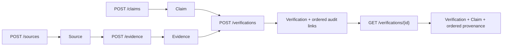

- `uv run pytest tests/test_knowledge_api.py -q`: 4 passed in 0.74s with one Starlette deprecation warning on the final review run.
- `uv run pytest -q`: 13 passed in 0.87s with one Starlette deprecation warning on the final review run.
- Changed-file Ruff check: passed.
- A fresh `assam_exam_ai_t003_test` database upgraded through both existing migrations to head; no database schema migration was required by T-003.
- Post-push architecture review: Approved. The API uses eager loading for the retrieval path, and the missing-Evidence test confirms no partial Verification or provenance row is written.

### T-004 Claim summary synchronization

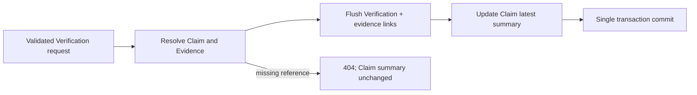

- `update_claim_verification_summary()` copies the Verification verdict, confidence, and database creation time to the linked Claim.
- `_commit_verification()` commits the Verification, provenance links, and Claim summary together and rolls back on failure.
- `uv run pytest tests/test_knowledge_api.py -q`: 4 passed in 1.17s with one Starlette deprecation warning on the final run.
- `uv run pytest -q`: 13 passed in 1.35s with one Starlette deprecation warning on the final run.
- Changed-file Ruff check: passed.
- No database schema migration was required; a fresh `assam_exam_ai_t004_test` database upgraded to the existing migration head successfully.
- Post-push architecture review: Approved. The Claim summary is explicitly the latest verification result, never human approval.

### T-005 Claim summary retrieval

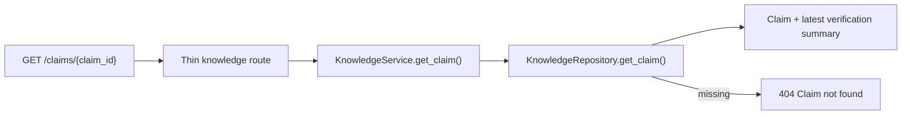

- `uv run pytest tests/test_knowledge_api.py -q`: 5 passed in 1.51s with one Starlette deprecation warning.
- `uv run pytest -q`: 14 passed in 1.01s with one Starlette deprecation warning.
- Changed-file Ruff check: passed.
- No database schema migration was required; a fresh `assam_exam_ai_t005_test` database upgraded through both existing migrations to head successfully.
- Post-push architecture review: Approved. This endpoint returns only the current Claim summary; it does not add history, search, or human approval.

### T-006 relevant Evidence linking

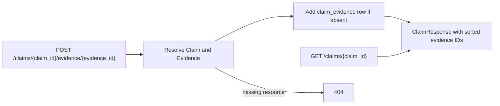

- Relevant Claim evidence is distinct from the evidence recorded for an individual Verification attempt.
- `uv run pytest tests/test_knowledge_api.py -q`: 8 passed in 1.04s with one Starlette deprecation warning on the concurrency-correction run.
- `uv run pytest -q`: 17 passed in 1.10s with one Starlette deprecation warning on the concurrency-correction run.
- Changed-file Ruff check: passed.
- No database schema migration was required; a fresh `assam_exam_ai_t006_test` database upgraded through both existing migrations to head, and `uv run alembic check` reported no new upgrade operations.
- Concurrency correction: the composite primary key plus PostgreSQL `ON CONFLICT DO NOTHING` guarantees duplicate inserts do not fail or create a second row; `populate_existing` refreshes the eagerly loaded relationship for the response.
- Correction migration check: `uv run alembic check` against `assam_exam_ai_t006_correction_test` exited 0 with no new upgrade operations detected.
- Post-push architecture review: Approved. Claim relevance and Verification audit evidence remain distinct; conflict-safe insertion preserves idempotency under concurrency.

### T-007 Evidence retrieval

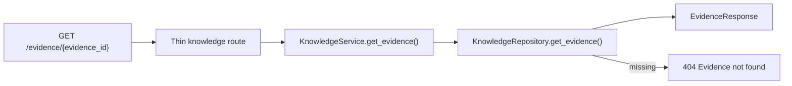

- `uv run pytest tests/test_knowledge_api.py -q`: 10 passed in 0.93s with one Starlette deprecation warning.
- `uv run pytest -q`: 19 passed in 1.00s with one Starlette deprecation warning.
- Changed-file Ruff check: passed.
- No database schema migration was required; a fresh `assam_exam_ai_t007_test` database upgraded through both existing migrations to head, and `uv run alembic check` reported no new upgrade operations.

### T-008 Claim human approval boundary

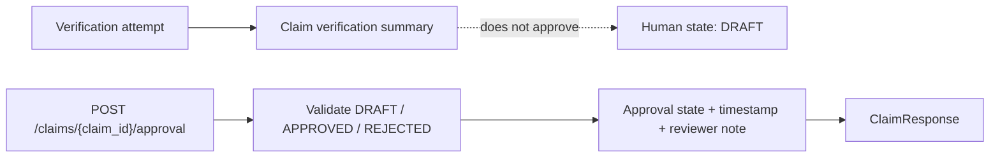

- `uv run pytest tests/test_knowledge_api.py -q`: 16 passed in 1.02s with one Starlette deprecation warning.
- `uv run pytest -q`: 25 passed in 1.10s with one Starlette deprecation warning.
- Changed-file Ruff check: passed.
- Fresh `assam_exam_ai_t008_test` upgrade to `c31a8f4d2b90`, downgrade to `92b13f7c4e61`, and re-upgrade all exited 0.
- A Claim inserted at the prior revision migrated to `DRAFT` with null decision timestamp and reviewer note.
- `uv run alembic check` exited 0 with no new upgrade operations detected.
- Approval-state consistency correction: `APPROVED` and `REJECTED` retain the supplied note and receive a current UTC decision timestamp; `DRAFT` clears both decision fields regardless of the request note.
- Correction verification: `uv run pytest tests/test_knowledge_api.py -q` passed 17 tests in 1.29s with one Starlette deprecation warning; `uv run pytest -q` passed 26 tests in 1.23s with the same warning. Changed-file Ruff and `uv run alembic check` passed; Alembic reported no new upgrade operations after a fresh upgrade to `c31a8f4d2b90`.

### T-009 Approved knowledge read boundary

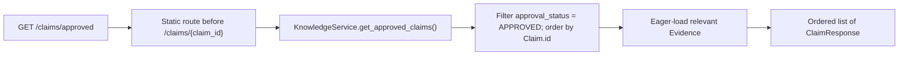

- Focused verification: `uv run pytest tests/test_knowledge_api.py -q` passed 19 tests in 1.23s with one Starlette deprecation warning.
- Full verification: `uv run pytest -q` passed 28 tests in 1.62s with one Starlette deprecation warning.
- Changed-file Ruff passed. No database schema migration is required; the endpoint reads the existing Claim approval fields, and `uv run alembic check` reported no new upgrade operations on the freshly upgraded `assam_exam_ai_t009_test` database.

### T-010 Minimal Topic classification

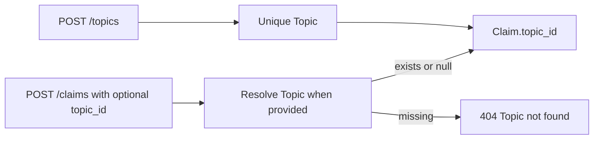

- `uv run pytest tests/test_knowledge_api.py -q`: 22 passed in 1.33s with one Starlette deprecation warning.
- `uv run pytest -q`: 31 passed in 1.29s with one Starlette deprecation warning.
- Changed-file Ruff passed.
- On fresh `assam_exam_ai_t010_test`, upgrade to `c31a8f4d2b90`, insertion of a pre-topic Claim, and upgrade to `e4a6c8d1f203` succeeded; the existing Claim retained null `topic_id`.
- Downgrade to `c31a8f4d2b90` removed both `topics` and `claims.topic_id`; re-upgrade to head succeeded.
- `uv run alembic check` reported no new upgrade operations.
- Duplicate-Topic correction: PostgreSQL remains the concurrency-safe uniqueness authority; the service rolls back its session after `IntegrityError`, raises `ResourceConflictError`, and the route returns HTTP 409 with `{"detail": "Topic name '<name>' already exists"}`.
- Correction verification: `uv run pytest tests/test_knowledge_api.py -q` passed 23 tests in 1.54s; `uv run pytest -q` passed 32 tests in 1.41s. Each run emitted one Starlette deprecation warning. Changed-file Ruff passed, and `uv run alembic check` reported no new upgrade operations.

### T-011 Topic-scoped approved knowledge

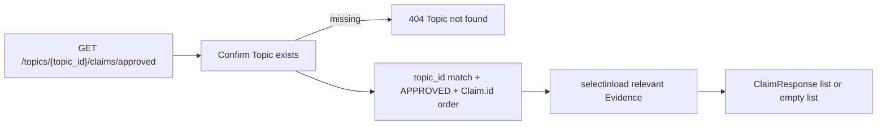

- `uv run pytest tests/test_knowledge_api.py -q`: 26 passed in 2.23s with one Starlette deprecation warning.
- `uv run pytest -q`: 35 passed in 1.48s with one Starlette deprecation warning.
- Changed-file Ruff passed.
- No database schema migration was required. Fresh `assam_exam_ai_t011_test` upgrade to `e4a6c8d1f203` succeeded, and `uv run alembic check` reported no new upgrade operations.

### T-012 Deterministic Topic note preview

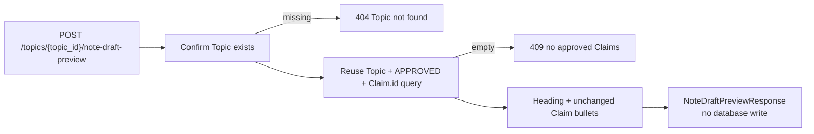

- `uv run pytest tests/test_knowledge_api.py -q`: 29 passed in 1.33s with one Starlette deprecation warning.
- `uv run pytest -q`: 38 passed in 1.62s with one Starlette deprecation warning.
- Changed-file Ruff passed.
- No database schema migration was required. Upgrade to existing head `e4a6c8d1f203` succeeded on `assam_exam_ai_t012_test`, and `uv run alembic check` reported no new upgrade operations.

### T-013 Stored internal Topic note draft

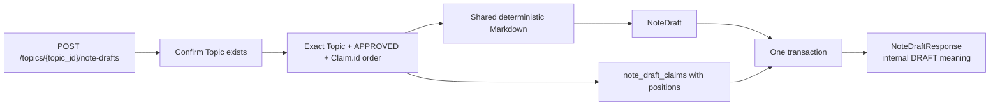

- `uv run pytest tests/test_note_drafts.py -q`: 4 passed in 0.85s with one Starlette deprecation warning.
- `uv run pytest -q`: 42 passed in 1.63s with one Starlette deprecation warning.
- Changed-file Ruff passed.
- Fresh upgrade through `b7d9e2f4a610` succeeded. Downgrade to `e4a6c8d1f203` removed both new tables, re-upgrade succeeded, and `uv run alembic check` reported no new upgrade operations.
- Duplicate-Claim constraint correction: `uv run pytest tests/test_note_drafts.py -q` passed 4 tests in 0.87s; `uv run pytest -q` passed 42 tests in 2.11s. Each emitted one Starlette deprecation warning. Changed-file Ruff passed, `uv run alembic check` reported no new upgrade operations, and `git diff --check` passed.

### T-014 Stored NoteDraft snapshot retrieval

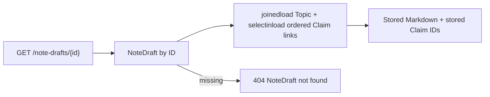

- `uv run pytest tests/test_note_drafts.py -q`: 6 passed in 1.01s with one Starlette deprecation warning.
- `uv run pytest -q`: 44 passed in 1.92s with one Starlette deprecation warning.
- Changed-file Ruff passed and `git diff --check` passed.
- No database schema migration was required. Fresh upgrade through existing head `b7d9e2f4a610` succeeded, and `uv run alembic check` reported no new upgrade operations.

### T-015 Independent NoteDraft human review

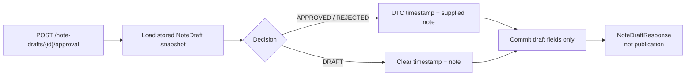

- `uv run pytest tests/test_note_drafts.py -q`: 12 passed in 1.31s with one Starlette deprecation warning.
- `uv run pytest -q`: 50 passed in 2.10s with one Starlette deprecation warning.
- Changed-file Ruff passed and `git diff --check` passed.
- Migration `d4f8a1c7e592` upgraded an existing draft to `DRAFT` with null decision metadata, downgrade removed all three approval fields, re-upgrade succeeded, and `uv run alembic check` reported no new upgrade operations.

### T-016 Approved NoteDraft read boundary

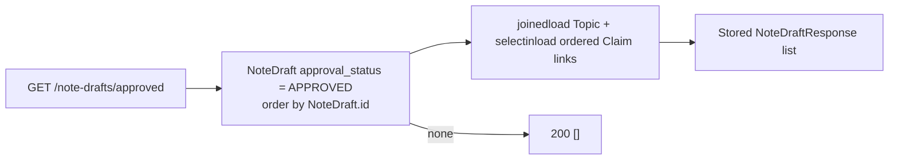

- `uv run pytest tests/test_note_drafts.py -q`: 14 passed in 1.35s with one Starlette deprecation warning.
- `uv run pytest -q`: 52 passed in 2.31s with the same warning.
- Changed-file Ruff passed and `git diff --check` passed.
- No database schema migration was required. A fresh dedicated `assam_exam_ai_t016_test` database upgraded through existing head `d4f8a1c7e592`; `uv run alembic check` reported no new upgrade operations.

### T-017 Sourced syllabus-version foundation

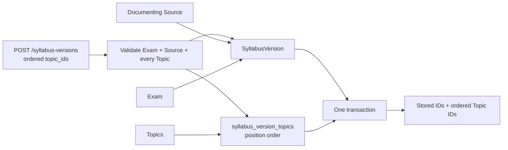

- `POST /api/v1/exams` creates only a unique code/name Exam identity; named PostgreSQL uniqueness constraints remain the concurrency-safe conflict authority.
- `POST /api/v1/syllabus-versions` validates every reference before persistence and derives non-negative positions from the non-empty duplicate-free request order.
- PostgreSQL restricts deletion of referenced Exams, Sources, Topics, and mapped SyllabusVersions; no relevance score, likelihood, probability, or syllabus content is inferred.
- `uv run pytest tests/test_syllabus_api.py -q`: 15 passed in 1.33s with one Starlette deprecation warning.
- `uv run pytest -q`: 67 passed in 3.57s with the same warning.
- Changed-file Ruff passed and `git diff --check` passed.
- Fresh upgrade through `f6b3c9a2d741`, downgrade to `d4f8a1c7e592`, re-upgrade, and `uv run alembic check` all passed; Alembic reported no new upgrade operations.

### T-018 Sourced previous-question occurrence foundation

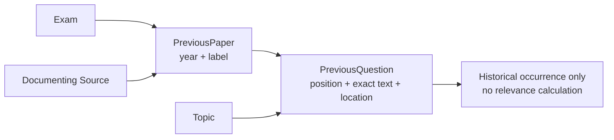

- `POST /api/v1/previous-papers` validates Exam and Source before committing a positive-year paper whose label is unique for that Exam/year.
- `POST /api/v1/previous-questions` validates Paper and Topic before committing exact non-blank text at a unique non-negative paper position.
- Named PostgreSQL constraints remain the concurrency-safe conflict authority; restrictive foreign keys preserve source, exam, paper, and Topic provenance.
- `uv run pytest tests/test_previous_papers_api.py -q`: 15 passed in 1.51s with one Starlette deprecation warning.
- `uv run pytest -q`: 82 passed in 3.44s with the same warning.
- Changed-file Ruff passed.
- Fresh upgrade through `a8c4e1d7f620`, downgrade to `f6b3c9a2d741`, re-upgrade, and `uv run alembic check` passed; Alembic reported no new upgrade operations.
- `git diff --check` passed.

### T-019 Explainable Topic priority band

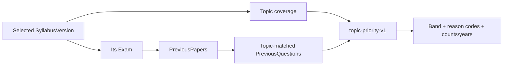

- The repository eagerly loads the selected version's Topic links and uses one outer-join query for all paper/occurrence statistics, avoiding N+1 queries.
- The service counts matched question occurrences separately from distinct matched papers and sorts unique matched years.
- Topics absent from the selected version are `LOW`; covered Topics repeated across at least two papers are `HIGH`; all other covered Topics are `MEDIUM`.
- Every result has one coverage reason and one historical-data reason, distinguishing no paper data from papers with no Topic match.
- `uv run pytest tests/test_topic_priority_api.py -q`: 8 passed in 1.50s with one Starlette deprecation warning.
- `uv run pytest -q`: 90 passed in 4.76s with the same warning.
- Changed-file Ruff passed; `uv run alembic check` reported no new upgrade operations; `git diff --check` passed.
- The endpoint performs no writes and returns no percentage, probability, or prediction.

### T-020 Canonical ContentVersion identity

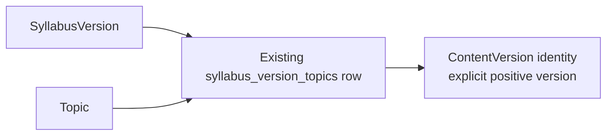

- Creation validates SyllabusVersion and Topic existence, then requires their exact stored mapping.
- PostgreSQL provides concurrency-safe uniqueness, positive-version validation, composite membership, and restrictive deletion protection.
- Versions are caller-supplied and retained independently. The current API is create/read-only with no update endpoint; database-level update/delete prevention is not implemented.
- `uv run pytest tests/test_content_versions_api.py -q`: 12 passed in 1.18s with one Starlette deprecation warning.
- `uv run pytest -q`: 102 passed in 4.18s with the same warning.
- Fresh upgrade through `c5e7a9d2b814`, downgrade to `a8c4e1d7f620`, re-upgrade, and `uv run alembic check` passed; no new upgrade operations were detected.
- Changed-file Ruff and `git diff --check` passed.
- No dependency, environment, secret, Docker-service, NoteDraft, priority-rule, release, AI, or learner-personalization change was required.

## Template for future pushed changes

Copy and append this section after inspecting the pushed commit and its reported checks.

````markdown
### W-XXX — Short change title

| Field | Value |
| --- | --- |
| Task ID | `T-XXX` |
| Implementation commit | `<full SHA>` |
| Date | `<UTC date>` |
| Components changed | `<paths and concise description>` |
| Test result | Passed / Failed / Not run — `<exact command and result or blocker>` |
| Documentation review | Pending / Approved / Changes requested |

#### Changed flow

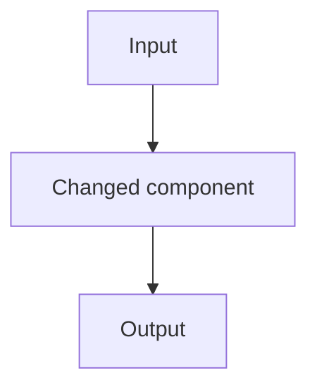

#### Component changes

| Component | File | Change | Responsibility | Tests |
| --- | --- | --- | --- | --- |
| `name()` | `path/to/file.py` | Added / changed / removed | Short responsibility | `test_name()` or Not applicable |
````

### T-007 post-push review

- Approved at `fbb1555acfecdc0942c032727684bce9d5e1e3a5`.
- The endpoint is intentionally a single-record read; no source details, lists, search, or history were introduced.

### T-008 post-push review

- Approved at `64c143498af19c9dc120093c5544e00c92011ef8`.
- Verification and approval remain intentionally separate. `DRAFT` clears decision metadata; it is not a decision.

### T-009 post-push review

- Approved at `262bb7db9226ef31f7d9e61e9c7323f9cbd512a8`.
- Only explicit human-approved Claims are returned; this is a read boundary, not content generation.

### T-010 post-push review

- Approved at `1a8a1ed15a94c128c7fb89442aee605d3263cbf6`.
- Topic classification remains deliberately flat and optional; deletion preserves Claims by nulling the Topic reference.


### T-011 review outcome

- Reviewed the pushed commit `209ea1678136030ba340b243c3735d1a9f65ee67`: it preserves the human-approval boundary and exposes only Topic-matched, explicitly approved Claims as a future internal draft input.


### T-012 review outcome

- Reviewed pushed commit `1c33a89056eda9b04db2c71c9b60d17d3e8ccd0f`: the Markdown preview uses only the ordered approved-Claim boundary and performs no write or publication. Persistent drafts will need their own provenance records before an LLM is introduced.


### T-013 review outcome

- Reviewed pushed commit `3aacf3d2b76098092cfae072c7cfa4ca40c88e3f`: note drafts and provenance links commit atomically; the database rejects duplicate Claim links and duplicate positions. Drafts remain internal and have no approval or publication state.


### T-014 review outcome

- Reviewed pushed commit `c595da4e9ce8aedd60bf0f881d9bb59c6618881d`: the read path returns stored Markdown and original ordered Claim links without re-evaluating today’s Claim eligibility. Retrieval is internal review only, not approval or publication.


### T-015 review outcome

- Reviewed pushed commit `811f10af3ee63a22e253ff24e9450770e2cbbbc2`: draft review has constrained DRAFT/APPROVED/REJECTED states, correct reset semantics, and never changes Claim state, provenance, or stored Markdown. Approval is not publication.


### T-016 review outcome

- Reviewed pushed commit `611fcb87b38b8506b1a509bea1c0abb4f581c5a7`: only each NoteDraft's own explicit APPROVED state controls the result. It returns immutable stored snapshots and does not make reviewed content public.


### T-017 review outcome

- Reviewed pushed commit `e1aea55991671679d1666f4e472a6ad7425310df`: Exam identity, sourced SyllabusVersion records, and ordered Topic mappings are protected by database constraints and created atomically.
- This flow records official syllabus coverage only. It does not calculate relevance, frequency, likelihood, or exam probability.


### T-018 review outcome

- Reviewed pushed commit `c7d7b9f18d68c9da1aeea5747b5925bf5922ead8`: previous papers cite their Exam and Source, and each historical question retains its Paper, Topic, position, exact text, and optional source location.
- The records support future frequency-based reasons but do not themselves generate content or predict an exam.


### T-019 review outcome

- Reviewed pushed commit `ff326dc5334dfc41ec298d10551f8c5801ae21b1`: the endpoint applies the exact fixed v1 rule, separates question and distinct-paper counts, excludes other Exams, returns deterministic reasons, and performs no writes.
- The band is an explainable preparation priority. It is not a percentage, calibrated likelihood, or prediction of exam appearance.


### T-020 review outcome

- Reviewed pushed commit `c5d2010da24731387162020accc9030d6fcca01e`: ContentVersion membership is enforced by the composite foreign key to the exact syllabus/Topic mapping, version identity is positive and scoped-unique, and the referenced mapping is deletion-restricted.
- The current API creates and retrieves identity only. There is no update endpoint or database-level prevention of direct ContentVersion update/deletion, and no canonical asset exists yet.
