# Assam Exam AI — Workflow and Component Register

## Purpose

This file is a chronological register of committed components and their current responsibilities. Planned work is kept separate from the implemented register. The repository was inspected on 2026-09-05 in Asia/Kolkata (UTC+05:30).

## Current runtime and database flow

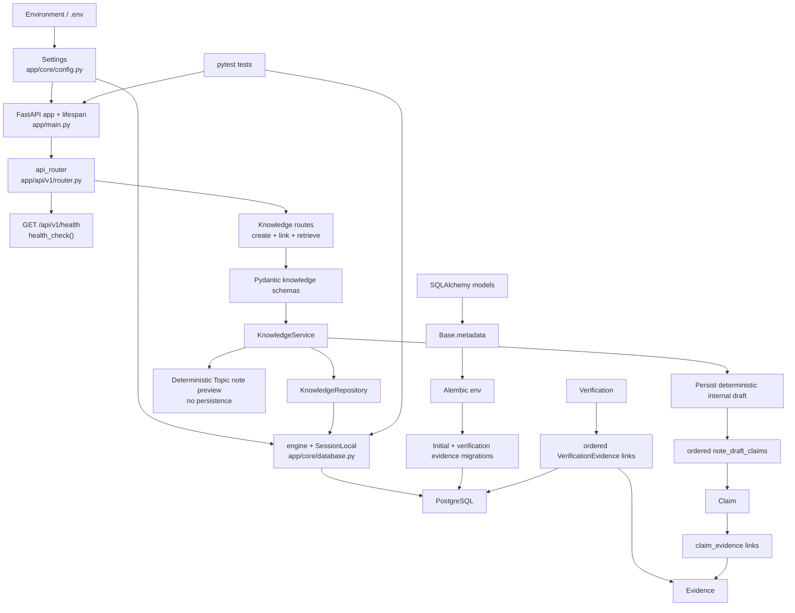

## Chronological commit register

| Commit | Date | Confirmed responsibility |
| --- | --- | --- |
| `80ffc262d81f85daf4f9a0fb34ab6aaf9e6bb648` | 2026-08-29 | Initial repository commit |
| `d61f88d018739f4b7f772aafe488c2e4ae3f91d7` | 2026-08-30 | FastAPI application foundation commit |
| `e31f71e3c2545ef9cf8fb552aba1a3eff858f994` | 2026-08-30 | FastAPI application foundation commit |
| `3c46b45580c2ddb259ef6801fd836f7d237b828d` | 2026-08-31 | PostgreSQL, SQLAlchemy models, and Alembic migration foundation |
| `bae213e1de35ee08d3788d7b9f42e9d0d36d503f` | 2026-09-01 | Repository operating instructions in `AGENTS.md` |
| `e8d553a8816ba5d3968b96998caa8d6e9e507f99` | 2026-09-02 | T-002 added ordered verification-evidence provenance with deletion protection |
| `603bddf260e9016e2db9215aec831ece7f018b50` | 2026-09-04 | T-003 added the minimal end-to-end internal knowledge API and atomic missing-Evidence rejection coverage |
| `e2f9d170c335f5ab9037749654bba9edb77938ba` | 2026-09-04 | T-004 synchronized each new Verification's latest result into its Claim summary atomically |
| `af76073a5ece57187f14540b519ec9606c2947a3` | 2026-09-04 | T-005 added direct Claim-summary retrieval with clear missing-Claim handling |
| `0a335483285835db8d9d3a76180c02ba4dad91e2` | 2026-09-04 | T-006 added concurrency-safe relevant Evidence linking to Claims |
| `fbb1555acfecdc0942c032727684bce9d5e1e3a5` | 2026-09-04 | T-007 added individual Evidence retrieval with clear missing-resource handling |
| `64c143498af19c9dc120093c5544e00c92011ef8` | 2026-09-04 | T-008 added independent Claim human-approval state and decisions |
| `262bb7db9226ef31f7d9e61e9c7323f9cbd512a8` | 2026-09-04 | T-009 added the global approved-Claims read boundary |
| `1a8a1ed15a94c128c7fb89442aee605d3263cbf6` | 2026-09-04 | T-010 added minimal Topic classification and conflict handling |
| `209ea1678136030ba340b243c3735d1a9f65ee67` | 2026-09-04 | T-011 added Topic-scoped approved-Claim retrieval |
| `1c33a89056eda9b04db2c71c9b60d17d3e8ccd0f` | 2026-09-04 | T-012 added a deterministic non-persistent Topic note-draft preview |
| `3aacf3d2b76098092cfae072c7cfa4ca40c88e3f` | 2026-09-04 | T-013 added persistent internal note drafts with ordered Claim provenance |
| `c595da4e9ce8aedd60bf0f881d9bb59c6618881d` | 2026-09-04 | T-014 added immutable stored NoteDraft snapshot retrieval |
| `811f10af3ee63a22e253ff24e9450770e2cbbbc2` | 2026-09-04 | T-015 added independent human review state to stored NoteDrafts |
| `611fcb87b38b8506b1a509bea1c0abb4f581c5a7` | 2026-09-04 | T-016 added the internal approved-NoteDraft read boundary |

The register reports current responsibility based on the inspected tree. T-002 was reviewed against commit `e8d553a8816ba5d3968b96998caa8d6e9e507f99`, T-003 against `603bddf260e9016e2db9215aec831ece7f018b50`, and T-004 against `e2f9d170c335f5ab9037749654bba9edb77938ba`; their test results are recorded below.

## Routes

| Route | Callable | File | Responsibility |
| --- | --- | --- | --- |
| `GET /api/v1/health` | `health_check()` | `app/api/v1/routes/health.py` | Returns `{"status": "ok"}` without checking the database |
| `POST /api/v1/sources` | `create_source()` | `app/api/v1/routes/knowledge.py` | Validates and creates a Source |
| `POST /api/v1/exams` | `create_exam()` | `app/api/v1/routes/knowledge.py` | Creates an Exam with stable unique code/name conflict handling |
| `POST /api/v1/syllabus-versions` | `create_syllabus_version()` | `app/api/v1/routes/knowledge.py` | Atomically stores a sourced syllabus version and ordered Topic mappings |
| `POST /api/v1/content-versions` | `create_content_version()` | `app/api/v1/routes/knowledge.py` | Creates explicit canonical identity for one mapped SyllabusVersion/Topic |
| `GET /api/v1/content-versions/{content_version_id}` | `get_content_version()` | `app/api/v1/routes/knowledge.py` | Retrieves stored ContentVersion identity only |
| `POST /api/v1/question-bank-items` | `create_question_bank_item()` | `app/api/v1/routes/knowledge.py` | Atomically stores a complete internal MCQ candidate with ordered Claim provenance and options |
| `GET /api/v1/question-bank-items/approved` | `get_approved_question_bank_items()` | `app/api/v1/routes/knowledge.py` | Returns explicitly approved stored candidates in stable ID order; registered before the dynamic item route |
| `GET /api/v1/question-bank-items/released` | `get_released_question_bank_items()` | `app/api/v1/routes/knowledge.py` | Returns currently RELEASED stored candidates in stable ID order; registered before the dynamic item route |
| `GET /api/v1/question-bank-items/{question_bank_item_id}` | `get_question_bank_item()` | `app/api/v1/routes/knowledge.py` | Retrieves one stored candidate snapshot with Claim order, options, and answer |
| `POST /api/v1/question-bank-items/{question_bank_item_id}/approval` | `record_question_bank_item_approval()` | `app/api/v1/routes/knowledge.py` | Records an independent candidate decision and maps missing/conflict errors |
| `POST /api/v1/question-bank-items/{question_bank_item_id}/release` | `record_question_bank_item_release()` | `app/api/v1/routes/knowledge.py` | Applies a controlled release or withdrawal decision with established 404/409 mapping |
| `GET /api/v1/syllabus-versions/{syllabus_version_id}/topics/{topic_id}/priority` | `get_topic_priority()` | `app/api/v1/routes/knowledge.py` | Returns the read-only deterministic v1 Topic priority assessment |
| `POST /api/v1/previous-papers` | `create_previous_paper()` | `app/api/v1/routes/knowledge.py` | Creates a sourced previous paper with stable per-Exam/year label conflicts |
| `POST /api/v1/previous-questions` | `create_previous_question()` | `app/api/v1/routes/knowledge.py` | Records one exact Topic-linked question occurrence at a paper position |
| `POST /api/v1/topics` | `create_topic()` | `app/api/v1/routes/knowledge.py` | Validates and creates a uniquely named Topic |
| `GET /api/v1/topics/{topic_id}/claims/approved` | `get_approved_claims_by_topic()` | `app/api/v1/routes/knowledge.py` | Returns approved Claims for one existing Topic in stable ID order |
| `POST /api/v1/topics/{topic_id}/note-draft-preview` | `create_note_draft_preview()` | `app/api/v1/routes/knowledge.py` | Returns deterministic Markdown from one Topic's approved Claims without persistence |
| `POST /api/v1/topics/{topic_id}/note-drafts` | `create_note_draft()` | `app/api/v1/routes/knowledge.py` | Requires a positive ContentVersion ID and atomically stores a same-Topic draft with ordered Claim provenance |
| `GET /api/v1/note-drafts/approved` | `get_approved_note_drafts()` | `app/api/v1/routes/knowledge.py` | Returns only approved stored NoteDraft snapshots in ascending ID order |
| `GET /api/v1/note-drafts/released` | `get_released_note_drafts()` | `app/api/v1/routes/knowledge.py` | Returns only currently released stored NoteDraft snapshots in ascending ID order |
| `GET /api/v1/note-drafts/{note_draft_id}` | `get_note_draft()` | `app/api/v1/routes/knowledge.py` | Returns one stored internal draft snapshot with position-ordered Claim IDs |
| `POST /api/v1/note-drafts/{note_draft_id}/approval` | `record_note_draft_approval()` | `app/api/v1/routes/knowledge.py` | Records or resets a NoteDraft human-review decision without publishing it |
| `POST /api/v1/note-drafts/{note_draft_id}/release` | `record_note_draft_release()` | `app/api/v1/routes/knowledge.py` | Applies the one-way controlled NoteDraft release or withdrawal decision with stable 404/409 mapping |
| `POST /api/v1/evidence` | `create_evidence()` | `app/api/v1/routes/knowledge.py` | Validates and creates Evidence for an existing Source |
| `GET /api/v1/evidence/{evidence_id}` | `get_evidence()` | `app/api/v1/routes/knowledge.py` | Returns one Evidence record or a clear 404 |
| `POST /api/v1/claims` | `create_claim()` | `app/api/v1/routes/knowledge.py` | Validates and creates a Claim |
| `GET /api/v1/claims/approved` | `get_approved_claims()` | `app/api/v1/routes/knowledge.py` | Returns approved Claims in stable ID order; registered before the dynamic Claim route |
| `GET /api/v1/claims/{claim_id}` | `get_claim()` | `app/api/v1/routes/knowledge.py` | Returns a Claim and its current latest-verification summary |
| `POST /api/v1/claims/{claim_id}/evidence/{evidence_id}` | `link_claim_evidence()` | `app/api/v1/routes/knowledge.py` | Idempotently links relevant Evidence to a Claim |
| `POST /api/v1/claims/{claim_id}/approval` | `record_claim_approval()` | `app/api/v1/routes/knowledge.py` | Records a Claim's explicit human approval state, timestamp, and optional note |
| `POST /api/v1/verifications` | `create_verification()` | `app/api/v1/routes/knowledge.py` | Creates a Verification with ordered evidence audit links |
| `GET /api/v1/verifications/{verification_id}` | `get_verification()` | `app/api/v1/routes/knowledge.py` | Returns a Verification, its Claim, and ordered evidence provenance |

## Callable functions

| Callable | File | Responsibility |
| --- | --- | --- |
| `lifespan()` | `app/main.py` | Logs application startup and shutdown around the FastAPI lifespan |
| `setup_logging()` | `app/core/logging.py` | Configures an INFO-level stdout handler once |
| `get_db()` | `app/core/database.py` | Yields a SQLAlchemy session and closes it afterward |
| `health_check()` | `app/api/v1/routes/health.py` | Implements the health route response |
| `run_migrations_offline()` | `migrations/env.py` | Configures and runs Alembic without a live connection |
| `run_migrations_online()` | `migrations/env.py` | Connects to the configured database and runs Alembic migrations |
| `upgrade()` | `migrations/versions/774778a8bb78_create_knowledge_foundation.py` | Creates the initial knowledge tables and foreign keys |
| `downgrade()` | `migrations/versions/774778a8bb78_create_knowledge_foundation.py` | Drops the initial knowledge tables in dependency-safe order |
| `_not_found()` | `app/api/v1/routes/knowledge.py` | Converts a service missing-resource error to HTTP 404 |
| `_conflict()` | `app/api/v1/routes/knowledge.py` | Converts a service conflict error to HTTP 409 |
| `create_source()` | `app/api/v1/routes/knowledge.py` | Delegates Source creation to `KnowledgeService` |
| `create_exam()` | `app/api/v1/routes/knowledge.py` | Delegates Exam creation and maps unique conflicts to 409 |
| `create_syllabus_version()` | `app/api/v1/routes/knowledge.py` | Delegates syllabus creation and maps missing references/conflicts to 404/409 |
| `create_content_version()` / `get_content_version()` | `app/api/v1/routes/knowledge.py` | Delegate identity creation/retrieval and map established 404/409 errors |
| `create_question_bank_item()` / `get_question_bank_item()` | `app/api/v1/routes/knowledge.py` | Delegate candidate creation/retrieval and map established 404/409 errors |
| `get_approved_question_bank_items()` | `app/api/v1/routes/knowledge.py` | Delegates the static approved-candidate read boundary before the dynamic item route |
| `get_topic_priority()` | `app/api/v1/routes/knowledge.py` | Delegates assessment and maps a missing SyllabusVersion or Topic to 404 |
| `create_previous_paper()` | `app/api/v1/routes/knowledge.py` | Delegates previous-paper creation and maps missing references/conflicts to 404/409 |
| `create_previous_question()` | `app/api/v1/routes/knowledge.py` | Delegates question-occurrence creation and maps missing references/conflicts to 404/409 |
| `create_topic()` | `app/api/v1/routes/knowledge.py` | Delegates Topic creation to `KnowledgeService` |
| `get_approved_claims_by_topic()` | `app/api/v1/routes/knowledge.py` | Delegates the Topic-scoped approved read and maps a missing Topic to 404 |
| `create_note_draft_preview()` | `app/api/v1/routes/knowledge.py` | Delegates deterministic preview creation and maps missing/empty approved knowledge to 404/409 |
| `create_note_draft()` | `app/api/v1/routes/knowledge.py` | Delegates persisted draft creation and maps missing/empty approved knowledge to 404/409 |
| `get_approved_note_drafts()` | `app/api/v1/routes/knowledge.py` | Delegates the static approved-draft read boundary before the dynamic draft-ID route |
| `get_released_note_drafts()` | `app/api/v1/routes/knowledge.py` | Delegates the static released-draft read boundary before the dynamic draft-ID route |
| `get_note_draft()` | `app/api/v1/routes/knowledge.py` | Delegates stored snapshot retrieval and maps a missing NoteDraft to 404 |
| `record_note_draft_approval()` | `app/api/v1/routes/knowledge.py` | Delegates the draft decision and maps a missing NoteDraft to 404 |
| `record_note_draft_release()` | `app/api/v1/routes/knowledge.py` | Delegates release/withdrawal and maps missing/conflict outcomes to 404/409 |
| `create_evidence()` | `app/api/v1/routes/knowledge.py` | Delegates Evidence creation and maps a missing Source to 404 |
| `get_evidence()` | `app/api/v1/routes/knowledge.py` | Delegates Evidence retrieval and maps missing Evidence to 404 |
| `create_claim()` | `app/api/v1/routes/knowledge.py` | Delegates Claim creation to `KnowledgeService` |
| `get_approved_claims()` | `app/api/v1/routes/knowledge.py` | Delegates the approved-knowledge read to `KnowledgeService` |
| `get_claim()` | `app/api/v1/routes/knowledge.py` | Delegates Claim retrieval and maps a missing Claim to 404 |
| `link_claim_evidence()` | `app/api/v1/routes/knowledge.py` | Delegates relevant-evidence linking and maps missing resources to 404 |
| `record_claim_approval()` | `app/api/v1/routes/knowledge.py` | Delegates the human decision and maps a missing Claim to 404 |
| `create_verification()` | `app/api/v1/routes/knowledge.py` | Delegates Verification creation and maps missing references to 404 |
| `get_verification()` | `app/api/v1/routes/knowledge.py` | Delegates provenance retrieval and maps a missing Verification to 404 |

## Models and persistent structures

| Model or structure | File | Responsibility |
| --- | --- | --- |
| `Base` | `app/models/base.py` | Declarative metadata root for SQLAlchemy models |
| `Source` | `app/models/source.py` | Stores basic source identity, authority, location, license status, hash, and creation time |
| `Exam` | `app/models/exam.py` | Stores a unique short exam code, unique name, and creation time |
| `SyllabusVersion` | `app/models/syllabus_version.py` | Stores one Exam's labeled syllabus version with its documenting Source |
| `SyllabusVersionTopic` | `app/models/syllabus_version_topic.py` | Stores one protected Topic mapping per version in constrained position order |
| `ContentVersion` | `app/models/content_version.py` | Stores retained version identity for exactly one syllabus/Topic mapping and exposes the composite key used by same-Topic NoteDraft ownership |
| `QuestionBankItem` | `app/models/question_bank_item.py` | Stores one internal MCQ candidate and its nullable backward-compatible same-item correct-option reference |
| `QuestionBankItemClaim` | `app/models/question_bank_item_claim.py` | Stores exact Claim grounding in constrained persisted position order |
| `QuestionBankOption` | `app/models/question_bank_option.py` | Stores one non-blank option at a unique non-negative position within an item |
| `PreviousPaper` | `app/models/previous_paper.py` | Stores one sourced Exam paper with positive year and per-Exam/year unique label |
| `PreviousQuestion` | `app/models/previous_question.py` | Stores exact non-blank question text, Topic, location reference, and constrained paper position |
| `Topic` | `app/models/topic.py` | Stores a unique Topic name and creation time, with typed traversal to classified Claims |
| `Evidence` | `app/models/evidence.py` | Stores text and an optional location reference belonging to a source |
| `Claim` | `app/models/claim.py` | Stores an atomic statement, optional Topic, verification summary, separate constrained human approval fields, and typed traversal to Topic and relevant Evidence |
| `Verification` | `app/models/verification.py` | Stores one verdict, confidence, reasoning, and timestamp for a claim |
| `VerificationEvidence` | `app/models/verification_evidence.py` | Records evidence used by a verification, its role, and its non-negative ordered position; referenced evidence is deletion-restricted |
| `claim_evidence` | `app/models/claim_evidence.py` | Associates claims and evidence with a composite primary key |
| `NoteDraft` | `app/models/note_draft.py` | Stores deterministic Markdown, nullable legacy-safe ContentVersion ownership, separate review state, and constrained release/withdrawal state |
| `NoteDraftClaim` | `app/models/note_draft_claim.py` | Records the exact Claims used by a draft in constrained position order |

## T-003 schemas

| Schema | File | Responsibility |
| --- | --- | --- |
| `EvidenceRole` | `app/schemas/knowledge.py` | Restricts evidence roles to `SUPPORTS`, `CONTRADICTS`, or `CONTEXT` |
| `VerificationVerdict` | `app/schemas/knowledge.py` | Defines accepted verification verdict values |
| `ClaimApprovalStatus` | `app/schemas/knowledge.py` | Restricts human decisions to `DRAFT`, `APPROVED`, or `REJECTED` |
| `SourceCreate` / `SourceResponse` | `app/schemas/knowledge.py` | Validate Source input and serialize persisted Sources |
| `ExamCreate` / `ExamResponse` | `app/schemas/knowledge.py` | Validate and serialize minimal Exam records |
| `SyllabusVersionCreate` | `app/schemas/knowledge.py` | Validates positive references and a non-empty duplicate-free ordered Topic ID list |
| `SyllabusVersionResponse` | `app/schemas/knowledge.py` | Serializes persisted syllabus identity, Source, label, time, and stored Topic order |
| `ContentVersionCreate` / `ContentVersionResponse` | `app/schemas/knowledge.py` | Validate positive explicit versions and serialize stored identity |
| `QuestionDifficulty` | `app/schemas/knowledge.py` | Restricts candidate difficulty to EASY, MEDIUM, or HARD |
| `QuestionBankItemCreate` | `app/schemas/knowledge.py` | Validates T-021 fields, at least two non-blank ordered options, and an in-range correct-option position |
| `QuestionBankItemResponse` | `app/schemas/knowledge.py` | Serializes stored Claim provenance, options, and answer; supports legacy empty/null option state |
| `QuestionBankItemApprovalCreate` | `app/schemas/knowledge.py` | Restricts candidate decisions to DRAFT, APPROVED, or REJECTED with an optional note |
| `QuestionBankItemReleaseStatus` | `app/schemas/knowledge.py` | Represents persisted UNRELEASED, RELEASED, or WITHDRAWN lifecycle state |
| `QuestionBankItemReleaseDecision` / `QuestionBankItemReleaseCreate` | `app/schemas/knowledge.py` | Accept only RELEASED or WITHDRAWN decisions with an optional release note |
| `NoteDraftReleaseStatus` | `app/schemas/knowledge.py` | Represents persisted UNRELEASED, RELEASED, or WITHDRAWN draft state |
| `NoteDraftReleaseDecision` / `NoteDraftReleaseCreate` | `app/schemas/knowledge.py` | Accept only RELEASED or WITHDRAWN draft decisions with an optional release note |
| `TopicPriorityBand` / `TopicPriorityReason` / `TopicPriorityResponse` | `app/schemas/knowledge.py` | Define the fixed bands, deterministic reason codes, and assessment response |
| `PreviousPaperCreate` / `PreviousPaperResponse` | `app/schemas/knowledge.py` | Validate and serialize sourced previous-paper identity |
| `PreviousQuestionCreate` / `PreviousQuestionResponse` | `app/schemas/knowledge.py` | Validate and serialize one Topic-linked historical question occurrence |
| `TopicCreate` / `TopicResponse` | `app/schemas/knowledge.py` | Validate a Topic name and serialize its identity and creation time |
| `EvidenceCreate` / `EvidenceResponse` | `app/schemas/knowledge.py` | Validate Evidence input and serialize persisted Evidence |
| `ClaimCreate` / `ClaimResponse` | `app/schemas/knowledge.py` | Validate Claim input including optional positive `topic_id` and serialize it with evidence and summary fields |
| `ClaimApprovalCreate` | `app/schemas/knowledge.py` | Validates an approval state and optional reviewer note |
| `VerificationEvidenceCreate` | `app/schemas/knowledge.py` | Validates an evidence ID, role, and non-negative position |
| `VerificationCreate` | `app/schemas/knowledge.py` | Validates Verification input and rejects duplicate evidence IDs or positions |
| `VerificationEvidenceResponse` | `app/schemas/knowledge.py` | Serializes evidence content with its audit role and position |
| `VerificationResponse` | `app/schemas/knowledge.py` | Serializes Verification details, Claim details, and ordered provenance |
| `NoteDraftPreviewResponse` | `app/schemas/knowledge.py` | Serializes Topic identity, ordered approved Claim IDs, and deterministic Markdown |
| `NoteDraftCreate` | `app/schemas/knowledge.py` | Requires one positive ContentVersion ID for persisted draft creation |
| `NoteDraftResponse` | `app/schemas/knowledge.py` | Adds persisted draft identity, nullable ContentVersion ownership, and creation time to the deterministic draft contract |
| `NoteDraftApprovalCreate` | `app/schemas/knowledge.py` | Validates a draft decision as DRAFT, APPROVED, or REJECTED with an optional reviewer note |

## T-003 repository and service

| Component | File | Responsibility |
| --- | --- | --- |
| `KnowledgeRepository` | `app/repositories/knowledge.py` | Encapsulates Topic, Source, Evidence, Claim, and Verification persistence queries |
| `add_source()` / `get_source()` | `app/repositories/knowledge.py` | Persist or retrieve Sources |
| `add_exam()` / `get_exam()` | `app/repositories/knowledge.py` | Persist or retrieve Exams |
| `add_syllabus_version()` | `app/repositories/knowledge.py` | Flushes a SyllabusVersion and its ordered Topic mappings in the caller's transaction |
| `get_syllabus_version()` | `app/repositories/knowledge.py` | Retrieves one version with Topic links eagerly loaded |
| `get_topic_occurrence_stats()` | `app/repositories/knowledge.py` | Uses one Exam-scoped outer join to count papers, questions, matched papers, and years |
| `add_content_version()` / `get_content_version()` | `app/repositories/knowledge.py` | Persist or retrieve a ContentVersion identity |
| `add_question_bank_item()` / `get_question_bank_item()` | `app/repositories/knowledge.py` | Flush a candidate with dependencies or eagerly retrieve ordered Claims and options |
| `get_question_bank_item_for_update()` | `app/repositories/knowledge.py` | Locks one candidate row while eagerly loading its completeness data for serialized decisions |
| `get_approved_question_bank_items()` | `app/repositories/knowledge.py` | Filters exactly on QuestionBankItem APPROVED state, orders by item ID, and select-in loads Claim links and options |
| `get_released_question_bank_items()` | `app/repositories/knowledge.py` | Filters exactly on QuestionBankItem RELEASED state, orders by item ID, and select-in loads Claim links and options |
| `get_claims_for_question_bank_item()` | `app/repositories/knowledge.py` | Loads all requested Claims in one locking query so eligibility stays stable through creation |
| `update_question_bank_item_approval()` | `app/repositories/knowledge.py` | Assigns candidate review status, decision time, and reviewer note in the caller's transaction |
| `update_question_bank_item_release()` | `app/repositories/knowledge.py` | Assigns release state and metadata inside the caller's atomic transaction |
| `add_previous_paper()` / `get_previous_paper()` | `app/repositories/knowledge.py` | Persist or retrieve sourced previous papers |
| `add_previous_question()` | `app/repositories/knowledge.py` | Flushes an exact historical question occurrence in the caller's transaction |
| `add_topic()` / `get_topic()` | `app/repositories/knowledge.py` | Persist or retrieve Topics |
| `add_evidence()` / `get_evidence()` | `app/repositories/knowledge.py` | Persist or retrieve Evidence |
| `add_claim()` / `get_claim()` | `app/repositories/knowledge.py` | Persist Claims or retrieve them with relevant Evidence eagerly loaded |
| `get_approved_claims()` | `app/repositories/knowledge.py` | Selects only `APPROVED` Claims in ascending ID order with relevant Evidence eagerly loaded |
| `get_approved_claims_by_topic()` | `app/repositories/knowledge.py` | Filters by exact Topic ID and `APPROVED`, orders by Claim ID, and eagerly loads relevant Evidence |
| `add_note_draft()` | `app/repositories/knowledge.py` | Adds and flushes a NoteDraft with its ordered Claim links |
| `get_note_draft()` | `app/repositories/knowledge.py` | Retrieves one NoteDraft with its Topic and all ordered Claim links eagerly loaded |
| `get_approved_note_drafts()` | `app/repositories/knowledge.py` | Filters exactly on NoteDraft APPROVED state, orders by ID, and eagerly loads Topic and Claim links |
| `get_released_note_drafts()` | `app/repositories/knowledge.py` | Filters exactly on NoteDraft RELEASED state, orders by ID, and eagerly loads Topic and Claim links |
| `update_note_draft_approval()` | `app/repositories/knowledge.py` | Updates only the draft's review state, decision timestamp, and reviewer note |
| `link_claim_evidence()` | `app/repositories/knowledge.py` | Uses PostgreSQL `INSERT ... ON CONFLICT DO NOTHING` against the composite key for concurrency-safe idempotency |
| `update_claim_approval()` | `app/repositories/knowledge.py` | Updates only the Claim's approval state and its nullable decision timestamp and reviewer note |
| `add_verification()` | `app/repositories/knowledge.py` | Persists a Verification and its audit links |
| `update_claim_verification_summary()` | `app/repositories/knowledge.py` | Copies a new Verification's verdict, confidence, and creation time into the Claim's latest summary |
| `get_verification()` | `app/repositories/knowledge.py` | Eagerly retrieves Claim and ordered evidence-link data |
| `ResourceNotFoundError` | `app/services/knowledge.py` | Carries the missing resource type and identifier |
| `ResourceConflictError` | `app/services/knowledge.py` | Carries a stable resource-conflict detail for HTTP translation |
| `KnowledgeService` | `app/services/knowledge.py` | Owns knowledge use cases and transaction boundaries |
| `create_source()` | `app/services/knowledge.py` | Creates and commits a Source |
| `create_exam()` | `app/services/knowledge.py` | Creates an Exam and translates named database uniqueness conflicts to stable domain conflicts |
| `create_syllabus_version()` | `app/services/knowledge.py` | Validates all references, constructs ordered mappings, and commits the sourced version atomically |
| `get_topic_priority()` | `app/services/knowledge.py` | Applies the exact read-only `topic-priority-v1` band and reason rules |
| `create_content_version()` / `get_content_version()` | `app/services/knowledge.py` | Enforce reference/membership behavior, translate named constraints, and return identity |
| `create_question_bank_item()` / `get_question_bank_item()` | `app/services/knowledge.py` | Enforce approved same-Topic grounding, own atomic creation, and return stored snapshots |
| `get_approved_question_bank_items()` | `app/services/knowledge.py` | Serializes the repository's ordered approved candidates without re-evaluating current Claim state |
| `_commit_question_bank_item()` | `app/services/knowledge.py` | Flushes item/options, assigns the selected option ID, and commits all candidate rows atomically |
| `_question_bank_item_response()` | `app/services/knowledge.py` | Serializes persisted Claim and option order plus correct position without re-evaluation |
| `record_question_bank_item_approval()` | `app/services/knowledge.py` | Applies review/reset semantics and blocks approval of incomplete stored candidates |
| `get_released_question_bank_items()` | `app/services/knowledge.py` | Serializes the repository's released stored snapshots without writes or eligibility re-evaluation |
| `record_question_bank_item_release()` | `app/services/knowledge.py` | Enforces one-way eligibility/transitions and atomically records release or withdrawal |
| `_is_complete_question_bank_item()` | `app/services/knowledge.py` | Requires at least two options and a correct option belonging to the stored item |
| `create_previous_paper()` | `app/services/knowledge.py` | Validates Exam/Source, commits a paper, and translates its named uniqueness conflict |
| `create_previous_question()` | `app/services/knowledge.py` | Validates Paper/Topic, commits an occurrence, and translates its named position conflict |
| `create_topic()` | `app/services/knowledge.py` | Creates a Topic; rolls back database uniqueness conflicts and raises a domain conflict error |
| `create_evidence()` | `app/services/knowledge.py` | Verifies the Source exists, then creates Evidence |
| `get_evidence()` | `app/services/knowledge.py` | Retrieves Evidence through the repository or raises a missing-resource error |
| `create_claim()` | `app/services/knowledge.py` | Validates an optional Topic reference, then creates and commits a Claim |
| `get_approved_claims()` | `app/services/knowledge.py` | Serializes the repository's ordered approved Claims with the existing `ClaimResponse` builder |
| `get_approved_claims_by_topic()` | `app/services/knowledge.py` | Distinguishes a missing Topic from an empty approved result, then serializes matching Claims |
| `create_note_draft_preview()` | `app/services/knowledge.py` | Confirms the Topic, reads ordered approved Claims, and renders their statements unchanged as non-persistent Markdown |
| `create_note_draft()` | `app/services/knowledge.py` | Resolves Topic then ContentVersion, enforces same-Topic ownership, confirms approved knowledge, and commits the draft and links atomically |
| `get_note_draft()` | `app/services/knowledge.py` | Serializes stored ContentVersion ownership, draft fields, and position-ordered link IDs without inference or mutation |
| `get_approved_note_drafts()` | `app/services/knowledge.py` | Serializes the repository's ordered approved drafts as stored snapshots |
| `get_released_note_drafts()` | `app/services/knowledge.py` | Serializes the repository's ordered released drafts as stored snapshots without writes or re-evaluation |
| `_note_draft_response()` | `app/services/knowledge.py` | Builds the shared stored NoteDraft response, including nullable ownership, without regenerating or re-evaluating Claims |
| `record_note_draft_approval()` | `app/services/knowledge.py` | Records APPROVED/REJECTED with UTC time and note, or clears decision metadata for DRAFT |
| `get_claim()` | `app/services/knowledge.py` | Retrieves a Claim through the repository or raises a missing-resource error |
| `link_claim_evidence()` | `app/services/knowledge.py` | Validates both resources, performs the conflict-safe insert, commits, freshly reloads the Claim, and returns its response |
| `record_claim_approval()` | `app/services/knowledge.py` | Records APPROVED/REJECTED with the current UTC time and supplied note, or clears decision metadata for DRAFT, then commits |
| `_claim_response()` | `app/services/knowledge.py` | Serializes a Claim with sorted relevant Evidence IDs only |
| `create_verification()` | `app/services/knowledge.py` | Validates references, records ordered audit links, and synchronizes the Claim summary atomically |
| `get_verification()` | `app/services/knowledge.py` | Builds the nested verification-provenance response |
| `_commit()` | `app/services/knowledge.py` | Commits a use case and rolls back on failure |
| `_commit_note_draft()` | `app/services/knowledge.py` | Flushes and commits the draft plus Claim links together, rolling back both on failure |
| `_render_note_markdown()` | `app/services/knowledge.py` | Provides the shared deterministic heading-and-bullets contract for preview and persistence |
| `_commit_verification()` | `app/services/knowledge.py` | Flushes the Verification, updates its Claim summary, and commits or rolls back both together |

## Migration functions

| Function | File | Responsibility |
| --- | --- | --- |
| `run_migrations_offline()` | `migrations/env.py` | Runs the configured migration context in offline mode |
| `run_migrations_online()` | `migrations/env.py` | Runs the configured migration context through a database connection |
| `upgrade()` | `migrations/versions/774778a8bb78_create_knowledge_foundation.py` | Creates `claims`, `sources`, `evidence`, `verifications`, and `claim_evidence` |
| `downgrade()` | `migrations/versions/774778a8bb78_create_knowledge_foundation.py` | Removes those five tables |
| `upgrade()` | `migrations/versions/92b13f7c4e61_add_verification_evidence.py` | Creates `verification_evidence` with role, position, ordering constraints, restricted Evidence deletion, and cascading association cleanup for Verification deletion |
| `downgrade()` | `migrations/versions/92b13f7c4e61_add_verification_evidence.py` | Removes `verification_evidence` |
| `upgrade()` | `migrations/versions/c31a8f4d2b90_add_claim_human_approval.py` | Adds constrained Claim approval state, decision timestamp, and reviewer note |
| `downgrade()` | `migrations/versions/c31a8f4d2b90_add_claim_human_approval.py` | Removes the Claim approval constraint and fields |
| `upgrade()` | `migrations/versions/e4a6c8d1f203_add_topics_to_claims.py` | Creates uniquely named Topics and adds nullable `claims.topic_id` with `ON DELETE SET NULL` |
| `downgrade()` | `migrations/versions/e4a6c8d1f203_add_topics_to_claims.py` | Removes the Claim Topic foreign key/column and Topics table |
| `upgrade()` | `migrations/versions/b7d9e2f4a610_add_note_drafts.py` | Creates internal note drafts and constrained ordered Claim provenance |
| `downgrade()` | `migrations/versions/b7d9e2f4a610_add_note_drafts.py` | Removes note-draft Claim links and note drafts in dependency order |
| `upgrade()` | `migrations/versions/d4f8a1c7e592_add_note_draft_approval.py` | Adds constrained NoteDraft approval state and nullable decision metadata, defaulting existing drafts to DRAFT |
| `downgrade()` | `migrations/versions/d4f8a1c7e592_add_note_draft_approval.py` | Removes the NoteDraft approval constraint and three decision fields |
| `upgrade()` | `migrations/versions/f6b3c9a2d741_add_exam_syllabus_foundation.py` | Creates Exams, sourced syllabus versions, and restricted ordered Topic mappings |
| `downgrade()` | `migrations/versions/f6b3c9a2d741_add_exam_syllabus_foundation.py` | Removes syllabus Topic mappings, versions, and Exams in dependency order |
| `upgrade()` | `migrations/versions/a8c4e1d7f620_add_previous_paper_questions.py` | Creates sourced previous papers and constrained Topic-linked question occurrences |
| `downgrade()` | `migrations/versions/a8c4e1d7f620_add_previous_paper_questions.py` | Removes previous questions and papers in dependency order |
| `upgrade()` | `migrations/versions/c5e7a9d2b814_add_content_versions.py` | Creates constrained canonical ContentVersion identities |
| `downgrade()` | `migrations/versions/c5e7a9d2b814_add_content_versions.py` | Removes the ContentVersion table |
| `upgrade()` | `migrations/versions/e9a4c2f7b163_add_question_bank_items.py` | Creates constrained question candidates and ordered Claim provenance |
| `downgrade()` | `migrations/versions/e9a4c2f7b163_add_question_bank_items.py` | Removes candidate links and items in dependency order |
| `upgrade()` | `migrations/versions/f2c8d4a6e915_add_question_bank_options.py` | Adds ordered options and nullable same-item correct-answer references |
| `downgrade()` | `migrations/versions/f2c8d4a6e915_add_question_bank_options.py` | Removes the answer reference before removing options |
| `upgrade()` | `migrations/versions/a6d1e8c3f247_add_question_bank_item_approval.py` | Adds constrained independent candidate-review fields with safe DRAFT defaults |
| `downgrade()` | `migrations/versions/a6d1e8c3f247_add_question_bank_item_approval.py` | Removes only candidate-review fields and their status constraint |
| `upgrade()` | `migrations/versions/b3e7f1a9c462_add_question_bank_item_release.py` | Adds constrained release state and null default metadata without inferring release |
| `downgrade()` | `migrations/versions/b3e7f1a9c462_add_question_bank_item_release.py` | Removes only release constraints and fields, retaining candidate records |
| `upgrade()` | `migrations/versions/c7a4e9d2f816_bind_note_drafts_to_content_versions.py` | Adds nullable legacy-safe ownership plus a restricted same-Topic composite foreign key |
| `downgrade()` | `migrations/versions/c7a4e9d2f816_bind_note_drafts_to_content_versions.py` | Removes only the composite foreign key, ownership column, and supporting ContentVersion uniqueness |
| `upgrade()` | `migrations/versions/d9e5b2a7c418_add_note_draft_release.py` | Adds constrained draft release state with a temporary migration default and no inferred release |
| `downgrade()` | `migrations/versions/d9e5b2a7c418_add_note_draft_release.py` | Removes only draft release constraints and fields while retaining T-027 ownership and earlier data |

## Tests

| Test | File | Responsibility | Current result |
| --- | --- | --- | --- |
| `test_settings()` | `tests/test_config.py` | Checks baseline application setting values | Passed in full suite for T-002 |
| `test_database_connection()` | `tests/test_database.py` | Executes `SELECT 1` through the configured engine | Passed in full suite for T-002 |
| `test_health_check()` | `tests/test_health.py` | Checks health status code and JSON body | Passed in full suite for T-002 |
| `test_logging_setup()` | `tests/test_logging.py` | Checks an INFO log message is captured | Passed in full suite for T-002 |
| `test_verification_retains_ordered_evidence()` | `tests/test_verification_evidence.py` | Proves ORM traversal retains database-defined evidence order and roles | Passed for T-002 |
| `test_verification_evidence_rejects_invalid_values()` | `tests/test_verification_evidence.py` | Proves PostgreSQL rejects an invalid role and a negative position | Passed twice through parametrization for T-002 |
| `test_used_evidence_cannot_be_deleted()` | `tests/test_verification_evidence.py` | Proves PostgreSQL blocks deletion of referenced evidence and retains its audit link | Passed for T-002 |
| `test_verification_evidence_rejects_duplicate_position()` | `tests/test_verification_evidence.py` | Proves one verification cannot assign the same position to two evidence links | Passed for T-002 |
| `test_complete_knowledge_api_flow()` | `tests/test_knowledge_api.py` | Exercises the full flow and confirms direct Claim retrieval exposes the synchronized summary | Passed for T-005 |
| `test_create_evidence_returns_404_for_missing_source()` | `tests/test_knowledge_api.py` | Confirms a missing Source reference returns a clear 404 | Passed for T-003 |
| `test_create_topic_and_assign_it_to_claim()` | `tests/test_knowledge_api.py` | Confirms Topic creation and optional Claim assignment are returned through the API | Passed for T-010 |
| `test_create_claim_returns_404_for_missing_topic()` | `tests/test_knowledge_api.py` | Confirms a missing optional Topic reference returns the clear 404 | Passed for T-010 |
| `test_database_rejects_duplicate_topic_name()` | `tests/test_knowledge_api.py` | Confirms PostgreSQL enforces unique Topic names | Passed for T-010 |
| `test_create_topic_returns_409_for_duplicate_name()` | `tests/test_knowledge_api.py` | Confirms duplicate Topic creation returns the exact stable HTTP 409 detail | Passed for the T-010 correction |
| `test_get_approved_claims_by_topic_returns_404_for_missing_topic()` | `tests/test_knowledge_api.py` | Confirms a missing Topic returns the established clear 404 | Passed for T-011 |
| `test_get_approved_claims_by_topic_returns_empty_list()` | `tests/test_knowledge_api.py` | Confirms an existing Topic with no approved Claims returns an empty list | Passed for T-011 |
| `test_get_approved_claims_by_topic_filters_orders_and_retains_summaries()` | `tests/test_knowledge_api.py` | Confirms state/Topic filtering, stable order, eager evidence data, and retained summaries | Passed for T-011 |
| `test_note_draft_preview_returns_404_for_missing_topic()` | `tests/test_knowledge_api.py` | Confirms previewing a missing Topic returns the established clear 404 | Passed for T-012 |
| `test_note_draft_preview_returns_409_without_approved_claims()` | `tests/test_knowledge_api.py` | Confirms an existing Topic without approved knowledge returns the stable 409 detail | Passed for T-012 |
| `test_note_draft_preview_is_exact_ordered_and_non_persistent()` | `tests/test_knowledge_api.py` | Confirms exact Topic/state filtering, stable Claim order, exact Markdown, and unchanged Claim state | Passed for T-012 |
| `test_create_note_draft_persists_exact_ordered_provenance()` | `tests/test_note_drafts.py` | Confirms approved/exact-Topic filtering, exact Markdown, persistence, and ordered Claim links | Passed for T-013 |
| `test_create_note_draft_returns_404_without_persistence()` | `tests/test_note_drafts.py` | Confirms missing Topic returns 404 without draft or link rows | Passed for T-013 |
| `test_create_note_draft_returns_409_without_approved_claims_atomically()` | `tests/test_note_drafts.py` | Confirms the stable 409 and no partial persistence for empty approved knowledge | Passed for T-013 |
| `test_note_draft_claim_constraints_are_enforced()` | `tests/test_note_drafts.py` | Confirms PostgreSQL rejects negative positions, duplicate per-draft positions, and duplicate Claims within one draft | Passed for T-013 correction |
| `test_get_note_draft_returns_stored_snapshot_after_claim_state_changes()` | `tests/test_note_drafts.py` | Confirms successful retrieval, stored link order and Markdown, and snapshot stability after approval changes | Passed for T-014 |
| `test_get_note_draft_returns_404_for_missing_draft()` | `tests/test_note_drafts.py` | Confirms a missing NoteDraft returns the established exact 404 detail | Passed for T-014 |
| `test_record_note_draft_approval_preserves_snapshot_and_claim_state()` | `tests/test_note_drafts.py` | Confirms APPROVED/REJECTED decisions and isolation from stored content, provenance, and Claim state | Passed twice for T-015 |
| `test_returning_note_draft_approval_to_draft_clears_decision()` | `tests/test_note_drafts.py` | Confirms DRAFT reset clears decision time and reviewer note | Passed for T-015 |
| `test_record_note_draft_approval_returns_404_for_missing_draft()` | `tests/test_note_drafts.py` | Confirms a missing NoteDraft decision returns the established 404 | Passed for T-015 |
| `test_record_note_draft_approval_rejects_invalid_status()` | `tests/test_note_drafts.py` | Confirms invalid draft approval input returns standard 422 validation | Passed for T-015 |
| `test_database_rejects_invalid_note_draft_approval_status()` | `tests/test_note_drafts.py` | Confirms PostgreSQL rejects draft approval values outside the constrained set | Passed for T-015 |
| `test_get_approved_note_drafts_returns_empty_list()` | `tests/test_note_drafts.py` | Confirms the approved-draft boundary returns an empty list when none qualify | Passed for T-016 |
| `test_create_note_draft_rejects_invalid_content_version_input_without_rows()` | `tests/test_note_drafts.py` | Confirms missing, non-positive, non-integer, and fractional ownership input returns 422 without rows | Passed five times for T-027 |
| `test_create_note_draft_validates_content_version_reference_and_topic_order()` | `tests/test_note_drafts.py` | Confirms ordered Topic/ContentVersion/same-Topic validation with exact 404/409 responses and no persistence | Passed for T-027 |
| `test_database_enforces_same_topic_ownership_and_restricts_content_deletion()` | `tests/test_note_drafts.py` | Confirms PostgreSQL rejects mismatched ownership and restricts deletion of a referenced ContentVersion | Passed for T-027 |
| `test_legacy_null_content_version_draft_remains_retrievable_and_reviewable()` | `tests/test_note_drafts.py` | Confirms legacy null ownership remains readable, reviewable, and compatible with the approved collection | Passed for T-027 |
| `test_get_approved_note_drafts_filters_orders_and_preserves_snapshots()` | `tests/test_note_drafts.py` | Confirms DRAFT/REJECTED exclusion, ascending approved-draft order, and stored snapshot stability after Claim approval changes | Passed for T-016 |
| `test_create_syllabus_version_persists_topics_in_request_order()` | `tests/test_syllabus_api.py` | Confirms API persistence and response order match the supplied Topic order | Passed for T-017 |
| `test_create_syllabus_version_rejects_missing_reference_without_partial_rows()` | `tests/test_syllabus_api.py` | Confirms missing Exam, Source, or Topic returns 404 without version or mapping rows | Passed three times for T-017 |
| `test_create_exam_returns_stable_conflict()` | `tests/test_syllabus_api.py` | Confirms duplicate Exam code and name return stable 409 details | Passed twice for T-017 |
| `test_create_syllabus_version_returns_stable_label_conflict()` | `tests/test_syllabus_api.py` | Confirms a duplicate per-Exam syllabus label returns stable 409 | Passed for T-017 |
| `test_create_syllabus_version_rejects_invalid_topic_ids()` | `tests/test_syllabus_api.py` | Confirms empty, duplicate, and non-positive Topic ID input returns 422 | Passed three times for T-017 |
| `test_syllabus_topic_database_constraints_are_enforced()` | `tests/test_syllabus_api.py` | Confirms PostgreSQL rejects negative positions, duplicate positions, and duplicate Topics per version | Passed for T-017 |
| `test_syllabus_references_restrict_parent_deletion()` | `tests/test_syllabus_api.py` | Confirms PostgreSQL protects referenced Exam, Source, Topic, and mapped SyllabusVersion deletion | Passed four times for T-017 |
| `test_create_previous_paper_and_question_preserves_exact_linkage()` | `tests/test_previous_papers_api.py` | Confirms exact Exam, Source, Paper, Topic, position, text, and location persistence | Passed for T-018 |
| `test_create_previous_paper_rejects_missing_reference_without_partial_row()` | `tests/test_previous_papers_api.py` | Confirms missing Exam/Source returns 404 without a paper row | Passed twice for T-018 |
| `test_create_previous_question_rejects_missing_reference_without_partial_row()` | `tests/test_previous_papers_api.py` | Confirms missing Paper/Topic returns 404 without a question row | Passed twice for T-018 |
| `test_create_previous_paper_returns_stable_conflict()` | `tests/test_previous_papers_api.py` | Confirms duplicate per-Exam/year paper label returns stable 409 | Passed for T-018 |
| `test_create_previous_question_returns_stable_position_conflict()` | `tests/test_previous_papers_api.py` | Confirms duplicate per-paper position returns stable 409 | Passed for T-018 |
| `test_previous_paper_inputs_return_422()` | `tests/test_previous_papers_api.py` | Confirms invalid year, position, and blank text return 422 | Passed three times for T-018 |
| `test_previous_paper_database_constraints_are_enforced()` | `tests/test_previous_papers_api.py` | Confirms PostgreSQL rejects invalid years, positions, and blank text | Passed for T-018 |
| `test_previous_question_provenance_restricts_parent_deletion()` | `tests/test_previous_papers_api.py` | Confirms PostgreSQL protects referenced Exam, Source, Paper, and Topic | Passed four times for T-018 |
| `test_priority_medium_with_no_previous_paper_data_exact_response()` | `tests/test_topic_priority_api.py` | Confirms exact covered/no-paper MEDIUM response and stable rule metadata | Passed for T-019 |
| `test_priority_medium_distinguishes_papers_with_no_match()` | `tests/test_topic_priority_api.py` | Distinguishes no matching occurrence from no paper data | Passed for T-019 |
| `test_priority_medium_counts_multiple_questions_in_one_paper_once()` | `tests/test_topic_priority_api.py` | Separates question count from distinct matched-paper count | Passed for T-019 |
| `test_priority_high_uses_distinct_exam_papers_and_sorted_unique_years()` | `tests/test_topic_priority_api.py` | Confirms HIGH, same-Exam filtering, distinct papers, and sorted unique years | Passed for T-019 |
| `test_priority_low_when_topic_is_absent_from_selected_syllabus()` | `tests/test_topic_priority_api.py` | Confirms syllabus absence takes precedence and returns LOW | Passed for T-019 |
| `test_priority_returns_established_404_for_missing_resources()` | `tests/test_topic_priority_api.py` | Confirms missing SyllabusVersion and Topic use established 404 details | Passed twice for T-019 |
| `test_priority_is_read_only()` | `tests/test_topic_priority_api.py` | Confirms assessment leaves syllabus, Topic, paper, and question row counts unchanged | Passed for T-019 |
| `test_create_and_retrieve_content_version_identity()` | `tests/test_content_versions_api.py` | Confirms exact stored identity creation and retrieval | Passed for T-020 |
| `test_explicit_versions_one_and_two_can_share_mapping()` | `tests/test_content_versions_api.py` | Confirms callers can explicitly create historical versions 1 and 2 | Passed for T-020 |
| `test_version_one_can_exist_under_different_syllabus_versions()` | `tests/test_content_versions_api.py` | Confirms version numbering is scoped to an exact mapping | Passed for T-020 |
| `test_create_content_version_returns_404_for_missing_reference()` | `tests/test_content_versions_api.py` | Confirms missing SyllabusVersion/Topic yields 404 without partial identity | Passed twice for T-020 |
| `test_get_content_version_returns_404_for_missing_identity()` | `tests/test_content_versions_api.py` | Confirms established missing-ContentVersion response | Passed for T-020 |
| `test_topic_outside_syllabus_returns_stable_conflict_without_partial_row()` | `tests/test_content_versions_api.py` | Confirms unmapped Topic returns stable 409 atomically | Passed for T-020 |
| `test_non_positive_content_version_returns_422()` | `tests/test_content_versions_api.py` | Confirms zero and negative versions return 422 | Passed twice for T-020 |
| `test_duplicate_content_version_returns_stable_conflict()` | `tests/test_content_versions_api.py` | Confirms named database uniqueness becomes stable 409 | Passed for T-020 |
| `test_content_version_database_constraints()` | `tests/test_content_versions_api.py` | Confirms PostgreSQL uniqueness, positivity, and composite membership | Passed for T-020 |
| `test_content_version_restricts_syllabus_topic_mapping_deletion()` | `tests/test_content_versions_api.py` | Confirms referenced syllabus/Topic mapping deletion is restricted | Passed for T-020 |
| `test_create_and_retrieve_item_preserves_ordered_claim_provenance()` | `tests/test_question_bank_items_api.py` | Confirms atomic complete-candidate creation/retrieval with persisted Claim and option order | Passed for T-022 |
| `test_missing_content_version_returns_404_without_partial_rows()` | `tests/test_question_bank_items_api.py` | Confirms missing ContentVersion returns 404 without persistence | Passed for T-021 |
| `test_missing_claim_returns_404_atomically()` | `tests/test_question_bank_items_api.py` | Confirms a later missing Claim leaves no item or association rows | Passed for T-021 |
| `test_get_missing_item_returns_established_404()` | `tests/test_question_bank_items_api.py` | Confirms missing QuestionBankItem uses the established 404 detail | Passed for T-021 |
| `test_unapproved_claim_returns_stable_conflict()` | `tests/test_question_bank_items_api.py` | Confirms DRAFT and REJECTED Claims return stable 409 | Passed twice for T-021 |
| `test_wrong_topic_claim_returns_stable_conflict()` | `tests/test_question_bank_items_api.py` | Confirms a Claim outside the ContentVersion Topic returns stable 409 | Passed for T-021 |
| `test_invalid_item_input_returns_422()` | `tests/test_question_bank_items_api.py` | Confirms invalid Claim IDs, text, difficulty, option counts/text, and correct positions return 422 | Passed twelve times for T-022 |
| `test_database_constraints_reject_invalid_item_and_link_rows()` | `tests/test_question_bank_items_api.py` | Confirms PostgreSQL text, difficulty, position, per-item order, and per-item Claim constraints | Passed for T-021 |
| `test_item_provenance_restricts_content_version_and_claim_deletion()` | `tests/test_question_bank_items_api.py` | Confirms referenced ContentVersion and Claims cannot be deleted | Passed for T-021 |
| `test_retrieval_is_stored_snapshot_after_claim_approval_changes()` | `tests/test_question_bank_items_api.py` | Confirms retrieval preserves stored provenance, options, and answer after Claim approval changes | Passed for T-022 |
| `test_missing_correct_option_position_returns_422()` | `tests/test_question_bank_items_api.py` | Confirms the correct-option reference is mandatory for new candidates | Passed for T-022 |
| `test_option_database_constraints_and_same_item_answer_integrity()` | `tests/test_question_bank_items_api.py` | Confirms PostgreSQL option text/order constraints, cross-item answer rejection, and selected-option deletion restriction | Passed for T-022 |
| `test_deleting_item_cascades_only_its_dependent_rows()` | `tests/test_question_bank_items_api.py` | Confirms parent deletion removes options and Claim links but retains ContentVersion and Claims | Passed for T-022 |
| `test_legacy_item_without_options_remains_retrievable()` | `tests/test_question_bank_items_api.py` | Confirms migrated T-021 rows serialize with empty options and null correct position | Passed for T-022 |
| `test_record_item_decision_preserves_complete_stored_snapshot()` | `tests/test_question_bank_items_api.py` | Confirms APPROVED/REJECTED decisions set metadata without changing content, provenance, or Claims | Passed twice for T-023 |
| `test_returning_item_to_draft_clears_decision_metadata()` | `tests/test_question_bank_items_api.py` | Confirms DRAFT clears the decision timestamp and reviewer note | Passed for T-023 |
| `test_item_approval_returns_404_and_invalid_status_returns_422()` | `tests/test_question_bank_items_api.py` | Confirms established missing-item 404 and schema-driven invalid-status 422 | Passed for T-023 |
| `test_complete_item_can_be_approved_after_claim_returns_to_draft()` | `tests/test_question_bank_items_api.py` | Confirms review uses the stored candidate snapshot rather than current Claim approval | Passed for T-023 |
| `test_incomplete_legacy_item_cannot_be_approved_and_is_unchanged()` | `tests/test_question_bank_items_api.py` | Confirms stable 409 and no mutation for incomplete-candidate approval | Passed for T-023 |
| `test_incomplete_legacy_item_can_be_rejected()` | `tests/test_question_bank_items_api.py` | Confirms incomplete legacy candidates may be rejected | Passed for T-023 |
| `test_database_rejects_invalid_item_approval_status()` | `tests/test_question_bank_items_api.py` | Confirms PostgreSQL restricts candidate review status | Passed for T-023 |
| `test_get_approved_items_returns_empty_list()` | `tests/test_question_bank_items_api.py` | Confirms the approved-candidate collection returns HTTP 200 with an empty list when none qualify | Passed for T-024 |
| `test_get_approved_items_filters_orders_and_preserves_stored_snapshots()` | `tests/test_question_bank_items_api.py` | Confirms exact approval filtering, stable item/order provenance, Claim-state independence, and no row-count mutation | Passed for T-024 |
| `test_release_and_withdraw_preserve_stored_snapshot_and_approval_boundary()` | `tests/test_question_bank_items_api.py` | Confirms UTC release/withdrawal metadata, preserved snapshot/review state, and unchanged approved-list eligibility | Passed for T-025 |
| `test_unapproved_item_cannot_be_released_and_remains_unchanged()` | `tests/test_question_bank_items_api.py` | Confirms DRAFT/REJECTED candidates return stable 409 without mutation | Passed twice for T-025 |
| `test_incomplete_approved_legacy_item_cannot_be_released()` | `tests/test_question_bank_items_api.py` | Confirms completeness remains mandatory even for an approved legacy row | Passed for T-025 |
| `test_other_approved_state_cannot_substitute_for_item_approval()` | `tests/test_question_bank_items_api.py` | Confirms Claim, NoteDraft, and Verification state cannot substitute for candidate approval | Passed for T-025 |
| `test_release_transition_conflicts_are_stable_and_do_not_mutate()` | `tests/test_question_bank_items_api.py` | Confirms invalid, duplicate, and post-withdrawal transitions remain immutable | Passed for T-025 |
| `test_released_item_approval_is_locked_until_withdrawal()` | `tests/test_question_bank_items_api.py` | Confirms DRAFT/REJECTED review changes are blocked while released and allowed after withdrawal | Passed twice for T-025 |
| `test_release_returns_404_and_invalid_decisions_return_422()` | `tests/test_question_bank_items_api.py` | Confirms established missing-item 404 and schema-driven invalid/UNRELEASED 422 | Passed for T-025 |
| `test_database_rejects_invalid_release_state_combinations()` | `tests/test_question_bank_items_api.py` | Confirms PostgreSQL rejects invalid status and metadata combinations | Passed six times for T-025 |
| `test_database_rejects_released_item_without_approved_review()` | `tests/test_question_bank_items_api.py` | Confirms PostgreSQL requires released candidates to remain approved | Passed for T-025 |
| `test_get_released_items_returns_empty_for_empty_and_ineligible_sets()` | `tests/test_released_question_bank_items_api.py` | Confirms empty and no-current-release data sets return HTTP 200 with `[]` | Passed for T-026 |
| `test_get_released_items_filters_orders_and_preserves_stored_snapshots()` | `tests/test_released_question_bank_items_api.py` | Confirms exact release filtering, stable nested ordering, approval-boundary separation, Claim-state independence, and no mutation | Passed for T-026 |
| `test_approved_version_owned_note_draft_can_be_released_without_re_evaluation()` | `tests/test_note_drafts.py` | Confirms approved owned-draft release, UTC metadata, stored snapshot preservation, and Claim-state independence | Passed for T-028 |
| `test_unapproved_note_draft_cannot_be_released_without_mutation()` | `tests/test_note_drafts.py` | Confirms DRAFT and REJECTED drafts return the stable eligibility conflict without mutation | Passed twice for T-028 |
| `test_approved_legacy_note_draft_cannot_be_released_without_mutation()` | `tests/test_note_drafts.py` | Confirms approved legacy null-owned drafts remain compatible but cannot be released | Passed for T-028 |
| `test_note_draft_release_transition_rules_and_withdrawal_snapshot()` | `tests/test_note_drafts.py` | Confirms one-way transitions, stable conflicts, retained release time, and withdrawal metadata | Passed for T-028 |
| `test_released_note_draft_blocks_review_change_until_withdrawn()` | `tests/test_note_drafts.py` | Confirms row-locked review changes are blocked while released and resume after withdrawal | Passed for T-028 |
| `test_note_draft_release_missing_and_invalid_requests()` | `tests/test_note_drafts.py` | Confirms established missing-draft 404 and schema-driven invalid/UNRELEASED 422 responses | Passed for T-028 |
| `test_approved_note_draft_collection_remains_approval_only_with_release_metadata()` | `tests/test_note_drafts.py` | Confirms the approved collection retains independent eligibility and returns stored release metadata | Passed for T-028 |
| `test_get_released_note_drafts_returns_empty_for_empty_and_ineligible_sets()` | `tests/test_released_note_drafts_api.py` | Confirms empty and no-current-release sets return HTTP 200 with `[]` | Passed for T-029 |
| `test_get_released_note_drafts_filters_orders_and_preserves_snapshots()` | `tests/test_released_note_drafts_api.py` | Confirms exact release filtering, stable ordering, stored provenance/metadata, boundary separation, independence, and no mutation | Passed for T-029 |
| `test_other_state_cannot_substitute_for_target_note_draft_approval()` | `tests/test_note_drafts.py` | Confirms Claim, Verification, QuestionBankItem, and another draft cannot substitute for the target draft's own approval | Passed for T-028 |
| `test_database_rejects_invalid_note_draft_release_states()` | `tests/test_note_drafts.py` | Confirms PostgreSQL rejects invalid status, timestamp, note, and approval combinations | Passed eight times for T-028 |
| `test_database_rejects_released_state_without_content_version()` | `tests/test_note_drafts.py` | Confirms PostgreSQL rejects RELEASED and WITHDRAWN state without version ownership | Passed twice for T-028 |
| `test_get_evidence_returns_created_evidence()` | `tests/test_knowledge_api.py` | Confirms Evidence retrieval returns the existing response fields including location reference | Passed for T-007 |
| `test_get_evidence_returns_404_for_missing_evidence()` | `tests/test_knowledge_api.py` | Confirms retrieving missing Evidence returns the clear 404 format | Passed for T-007 |
| `test_claim_defaults_to_draft_approval()` | `tests/test_knowledge_api.py` | Confirms a new Claim defaults to `DRAFT` without a decision timestamp or note | Passed for T-008 |
| `test_record_claim_approval()` | `tests/test_knowledge_api.py` | Confirms APPROVED and REJECTED decisions persist with timestamp and reviewer note | Passed twice through parametrization for T-008 |
| `test_returning_claim_approval_to_draft_clears_decision()` | `tests/test_knowledge_api.py` | Confirms an approved Claim returned to DRAFT clears its decision timestamp and reviewer note | Passed for the T-008 correction |
| `test_record_claim_approval_rejects_invalid_status()` | `tests/test_knowledge_api.py` | Confirms an invalid approval state returns 422 | Passed for T-008 |
| `test_record_claim_approval_returns_404_for_missing_claim()` | `tests/test_knowledge_api.py` | Confirms approval of a missing Claim returns the clear 404 | Passed for T-008 |
| `test_database_rejects_invalid_claim_approval_status()` | `tests/test_knowledge_api.py` | Confirms PostgreSQL rejects approval values outside the constrained set | Passed for T-008 |
| `test_get_claim_returns_404_for_missing_claim()` | `tests/test_knowledge_api.py` | Confirms retrieving a missing Claim returns a clear 404 | Passed for T-005 |
| `test_get_approved_claims_returns_empty_list()` | `tests/test_knowledge_api.py` | Confirms the approved-Claims endpoint returns an empty list when none exist | Passed for T-009 |
| `test_get_approved_claims_filters_orders_and_retains_summaries()` | `tests/test_knowledge_api.py` | Confirms DRAFT/REJECTED exclusion, APPROVED inclusion in ID order, and retained evidence/verification/approval fields | Passed for T-009 |
| `test_link_claim_evidence_is_idempotent_and_retrievable()` | `tests/test_knowledge_api.py` | Confirms linking, duplicate idempotency, one association row per pair, and stable ID-only retrieval | Passed for T-006 |
| `test_link_claim_evidence_returns_404_for_missing_evidence()` | `tests/test_knowledge_api.py` | Confirms linking a missing Evidence resource returns the clear 404 format | Passed for T-006 |
| `test_repository_duplicate_claim_evidence_insert_is_conflict_safe()` | `tests/test_knowledge_api.py` | Executes the database insertion path twice and confirms both calls succeed with one association row | Passed for T-006 correction |
| `test_create_verification_rejects_invalid_evidence_role()` | `tests/test_knowledge_api.py` | Confirms an invalid evidence role returns validation status 422 | Passed for T-003 |
| `test_create_verification_returns_404_without_partial_record()` | `tests/test_knowledge_api.py` | Confirms missing Evidence creates no Verification/link and leaves the Claim summary unchanged | Passed for T-004 |

### T-002 verification results

- `uv run pytest tests/test_verification_evidence.py -q`: 5 passed in 0.61s on the final review run.
- `uv run pytest -q`: 9 passed in 0.87s with one Starlette deprecation warning from the installed FastAPI test client.
- Migration check on `assam_exam_ai_t002_test`: upgrade to head, downgrade to `774778a8bb78`, re-upgrade to head, and `alembic check` all exited 0; no new upgrade operations were detected.
- Changed-file Ruff check: passed.
- `uv run ruff check .`: failed with 12 pre-existing findings outside the T-002 changes.

### T-003 end-to-end flow and results

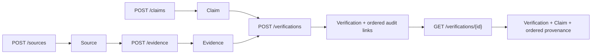

- `uv run pytest tests/test_knowledge_api.py -q`: 4 passed in 0.74s with one Starlette deprecation warning on the final review run.
- `uv run pytest -q`: 13 passed in 0.87s with one Starlette deprecation warning on the final review run.
- Changed-file Ruff check: passed.
- A fresh `assam_exam_ai_t003_test` database upgraded through both existing migrations to head; no database schema migration was required by T-003.
- Post-push architecture review: Approved. The API uses eager loading for the retrieval path, and the missing-Evidence test confirms no partial Verification or provenance row is written.

### T-004 Claim summary synchronization

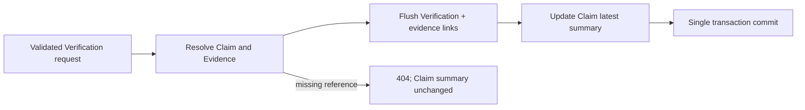

- `update_claim_verification_summary()` copies the Verification verdict, confidence, and database creation time to the linked Claim.
- `_commit_verification()` commits the Verification, provenance links, and Claim summary together and rolls back on failure.
- `uv run pytest tests/test_knowledge_api.py -q`: 4 passed in 1.17s with one Starlette deprecation warning on the final run.
- `uv run pytest -q`: 13 passed in 1.35s with one Starlette deprecation warning on the final run.
- Changed-file Ruff check: passed.
- No database schema migration was required; a fresh `assam_exam_ai_t004_test` database upgraded to the existing migration head successfully.
- Post-push architecture review: Approved. The Claim summary is explicitly the latest verification result, never human approval.

### T-005 Claim summary retrieval

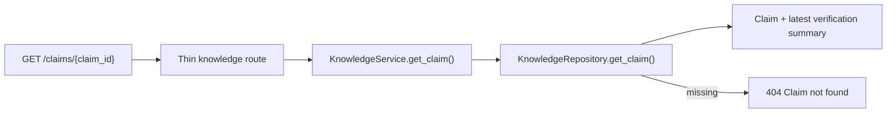

- `uv run pytest tests/test_knowledge_api.py -q`: 5 passed in 1.51s with one Starlette deprecation warning.
- `uv run pytest -q`: 14 passed in 1.01s with one Starlette deprecation warning.
- Changed-file Ruff check: passed.
- No database schema migration was required; a fresh `assam_exam_ai_t005_test` database upgraded through both existing migrations to head successfully.
- Post-push architecture review: Approved. This endpoint returns only the current Claim summary; it does not add history, search, or human approval.

### T-006 relevant Evidence linking

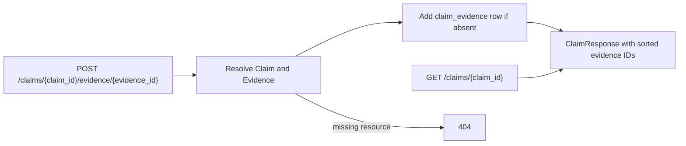

- Relevant Claim evidence is distinct from the evidence recorded for an individual Verification attempt.
- `uv run pytest tests/test_knowledge_api.py -q`: 8 passed in 1.04s with one Starlette deprecation warning on the concurrency-correction run.
- `uv run pytest -q`: 17 passed in 1.10s with one Starlette deprecation warning on the concurrency-correction run.
- Changed-file Ruff check: passed.
- No database schema migration was required; a fresh `assam_exam_ai_t006_test` database upgraded through both existing migrations to head, and `uv run alembic check` reported no new upgrade operations.
- Concurrency correction: the composite primary key plus PostgreSQL `ON CONFLICT DO NOTHING` guarantees duplicate inserts do not fail or create a second row; `populate_existing` refreshes the eagerly loaded relationship for the response.
- Correction migration check: `uv run alembic check` against `assam_exam_ai_t006_correction_test` exited 0 with no new upgrade operations detected.
- Post-push architecture review: Approved. Claim relevance and Verification audit evidence remain distinct; conflict-safe insertion preserves idempotency under concurrency.

### T-007 Evidence retrieval

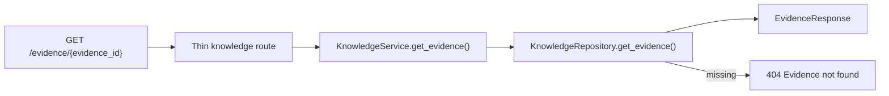

- `uv run pytest tests/test_knowledge_api.py -q`: 10 passed in 0.93s with one Starlette deprecation warning.
- `uv run pytest -q`: 19 passed in 1.00s with one Starlette deprecation warning.
- Changed-file Ruff check: passed.
- No database schema migration was required; a fresh `assam_exam_ai_t007_test` database upgraded through both existing migrations to head, and `uv run alembic check` reported no new upgrade operations.

### T-008 Claim human approval boundary

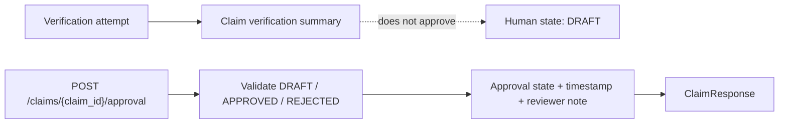

- `uv run pytest tests/test_knowledge_api.py -q`: 16 passed in 1.02s with one Starlette deprecation warning.
- `uv run pytest -q`: 25 passed in 1.10s with one Starlette deprecation warning.
- Changed-file Ruff check: passed.
- Fresh `assam_exam_ai_t008_test` upgrade to `c31a8f4d2b90`, downgrade to `92b13f7c4e61`, and re-upgrade all exited 0.
- A Claim inserted at the prior revision migrated to `DRAFT` with null decision timestamp and reviewer note.
- `uv run alembic check` exited 0 with no new upgrade operations detected.
- Approval-state consistency correction: `APPROVED` and `REJECTED` retain the supplied note and receive a current UTC decision timestamp; `DRAFT` clears both decision fields regardless of the request note.
- Correction verification: `uv run pytest tests/test_knowledge_api.py -q` passed 17 tests in 1.29s with one Starlette deprecation warning; `uv run pytest -q` passed 26 tests in 1.23s with the same warning. Changed-file Ruff and `uv run alembic check` passed; Alembic reported no new upgrade operations after a fresh upgrade to `c31a8f4d2b90`.

### T-009 Approved knowledge read boundary

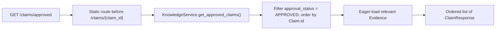

- Focused verification: `uv run pytest tests/test_knowledge_api.py -q` passed 19 tests in 1.23s with one Starlette deprecation warning.
- Full verification: `uv run pytest -q` passed 28 tests in 1.62s with one Starlette deprecation warning.
- Changed-file Ruff passed. No database schema migration is required; the endpoint reads the existing Claim approval fields, and `uv run alembic check` reported no new upgrade operations on the freshly upgraded `assam_exam_ai_t009_test` database.

### T-010 Minimal Topic classification

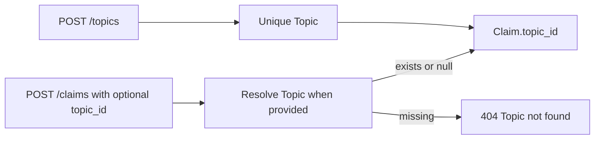

- `uv run pytest tests/test_knowledge_api.py -q`: 22 passed in 1.33s with one Starlette deprecation warning.
- `uv run pytest -q`: 31 passed in 1.29s with one Starlette deprecation warning.
- Changed-file Ruff passed.
- On fresh `assam_exam_ai_t010_test`, upgrade to `c31a8f4d2b90`, insertion of a pre-topic Claim, and upgrade to `e4a6c8d1f203` succeeded; the existing Claim retained null `topic_id`.
- Downgrade to `c31a8f4d2b90` removed both `topics` and `claims.topic_id`; re-upgrade to head succeeded.
- `uv run alembic check` reported no new upgrade operations.
- Duplicate-Topic correction: PostgreSQL remains the concurrency-safe uniqueness authority; the service rolls back its session after `IntegrityError`, raises `ResourceConflictError`, and the route returns HTTP 409 with `{"detail": "Topic name '<name>' already exists"}`.
- Correction verification: `uv run pytest tests/test_knowledge_api.py -q` passed 23 tests in 1.54s; `uv run pytest -q` passed 32 tests in 1.41s. Each run emitted one Starlette deprecation warning. Changed-file Ruff passed, and `uv run alembic check` reported no new upgrade operations.

### T-011 Topic-scoped approved knowledge

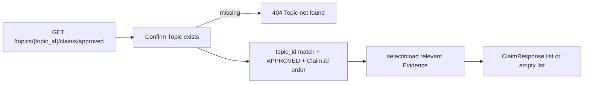

- `uv run pytest tests/test_knowledge_api.py -q`: 26 passed in 2.23s with one Starlette deprecation warning.
- `uv run pytest -q`: 35 passed in 1.48s with one Starlette deprecation warning.
- Changed-file Ruff passed.
- No database schema migration was required. Fresh `assam_exam_ai_t011_test` upgrade to `e4a6c8d1f203` succeeded, and `uv run alembic check` reported no new upgrade operations.

### T-012 Deterministic Topic note preview

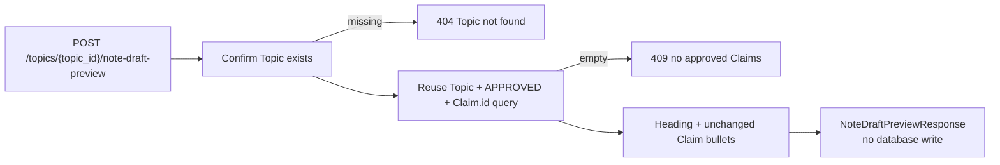

- `uv run pytest tests/test_knowledge_api.py -q`: 29 passed in 1.33s with one Starlette deprecation warning.
- `uv run pytest -q`: 38 passed in 1.62s with one Starlette deprecation warning.
- Changed-file Ruff passed.
- No database schema migration was required. Upgrade to existing head `e4a6c8d1f203` succeeded on `assam_exam_ai_t012_test`, and `uv run alembic check` reported no new upgrade operations.

### T-013 Stored internal Topic note draft

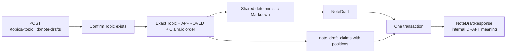

- `uv run pytest tests/test_note_drafts.py -q`: 4 passed in 0.85s with one Starlette deprecation warning.
- `uv run pytest -q`: 42 passed in 1.63s with one Starlette deprecation warning.
- Changed-file Ruff passed.
- Fresh upgrade through `b7d9e2f4a610` succeeded. Downgrade to `e4a6c8d1f203` removed both new tables, re-upgrade succeeded, and `uv run alembic check` reported no new upgrade operations.
- Duplicate-Claim constraint correction: `uv run pytest tests/test_note_drafts.py -q` passed 4 tests in 0.87s; `uv run pytest -q` passed 42 tests in 2.11s. Each emitted one Starlette deprecation warning. Changed-file Ruff passed, `uv run alembic check` reported no new upgrade operations, and `git diff --check` passed.

### T-014 Stored NoteDraft snapshot retrieval

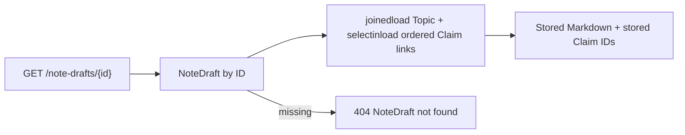

- `uv run pytest tests/test_note_drafts.py -q`: 6 passed in 1.01s with one Starlette deprecation warning.
- `uv run pytest -q`: 44 passed in 1.92s with one Starlette deprecation warning.
- Changed-file Ruff passed and `git diff --check` passed.
- No database schema migration was required. Fresh upgrade through existing head `b7d9e2f4a610` succeeded, and `uv run alembic check` reported no new upgrade operations.

### T-015 Independent NoteDraft human review

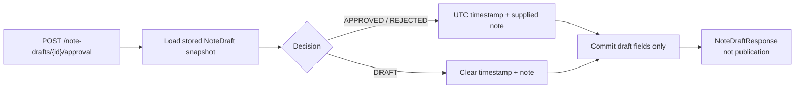

- `uv run pytest tests/test_note_drafts.py -q`: 12 passed in 1.31s with one Starlette deprecation warning.
- `uv run pytest -q`: 50 passed in 2.10s with one Starlette deprecation warning.
- Changed-file Ruff passed and `git diff --check` passed.
- Migration `d4f8a1c7e592` upgraded an existing draft to `DRAFT` with null decision metadata, downgrade removed all three approval fields, re-upgrade succeeded, and `uv run alembic check` reported no new upgrade operations.

### T-016 Approved NoteDraft read boundary

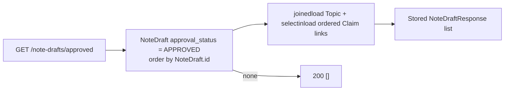

- `uv run pytest tests/test_note_drafts.py -q`: 14 passed in 1.35s with one Starlette deprecation warning.
- `uv run pytest -q`: 52 passed in 2.31s with the same warning.
- Changed-file Ruff passed and `git diff --check` passed.
- No database schema migration was required. A fresh dedicated `assam_exam_ai_t016_test` database upgraded through existing head `d4f8a1c7e592`; `uv run alembic check` reported no new upgrade operations.

### T-017 Sourced syllabus-version foundation

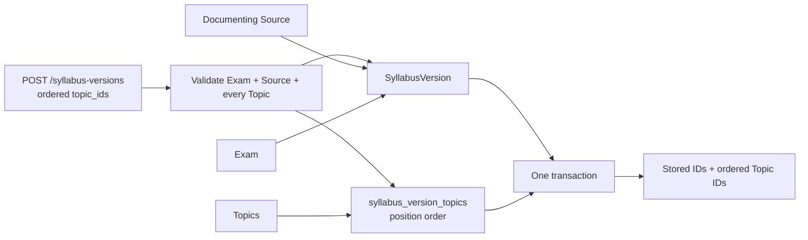

- `POST /api/v1/exams` creates only a unique code/name Exam identity; named PostgreSQL uniqueness constraints remain the concurrency-safe conflict authority.
- `POST /api/v1/syllabus-versions` validates every reference before persistence and derives non-negative positions from the non-empty duplicate-free request order.
- PostgreSQL restricts deletion of referenced Exams, Sources, Topics, and mapped SyllabusVersions; no relevance score, likelihood, probability, or syllabus content is inferred.
- `uv run pytest tests/test_syllabus_api.py -q`: 15 passed in 1.33s with one Starlette deprecation warning.
- `uv run pytest -q`: 67 passed in 3.57s with the same warning.
- Changed-file Ruff passed and `git diff --check` passed.
- Fresh upgrade through `f6b3c9a2d741`, downgrade to `d4f8a1c7e592`, re-upgrade, and `uv run alembic check` all passed; Alembic reported no new upgrade operations.

### T-018 Sourced previous-question occurrence foundation

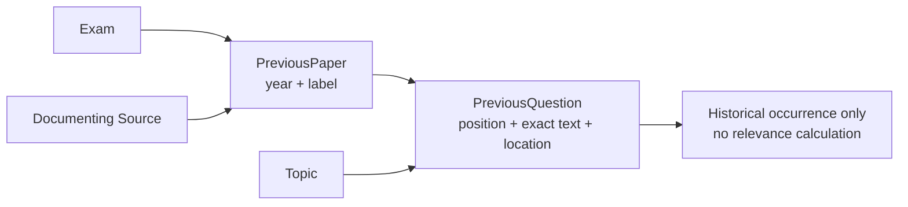

- `POST /api/v1/previous-papers` validates Exam and Source before committing a positive-year paper whose label is unique for that Exam/year.
- `POST /api/v1/previous-questions` validates Paper and Topic before committing exact non-blank text at a unique non-negative paper position.
- Named PostgreSQL constraints remain the concurrency-safe conflict authority; restrictive foreign keys preserve source, exam, paper, and Topic provenance.
- `uv run pytest tests/test_previous_papers_api.py -q`: 15 passed in 1.51s with one Starlette deprecation warning.
- `uv run pytest -q`: 82 passed in 3.44s with the same warning.
- Changed-file Ruff passed.
- Fresh upgrade through `a8c4e1d7f620`, downgrade to `f6b3c9a2d741`, re-upgrade, and `uv run alembic check` passed; Alembic reported no new upgrade operations.
- `git diff --check` passed.

### T-019 Explainable Topic priority band

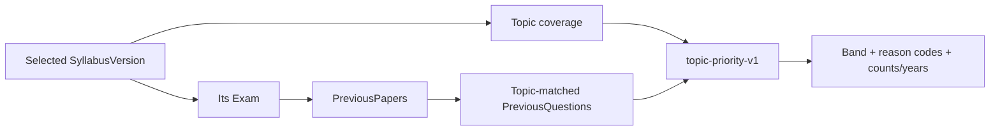

- The repository eagerly loads the selected version's Topic links and uses one outer-join query for all paper/occurrence statistics, avoiding N+1 queries.
- The service counts matched question occurrences separately from distinct matched papers and sorts unique matched years.
- Topics absent from the selected version are `LOW`; covered Topics repeated across at least two papers are `HIGH`; all other covered Topics are `MEDIUM`.
- Every result has one coverage reason and one historical-data reason, distinguishing no paper data from papers with no Topic match.
- `uv run pytest tests/test_topic_priority_api.py -q`: 8 passed in 1.50s with one Starlette deprecation warning.
- `uv run pytest -q`: 90 passed in 4.76s with the same warning.
- Changed-file Ruff passed; `uv run alembic check` reported no new upgrade operations; `git diff --check` passed.
- The endpoint performs no writes and returns no percentage, probability, or prediction.

### T-020 Canonical ContentVersion identity

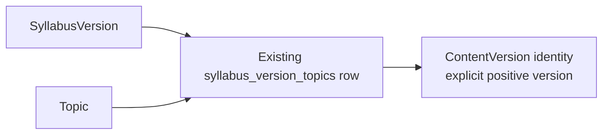

- Creation validates SyllabusVersion and Topic existence, then requires their exact stored mapping.
- PostgreSQL provides concurrency-safe uniqueness, positive-version validation, composite membership, and restrictive deletion protection.
- Versions are caller-supplied and retained independently. The current API is create/read-only with no update endpoint; database-level update/delete prevention is not implemented.
- `uv run pytest tests/test_content_versions_api.py -q`: 12 passed in 1.18s with one Starlette deprecation warning.
- `uv run pytest -q`: 102 passed in 4.18s with the same warning.
- Fresh upgrade through `c5e7a9d2b814`, downgrade to `a8c4e1d7f620`, re-upgrade, and `uv run alembic check` passed; no new upgrade operations were detected.
- Changed-file Ruff and `git diff --check` passed.
- No dependency, environment, secret, Docker-service, NoteDraft, priority-rule, release, AI, or learner-personalization change was required.

### T-021 Grounded QuestionBankItem candidate

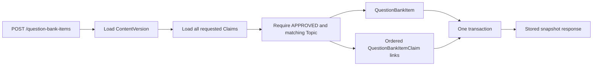

- Positions are derived from request order; the request rejects empty, duplicate, and non-positive Claim IDs.
- PostgreSQL enforces non-whitespace text, allowed difficulty, one Claim per item, unique non-negative positions, and restricted deletion of referenced ContentVersions and Claims.
- Creation locks and validates every requested Claim in one query before persistence, then commits the item and all links together; any failure rolls back the transaction.
- Retrieval eagerly loads all Claim links and returns stored fields and persisted Claim order without reconsidering current approval.
- `uv run pytest tests/test_question_bank_items_api.py -q`: 17 passed in 2.03s with one Starlette deprecation warning.
- `uv run pytest -q`: 119 passed in 4.72s with the same warning.
- Fresh upgrade through `e9a4c2f7b163`, downgrade to `c5e7a9d2b814`, re-upgrade, and `uv run alembic check` passed; no new upgrade operations were detected.
- No dependency, configuration, option/answer, review, release, AI, NoteDraft-binding, or learner-facing feature was added.

### T-022 Complete internal MCQ structure

```mermaid
flowchart LR
    REQUEST["POST /question-bank-items\noptions + correct position"] --> VALIDATE["Pydantic validation"]
    VALIDATE --> ITEM["QuestionBankItem"]
    ITEM --> OPTIONS["Ordered QuestionBankOption rows"]
    OPTIONS --> FLUSH["Flush item and options"]
    FLUSH --> ANSWER["Store selected option ID"]
    ANSWER --> COMMIT["Atomic commit with Claim links"]
    COMMIT --> READ["Eager stored snapshot read"]
```

- New requests require at least two non-blank option strings and one in-range `correct_option_position`; option positions come from request order.
- `question_bank_items.correct_option_id` remains nullable only so existing T-021 rows migrate and remain retrievable as `options: []` and `correct_option_position: null`.
- The composite `(question_bank_item.id, correct_option_id)` foreign key references `(question_bank_option.question_bank_item_id, id)`, preventing cross-item answers and direct deletion of the selected option.
- PostgreSQL also enforces non-whitespace option text and unique non-negative positions. Deleting an item cascades only its option and Claim-link dependents.
- Retrieval select-in loads both ordered collections and never re-evaluates Claim approval.
- `uv run pytest tests/test_question_bank_items_api.py -q`: 26 passed in 1.42s with one Starlette deprecation warning.
- `uv run pytest -q`: 128 passed in 4.88s with the same warning.
- Fresh upgrade through `f2c8d4a6e915`, downgrade to `e9a4c2f7b163`, re-upgrade, and `uv run alembic check` passed; no new upgrade operations were detected.
- No dependency, configuration, Docker, AGENTS, README, review, release, AI, previous-question conversion, NoteDraft binding, or learner feature changed.

### T-023 Independent QuestionBankItem review

```mermaid
flowchart LR
    REQUEST["POST /question-bank-items/{id}/approval"] --> LOAD["Load stored candidate snapshot"]
    LOAD --> COMPLETE{"APPROVED and complete?"}
    COMPLETE -->|No| CONFLICT["Stable 409; no mutation"]
    COMPLETE -->|Yes or non-APPROVED| DECISION["Set or clear decision metadata"]
    DECISION --> COMMIT["Atomic commit"]
    COMMIT --> RESPONSE["Complete stored response"]
```

- New and migrated candidates default to DRAFT with null decision time and reviewer note; migration never infers approval.
- APPROVED and REJECTED decisions record current UTC time and the supplied note. DRAFT clears both metadata fields.
- APPROVED requires at least two stored options and a valid same-item correct option. Incomplete legacy rows remain DRAFT-capable and rejectable.
- Review does not re-evaluate current Claim approval or change text, explanation, difficulty, ContentVersion, Claims, options, or answer.
- `uv run pytest tests/test_question_bank_items_api.py -q`: 34 passed in 2.28s with one Starlette deprecation warning.
- `uv run pytest -q`: 136 passed in 6.13s with the same warning.
- A seeded complete T-022 row survived downgrade/re-upgrade and received DRAFT with null decision metadata on each upgrade; `uv run alembic check` reported no new upgrade operations.
- Changed-file Ruff and `git diff --check` passed.

### T-024 Approved QuestionBankItem read boundary

```mermaid
flowchart LR
    REQUEST["GET /question-bank-items/approved"] --> QUERY["Filter own status = APPROVED; order by ID"]
    QUERY --> EAGER["Select-in load ordered Claim links and options"]
    EAGER --> SNAPSHOT["Serialize stored QuestionBankItem snapshots"]
    SNAPSHOT --> RESPONSE["200 list; empty list when none"]
```

- The static route is registered before the dynamic QuestionBankItem ID route.
- Eligibility depends only on each QuestionBankItem's explicit APPROVED status; current Claim, NoteDraft, and Verification states are not consulted.
- Retrieval returns stored text, explanation, difficulty, ContentVersion, ordered Claim IDs, ordered options, correct answer, and approval metadata without writes or regeneration.
- `uv run pytest tests/test_question_bank_items_api.py -q`: 36 passed, 1 warning in 2.30s.
- `uv run pytest -q`: 138 passed, 1 warning in 5.51s.
- Changed-file Ruff passed, and `uv run alembic check` reported no new upgrade operations. No schema migration was required.

### T-025 Controlled QuestionBankItem release lifecycle

```mermaid
flowchart LR
    UNRELEASED -->|"complete + own APPROVED"| RELEASED
    RELEASED -->|"explicit withdrawal"| WITHDRAWN
    RELEASED --> LOCK["Block DRAFT/REJECTED review changes"]
    WITHDRAWN --> REVIEW["Review changes allowed; no re-release"]
```

- New and migrated candidates default to UNRELEASED with null release metadata; approval never implies release.
- PostgreSQL enforces valid status/timestamp combinations and requires RELEASED rows to have their own APPROVED review state.
- Release and approval decisions lock the candidate row, validate transitions, and use the existing rollback-safe commit boundary.
- Release requires the stored candidate to be complete and currently approved but does not re-evaluate Claim, NoteDraft, or Verification state.
- Withdrawal preserves the original release time, records its own UTC time, and prevents in-place re-release.
- The approved-items endpoint remains an approval-only boundary and can return approved UNRELEASED, RELEASED, or WITHDRAWN candidates.
- `uv run pytest tests/test_question_bank_items_api.py -q`: 52 passed, 1 warning in 3.45s.
- `uv run pytest -q`: 154 passed, 1 warning in 6.11s.
- Fresh upgrade, downgrade to `a6d1e8c3f247`, re-upgrade to `b3e7f1a9c462`, seeded-row preservation, changed-file Ruff, and Alembic metadata checks passed.

### T-026 Released QuestionBankItem read boundary

```mermaid
flowchart LR
    REQUEST["GET /question-bank-items/released"] --> QUERY["Filter current release_status = RELEASED; order by ID"]
    QUERY --> EAGER["Select-in load ordered Claim links and options"]
    EAGER --> SNAPSHOT["Serialize stored QuestionBankItem snapshots"]
    SNAPSHOT --> RESPONSE["200 list; empty list when none"]
```

- Eligibility depends only on each QuestionBankItem's current persisted RELEASED state; approved UNRELEASED and approved WITHDRAWN candidates are excluded.
- The existing approved-items endpoint remains approval-only and continues to include approved candidates regardless of UNRELEASED or WITHDRAWN state.
- Repository filtering, ascending item order, and select-in loading avoid per-item Claim/option queries; relationship order preserves stored positions.
- Responses reuse `QuestionBankItemResponse` and do not regenerate content, re-evaluate Claim/NoteDraft/Verification state, lock rows, or write data.
- `uv run pytest tests/test_released_question_bank_items_api.py tests/test_question_bank_items_api.py -q`: 54 passed, 1 warning in 4.11s.
- `uv run pytest tests/test_question_bank_items_api.py -q`: 52 passed, 1 warning in 3.97s.
- `uv run pytest -q`: 156 passed, 1 warning in 6.91s.
- Changed-file Ruff passed. No model, schema, or migration changed; Alembic head remains `b3e7f1a9c462`, and `uv run alembic check` reported no new upgrade operations.

## Template for future pushed changes

Copy and append this section after inspecting the pushed commit and its reported checks.

````markdown
### W-XXX — Short change title

| Field | Value |
| --- | --- |
| Task ID | `T-XXX` |
| Implementation commit | `<full SHA>` |
| Date | `<UTC date>` |
| Components changed | `<paths and concise description>` |
| Test result | Passed / Failed / Not run — `<exact command and result or blocker>` |
| Documentation review | Pending / Approved / Changes requested |

#### Changed flow

```mermaid
flowchart TD
    INPUT["Input"] --> COMPONENT["Changed component"]
    COMPONENT --> OUTPUT["Output"]
```

#### Component changes

| Component | File | Change | Responsibility | Tests |
| --- | --- | --- | --- | --- |
| `name()` | `path/to/file.py` | Added / changed / removed | Short responsibility | `test_name()` or Not applicable |
````

### T-007 post-push review

- Approved at `fbb1555acfecdc0942c032727684bce9d5e1e3a5`.
- The endpoint is intentionally a single-record read; no source details, lists, search, or history were introduced.

### T-008 post-push review

- Approved at `64c143498af19c9dc120093c5544e00c92011ef8`.
- Verification and approval remain intentionally separate. `DRAFT` clears decision metadata; it is not a decision.

### T-009 post-push review

- Approved at `262bb7db9226ef31f7d9e61e9c7323f9cbd512a8`.
- Only explicit human-approved Claims are returned; this is a read boundary, not content generation.

### T-010 post-push review

- Approved at `1a8a1ed15a94c128c7fb89442aee605d3263cbf6`.
- Topic classification remains deliberately flat and optional; deletion preserves Claims by nulling the Topic reference.


### T-011 review outcome

- Reviewed the pushed commit `209ea1678136030ba340b243c3735d1a9f65ee67`: it preserves the human-approval boundary and exposes only Topic-matched, explicitly approved Claims as a future internal draft input.


### T-012 review outcome

- Reviewed pushed commit `1c33a89056eda9b04db2c71c9b60d17d3e8ccd0f`: the Markdown preview uses only the ordered approved-Claim boundary and performs no write or publication. Persistent drafts will need their own provenance records before an LLM is introduced.


### T-013 review outcome

- Reviewed pushed commit `3aacf3d2b76098092cfae072c7cfa4ca40c88e3f`: note drafts and provenance links commit atomically; the database rejects duplicate Claim links and duplicate positions. Drafts remain internal and have no approval or publication state.


### T-014 review outcome

- Reviewed pushed commit `c595da4e9ce8aedd60bf0f881d9bb59c6618881d`: the read path returns stored Markdown and original ordered Claim links without re-evaluating today’s Claim eligibility. Retrieval is internal review only, not approval or publication.


### T-015 review outcome

- Reviewed pushed commit `811f10af3ee63a22e253ff24e9450770e2cbbbc2`: draft review has constrained DRAFT/APPROVED/REJECTED states, correct reset semantics, and never changes Claim state, provenance, or stored Markdown. Approval is not publication.


### T-016 review outcome

- Reviewed pushed commit `611fcb87b38b8506b1a509bea1c0abb4f581c5a7`: only each NoteDraft's own explicit APPROVED state controls the result. It returns immutable stored snapshots and does not make reviewed content public.


### T-017 review outcome

- Reviewed pushed commit `e1aea55991671679d1666f4e472a6ad7425310df`: Exam identity, sourced SyllabusVersion records, and ordered Topic mappings are protected by database constraints and created atomically.
- This flow records official syllabus coverage only. It does not calculate relevance, frequency, likelihood, or exam probability.


### T-018 review outcome

- Reviewed pushed commit `c7d7b9f18d68c9da1aeea5747b5925bf5922ead8`: previous papers cite their Exam and Source, and each historical question retains its Paper, Topic, position, exact text, and optional source location.
- The records support future frequency-based reasons but do not themselves generate content or predict an exam.


### T-019 review outcome

- Reviewed pushed commit `ff326dc5334dfc41ec298d10551f8c5801ae21b1`: the endpoint applies the exact fixed v1 rule, separates question and distinct-paper counts, excludes other Exams, returns deterministic reasons, and performs no writes.
- The band is an explainable preparation priority. It is not a percentage, calibrated likelihood, or prediction of exam appearance.


### T-020 review outcome

- Reviewed pushed commit `c5d2010da24731387162020accc9030d6fcca01e`: ContentVersion membership is enforced by the composite foreign key to the exact syllabus/Topic mapping, version identity is positive and scoped-unique, and the referenced mapping is deletion-restricted.
- The current API creates and retrieves identity only. There is no update endpoint or database-level prevention of direct ContentVersion update/deletion, and no canonical asset exists yet.


### T-023 review outcome

- Independently reviewed pushed implementation commit `1e84907906579c08d7218771669730b9855778d6`, whose parent is the approved T-022 documentation head `2f889fed9302c483c9065102953d4c1ca1fe2fe2`.
- Approved: the migration safely defaults existing candidates to DRAFT without inferred approval; the API records or clears independent decision metadata while preserving stored content and provenance; incomplete legacy candidates cannot be approved.
- The implementation preserves route to schema to service to repository to PostgreSQL layering and adds no approved-item list, release, publication, learner, AI, dependency, configuration, or infrastructure behavior.
- GitHub reported no status contexts and no check runs for the implementation commit. The recorded `34 passed` focused and `136 passed` full-suite results, Ruff, migration-cycle, Alembic, and diff checks are developer-provided validation evidence, not independently verified GitHub CI.


---

## T-024 independent review outcome

- **APPROVED** after inspection of implementation commit `6dc8e9497fe55870173c584717e3ab78563baf3f` against the issued T-024 prompt and its parent `e2c62be92006061b77ef2c260489ad5e0821f17b`.
- The static approved-candidate route precedes the dynamic ID route; repository filtering uses only the QuestionBankItem's own `APPROVED` state, orders by item ID, and select-in loads ordered Claim links and options.
- Responses reuse stored `QuestionBankItemResponse` snapshots, return `[]` when no item qualifies, do not re-evaluate Claim, NoteDraft, or Verification state, and perform no writes.
- Developer-recorded validation: `36 passed, 1 warning` focused; `138 passed, 1 warning` full suite; changed-file Ruff, fresh database upgrade, Alembic check, and diff check passed. GitHub exposes no status contexts or workflow runs for the commit, so no CI pass is claimed.
- No model, schema, migration, dependency, configuration, Docker, release, publication, learner, generation, personalization, mock, or T-025 implementation was included.


---

## T-025 independent review outcome

- **APPROVED** after inspection of implementation commit `84e0b20fd81d9bf7b241a93686811db0ccd3e8dc` against the issued T-025 prompt and its parent `91a9ecaa861a0ceba8d557bb1995f6d636bfcd8f`.
- The migration adds the constrained UNRELEASED/RELEASED/WITHDRAWN lifecycle after `a6d1e8c3f247`, defaults existing candidates without inferred release, and removes only T-025 fields and constraints on downgrade.
- The release endpoint requires a complete, currently APPROVED stored candidate; withdrawal preserves the original release time; invalid eligibility and transitions return stable 409 without mutation.
- Approval and release decisions lock the candidate row. Release does not re-evaluate current Claim, NoteDraft, or Verification state and changes no stored content, provenance, answer, or prior review metadata.
- `GET /api/v1/question-bank-items/approved` remains an approval-only boundary. No released collection, public/learner delivery, generation, personalization, dependency, configuration, Docker, or T-026 implementation was included.
- Developer-recorded validation: `52 passed, 1 warning` focused; `154 passed, 1 warning` full suite; changed-file Ruff, fresh upgrade, downgrade/re-upgrade, seeded-row preservation, Alembic check, and diff check passed. GitHub exposes no status contexts or workflow runs for the implementation commit, so no CI pass is claimed.


---

## T-026 independent review outcome

- **APPROVED** after inspection of implementation commit `d5c3b484b8268ae745da491617c56c02a1be3853` against the canonical T-026 prompt and parent `3e630d9fd952dcb24a320295fbc281b6396b0e45`.
- The static released-candidate route precedes the dynamic item route. Its repository query filters exactly on current RELEASED state, orders by item ID, and select-in loads ordered Claim links and options.
- Responses reuse stored `QuestionBankItemResponse` snapshots. UNRELEASED and WITHDRAWN candidates are excluded; the approved-items collection remains an independent approval-only boundary.
- The endpoint performs no write, lock, transition, regeneration, or current Claim/NoteDraft/Verification evaluation. Existing T-021 through T-025 behavior remains intact.
- Developer-recorded validation: `54 passed, 1 warning` combined focused tests; `52 passed, 1 warning` existing QuestionBankItem tests; `156 passed, 1 warning` full suite; changed-file Ruff and Alembic checks passed. GitHub exposes no status contexts or workflow runs, so no CI pass is claimed.
- No model, schema, migration, dependency, configuration, Docker, public/learner delivery, publication transport, mock assembly, AI, personalization, or T-027 implementation was included.


### T-027 NoteDraft ContentVersion ownership

```mermaid
flowchart LR
    REQUEST["POST /topics/{topic_id}/note-drafts\ncontent_version_id"] --> TOPIC["Resolve path Topic"]
    TOPIC --> VERSION["Resolve ContentVersion"]
    VERSION --> MATCH["Require matching topic_id"]
    MATCH --> CLAIMS["Load ordered APPROVED Claims"]
    CLAIMS --> STORE["Atomically store NoteDraft + ordered Claim links"]
    STORE --> FK["PostgreSQL composite same-Topic FK"]
```

- New persisted drafts require a positive ContentVersion ID; preview remains request-body-free and non-persistent.
- Service validation is ordered as Topic 404, ContentVersion 404, same-Topic 409, then existing no-approved-Claims 409, before persistence begins.
- PostgreSQL enforces `(content_version_id, topic_id)` membership against `(content_versions.id, content_versions.topic_id)` and restricts deletion of a referenced ContentVersion.
- The database column remains nullable only for migration-safe legacy compatibility. Existing drafts retain null ownership without inference and remain retrievable, reviewable, and eligible for the approval-only collection.
- Fresh migration upgrade, downgrade to `b3e7f1a9c462`, and re-upgrade to `c7a4e9d2f816` preserved a seeded legacy draft, its Markdown, Topic, approval metadata, and ordered Claim link with null ContentVersion ownership.
- `uv run pytest tests/test_note_drafts.py -q`: 22 passed, 1 warning in 1.93s.
- `uv run pytest tests/test_content_versions_api.py -q`: 12 passed, 1 warning in 0.96s.
- `uv run pytest -q`: 164 passed, 1 warning in 7.88s.
- Changed-file Ruff passed; `uv run alembic heads` reports `c7a4e9d2f816 (head)` and `uv run alembic check` reports no new upgrade operations.
### T-027 post-push review

- **APPROVED** at implementation commit `bcff4c54a04f6ec3cdcb094f71d64241e87a3622`, whose parent is the T-027 issuance head `a2e9f2ba19ba599255a18f3724e07482489b4b72`.
- The persisted NoteDraft creation boundary now requires a positive ContentVersion ID, validates Topic then ContentVersion then same-Topic ownership before approved Claims, and atomically stores the exact ContentVersion with deterministic Markdown and ordered Claim provenance.
- Migration `c7a4e9d2f816` follows `b3e7f1a9c462`, preserves legacy drafts with null ownership, and enforces non-null same-Topic ownership plus restricted ContentVersion deletion through PostgreSQL.
- Individual retrieval, approval responses, and the approved-drafts collection preserve stored ownership; explicit tests cover non-null new ownership and null legacy compatibility.
- Developer-recorded evidence is 22 focused NoteDraft tests, 12 focused ContentVersion tests, and 164 full-suite tests, each with one existing warning, plus successful Ruff, migration-cycle, Alembic, and diff checks. GitHub exposes no status contexts or workflow runs for the implementation commit, so no CI pass is claimed.
- No NoteDraft release, released collection, publication transport, public/learner delivery, PDF, AI, personalization, dependency, configuration, Docker, or T-028 implementation was included.


### T-028 Controlled NoteDraft release lifecycle

```mermaid
flowchart LR
    UNRELEASED -->|"own APPROVED + ContentVersion"| RELEASED
    RELEASED -->|"explicit withdrawal"| WITHDRAWN
    RELEASED --> LOCK["Block DRAFT/REJECTED review changes"]
    WITHDRAWN --> REVIEW["Review changes allowed; no re-release"]
```

- New and migrated drafts default to UNRELEASED with null release metadata; neither approval nor version ownership infers release.
- Release and approval decisions use `SELECT ... FOR UPDATE OF note_drafts`; conflicts occur before field mutation, and successful decisions commit once through the rollback-safe service boundary.
- Release requires the draft's own APPROVED review and non-null stored ContentVersion, without re-evaluating Claims or other review/release concepts.
- Withdrawal retains the initial release time, records the UTC withdrawal time, replaces the optional decision note, and prevents in-place re-release.
- The approved-drafts collection remains approval-only and returns stored release metadata for approved UNRELEASED, RELEASED, and WITHDRAWN snapshots.
- `uv run pytest tests/test_note_drafts.py -q`: 41 passed, 1 warning in 3.56s.
- `uv run pytest -q`: 183 passed, 1 warning in 10.37s.
- Fresh upgrade, downgrade to `c7a4e9d2f816`, re-upgrade to `d9e5b2a7c418`, seeded owned/legacy-row preservation, PostgreSQL constraint probes, and Alembic metadata checks passed.
### T-028 post-push review

- **APPROVED** at implementation commit `4974d87f90c08a5e39b3fe31a5cd1f7e1f9a4470`, whose parent is the T-028 issuance head `ac5f19c54c637dba27c5e396641c9d6cc34896dd`.
- The immutable commit adds only the controlled NoteDraft UNRELEASED/RELEASED/WITHDRAWN lifecycle, migration `d9e5b2a7c418`, response metadata, row-locked approval/release decisions, and one release-decision endpoint.
- Release requires the target draft's own APPROVED review and stored ContentVersion ownership. Withdrawal preserves the original release time; legacy null-owned drafts remain readable and reviewable but cannot be released.
- PostgreSQL independently constrains lifecycle status, metadata, approval, and ownership. The approved-drafts collection remains approval-only, and no released-draft collection or publication boundary was added.
- Developer-recorded evidence is 41 focused NoteDraft tests and 183 full-suite tests, each with one existing warning, plus successful Ruff, fresh migration, seeded downgrade/re-upgrade, PostgreSQL constraint, Alembic, and diff checks. GitHub exposes no status contexts or workflow runs, so no CI pass is claimed.
- No dependency, configuration, Docker, public/learner delivery, publication transport, PDF, AI, personalization, or T-029 implementation was included.


### T-029 Released NoteDraft read boundary

```mermaid
flowchart LR
    REQUEST["GET /note-drafts/released"] --> QUERY["Filter release_status = RELEASED; order by ID"]
    QUERY --> EAGER["Joined-load Topic + select-in load ordered Claim links"]
    EAGER --> SNAPSHOT["Serialize stored NoteDraftResponse snapshots"]
    SNAPSHOT --> RESPONSE["200 list; empty list when none"]
```

- The static released route precedes the dynamic NoteDraft-ID route and delegates through the existing service and repository layers.
- Eligibility depends only on current persisted RELEASED state; UNRELEASED and WITHDRAWN drafts are excluded even when approved.
- The repository performs exact filtering, ascending ordering, and eager loading. The service reuses the stored response serializer without locks, writes, regeneration, or current Claim/Verification/QuestionBankItem/priority evaluation.
- The approved-drafts endpoint remains approval-only and continues to include approved UNRELEASED and approved WITHDRAWN drafts.
- `uv run pytest tests/test_released_note_drafts_api.py -q`: 2 passed, 1 warning in 1.47s.
- `uv run pytest tests/test_note_drafts.py -q`: 41 passed, 1 warning in 3.55s.
- `uv run pytest -q`: 185 passed, 1 warning in 10.29s.
- Changed-file Ruff passed. No model, schema, or migration changed; Alembic head remains `d9e5b2a7c418`.


### T-029 post-push review

- **APPROVED** at implementation commit `ee755cfc3a88700abababf2473bd8d615c16c871`, whose parent is the T-029 issuance head `a351673bc242261640faa1468a33e395fe740e4b`.
- The immutable commit adds only `GET /api/v1/note-drafts/released` through the existing route, service, repository, and `NoteDraftResponse` layers.
- Eligibility is exactly current persisted RELEASED state. Results are ordered by ascending draft ID; Topic is joined-loaded and ordered Claim links are select-in loaded, avoiding obvious per-draft N+1 behavior.
- Stored ContentVersion ownership, Markdown, Claim provenance, review metadata, and release metadata are returned without locks, writes, regeneration, or current-state re-evaluation. The approved-drafts collection remains approval-only.
- Developer-recorded evidence is 2 focused released-draft tests, 41 focused NoteDraft tests, and 185 full-suite tests, each with one existing warning, plus successful Ruff, Alembic-head/check, and diff checks. GitHub exposes no status contexts or workflow runs for the implementation commit, so no CI pass is claimed.
- No model, schema, migration, dependency, configuration, Docker, publication transport, public/learner delivery, PDF, content package, mock assembly, AI, personalization, or T-030 implementation was included.


### T-030 ContentVersion released-assets manifest

```mermaid
flowchart LR
    REQUEST["GET /content-versions/{id}/released-assets"] --> VERSION["Resolve exact ContentVersion"]
    VERSION --> NOTES["Filter RELEASED NoteDrafts by ContentVersion; order by ID; eager-load Topic and Claims"]
    VERSION --> QUESTIONS["Filter RELEASED QuestionBankItems by ContentVersion; order by ID; eager-load Claims and options"]
    NOTES --> RESPONSE["Serialize stored snapshots"]
    QUESTIONS --> RESPONSE
    RESPONSE --> RESULT["200 manifest; empty asset lists allowed"]
```

- The route returns the exact stored ContentVersion response and independently ordered lists of only its currently RELEASED NoteDraft and QuestionBankItem snapshots.
- Ownership and release filtering occur in PostgreSQL. NoteDraft Topic and ordered Claim links, plus QuestionBankItem ordered Claim links and options, are eagerly loaded with fixed-query patterns that avoid per-asset relationship queries.
- The service reuses the existing stored asset serializers. The endpoint performs no locks, writes, flushes, commits, transitions, regeneration, inference, or current Claim/Verification/priority evaluation.
- Missing ContentVersion returns the established 404. An existing ContentVersion with no eligible assets returns HTTP 200 with both lists empty. Global approval and release collections retain their independent semantics.
- `uv run pytest tests/test_content_version_released_assets_api.py -q`: 3 passed, 1 warning in 1.85s.
- `uv run pytest tests/test_content_versions_api.py -q`: 12 passed, 1 warning in 1.09s.
- `uv run pytest tests/test_released_note_drafts_api.py -q`: 2 passed, 1 warning in 1.38s.
- `uv run pytest tests/test_released_question_bank_items_api.py -q`: 2 passed, 1 warning in 1.21s.
- `uv run pytest -q`: 188 passed, 1 warning in 11.12s. Changed-file Ruff passed. Fresh upgrade reached `d9e5b2a7c418`; Alembic reported one head and no new upgrade operations.
- No model, migration, dependency, configuration, environment, Docker, package persistence, publication transport, public/learner delivery, PDF, AI, personalization, or T-031 work was added.


### T-030 post-push review

- **APPROVED** at implementation commit `3a81ce6cefdcc3bd0abd7a17ecc1472d5bb1d4d4`, whose parent is the T-030 issuance head `f25c633b86648bf9958cdf317b72336a38dd5ca6`.
- The implementation commit was originally titled `T-031 implemented`; empty follow-up commit `265f683b5180cde585d366fce17ffe53c11c1955` corrects task traceability without changing the tree or rewriting history.
- The immutable implementation adds only the exact-ContentVersion released-assets manifest through the route, composite response schema, service, repository queries, focused tests, and accurate documentation.
- PostgreSQL filters each asset type by exact stored ContentVersion ownership and RELEASED state. Results use independent ascending-ID order and eager loading for NoteDraft Topic/Claims and QuestionBankItem Claims/options.
- Stored ContentVersion, NoteDraft, and QuestionBankItem serializers are reused. Missing versions retain the established 404; existing versions may return two empty lists; requests perform no locks, writes, transitions, inference, regeneration, or current-state re-evaluation.
- Developer-recorded evidence is 3 focused manifest tests, 12 ContentVersion tests, 2 released-NoteDraft tests, 2 released-QuestionBankItem tests, and 188 full-suite tests, each with one existing warning, plus successful Ruff, fresh database upgrade, Alembic-head/check, and diff checks. GitHub exposes no status contexts or workflow runs for either pushed commit, so no CI pass is claimed.
- No model, migration, dependency, configuration, Docker, persisted package, publication transport, public/learner delivery, PDF, AI, personalization, or actual T-031 implementation was included.


### T-031 Immutable ContentPackage membership snapshot

```mermaid
flowchart LR
    REQUEST["POST /content-versions/{id}/content-packages"] --> LOCK["Lock ContentVersion"]
    LOCK --> NOTES["Lock exact-version RELEASED NoteDrafts; order by ID"]
    LOCK --> QUESTIONS["Lock exact-version RELEASED QuestionBankItems; order by ID"]
    NOTES --> PACKAGE["Persist package + zero-based ordered links"]
    QUESTIONS --> PACKAGE
    PACKAGE --> COMMIT["One commit; stored membership response"]
```

- `ContentPackageResponse` returns the stored package ID, ContentVersion ID, creation time, and both membership ID lists in persisted position order.
- Repository selection filters exact ContentVersion ownership plus RELEASED state in PostgreSQL, orders each asset type by ID, and uses row locks together with the locked ContentVersion during creation.
- The service rejects a missing ContentVersion with the established 404 and rejects two empty eligible collections with `ContentVersion <id> has no released assets to package`; both paths create no package or links.
- PostgreSQL composite foreign keys bind every package link and asset to the same ContentVersion. Per-type primary keys, unique package positions, and non-negative position checks reject duplicate membership and invalid ordering; referenced assets and the ContentVersion are deletion-restricted while package membership exists.
- Package creation stores membership IDs and positions only. Later withdrawal changes the dynamic T-030 manifest but does not alter the retained package membership.
- `uv run pytest tests/test_content_packages_api.py -q`: 10 passed, 1 warning in 2.74s.
- Required focused regressions passed: ContentVersion manifest 3, ContentVersion 12, NoteDraft 41, released NoteDraft 2, QuestionBankItem 52, and released QuestionBankItem 2 tests, each with one existing warning.
- `uv run pytest -q`: 198 passed, 1 warning in 13.20s.
- Fresh upgrade, seeded pre-T-031 upgrade, representative package inspection, downgrade to `d9e5b2a7c418`, and re-upgrade to `e2c6f8a1d943` passed; pre-existing rows remained intact and neither upgrade inferred a package.
- ContentPackage has no retrieval/list route, mutable metadata, approval, release, publication, PDF, export, public/learner delivery, AI generation, mock assembly, or personalization.


### T-031 post-push review

- **APPROVED** at implementation commit `a261a36a539c40b718e2185eaed794f700dd4b77`, whose parent is the T-031 issuance head `12ede1545988432045ea781587d0f09059ee2160`.
- Documentation-only correction commit `67e80c29928eb7e913bca99f899082562e4c2cb1` follows the implementation commit and fixes the inspection date, migration/model inventory, and verified test count without changing application code, tests, or migrations.
- The immutable implementation adds only ContentPackage identity, two ordered membership tables, migration `e2c6f8a1d943`, and `POST /api/v1/content-versions/{content_version_id}/content-packages` through the established route, schema, service, repository, and PostgreSQL layers.
- Creation locks the exact ContentVersion and currently RELEASED exact-version NoteDraft and QuestionBankItem rows, persists independent zero-based ordered membership lists, commits once, and rolls back the complete package on failure.
- Composite foreign keys preserve same-ContentVersion membership. PostgreSQL also rejects duplicate membership, duplicate per-type positions, negative positions, and deletion of referenced assets or the owning ContentVersion while links exist.
- Later withdrawal changes the dynamic T-030 released-assets manifest but does not rewrite the retained package membership snapshot.
- Developer-recorded evidence is 10 focused ContentPackage tests and 198 full-suite tests, each with one existing warning, plus focused regressions, successful Ruff, fresh/seeded upgrade, downgrade/re-upgrade, PostgreSQL constraint probes, Alembic-head/check, and diff checks. GitHub exposes no status contexts or workflow runs for either pushed commit, so no CI pass is claimed.
- No package retrieval/list, mutable package state, publication, PDF/export, public/learner delivery, AI generation, mock assembly, personalization, dependency, configuration, Docker, or T-032 implementation was included.


### T-032 Individual ContentPackage retrieval boundary

```mermaid
flowchart LR
    REQUEST["GET /content-packages/{id}"] --> QUERY["Load exact ContentPackage"]
    QUERY --> EAGER["Select-in load both ordered membership-link collections"]
    EAGER --> SERIALIZE["Reuse stored ContentPackageResponse serializer"]
    SERIALIZE --> RESPONSE["200 retained ID lists; 404 when missing"]
```

- The thin route delegates through the service and existing repository retrieval method; a missing package returns `ContentPackage <id> not found`.
- Both membership lists come from persisted association rows in stored position order. Retrieval does not sort by asset ID, inspect current approval or release state, or rebuild membership from the dynamic T-030 manifest.
- The repository eagerly loads both link collections with a fixed three-query strategy. The service reuses the T-031 package serializer and performs no locks, writes, flushes, commits, transitions, regeneration, or inference.
- Later asset withdrawal, permitted post-withdrawal review changes, and Claim approval changes do not alter retained membership. T-030 continues to reflect current RELEASED assets independently.
- `uv run pytest tests/test_content_packages_api.py -q`: 13 passed, 1 warning in 5.78s. Required focused regressions passed: T-031 package creation 10, ContentVersion manifest 3, ContentVersion 12, NoteDraft 41, released NoteDraft 2, QuestionBankItem 52, and released QuestionBankItem 2 tests, each with one existing warning.
- `uv run pytest -q`: 201 passed, 1 warning in 32.75s. Changed-file Ruff passed. Fresh upgrade reached unchanged Alembic head `e2c6f8a1d943`; Alembic reported no new upgrade operations.
- No model, schema, migration, dependency, configuration, environment, Docker, package list/mutation/lifecycle, publication, PDF/export, public/learner delivery, AI, mock assembly, personalization, or T-033 work was added.


### T-032 post-push review

- **APPROVED** at implementation commit `1a695d8a2335612ff4873df3a3c3bb51543d1591`, whose parent is the T-032 issuance head `94cb1894a40e1736f9af39a41a849d8858965601`.
- The immutable commit adds only `GET /api/v1/content-packages/{content_package_id}` through one thin route and one read-only service method, reusing the existing repository retrieval query and shared `ContentPackageResponse` serializer.
- Both membership lists come from persisted association rows in stored position order. Retrieval does not rebuild from current release state, sort by asset ID, load full asset bodies, or inspect Claim, Verification, priority, approval, or other package state.
- Missing packages return the exact established 404. Later withdrawal, permitted review changes, and Claim changes do not alter or hide retained membership; the T-030 manifest remains the independent dynamic current-release view.
- Repository eager loading uses a fixed three-query pattern and no row locks. The endpoint performs no writes, flushes, commits, transitions, regeneration, inference, or mutation.
- Developer-recorded evidence is 13 ContentPackage tests and 201 full-suite tests, each with one existing warning, plus required focused regressions, successful Ruff, a fresh database upgrade, unchanged Alembic head/check, and diff checks. GitHub exposes no status contexts or workflow runs, so no CI pass is claimed.
- No model, schema, repository, migration, dependency, configuration, Docker, package list/mutation/lifecycle, publication, PDF/export, public/learner delivery, AI generation, mock assembly, personalization, or T-033 implementation was included.


### T-033 Expanded ContentPackage content boundary

```mermaid
flowchart LR
    REQUEST["GET /content-packages/{id}/content"] --> PACKAGE["Load retained package + ordered membership IDs"]
    PACKAGE --> NOTES["Join ordered NoteDraft members; eager-load Topic + Claims"]
    PACKAGE --> QUESTIONS["Join ordered QuestionBankItem members; eager-load Claims + options"]
    NOTES --> VERIFY["Verify resolved IDs exactly match membership"]
    QUESTIONS --> VERIFY
    VERIFY --> RESPONSE["Reuse stored package and asset serializers"]
```

- The thin route delegates through the service and repository. Missing packages retain `ContentPackage <id> not found`; an impossible membership-resolution mismatch raises an internal error instead of omitting or rebuilding members.
- Repository joins filter only by exact package ID and order each asset type by its association position. Topic, Claim links, and options use eager loading, producing a fixed eight-query mixed-package read without per-member queries or row locks.
- The response nests the existing `ContentPackageResponse`, `NoteDraftResponse`, and `QuestionBankItemResponse`. Package membership determines eligibility and top-level order; stored Claim and option positions determine nested order.
- Withdrawn or subsequently DRAFT/REJECTED assets remain visible when retained by the package. Claim decisions and unrelated evidence, verification, historical-question, priority, global-release, and T-030 state do not change the stored package view.
- `uv run pytest tests/test_content_packages_api.py -k get_content_package_content -q`: 4 passed, 13 deselected, 1 warning in 2.52s. `uv run pytest tests/test_content_packages_api.py -q`: 17 passed, 1 warning in 4.72s.
- Required focused regressions passed: ContentVersion manifest 3, ContentVersion 12, NoteDraft 41, released NoteDraft 2, QuestionBankItem 52, and released QuestionBankItem 2 tests, each with one existing warning. `uv run pytest -q`: 205 passed, 1 warning in 14.33s.
- Fresh dedicated-database upgrade reached unchanged Alembic head `e2c6f8a1d943`. Changed-file Ruff passed; Alembic reported one head and no new upgrade operations.
- No model, relationship, migration, dependency, configuration, environment, Docker, package list/mutation/lifecycle, publication, rendering, PDF/export, public/learner delivery, AI, source discovery, mock assembly, personalization, or T-034 work was added.


### T-033 post-push review

- **APPROVED** at implementation commit `673b4ae62c4d2dd102986f3144ed8e30dea9116f`, whose parent is the T-033 issuance head `23539a56f397202480e76aee42a0ade99424ddce`.
- The immutable commit adds only `GET /api/v1/content-packages/{content_package_id}/content` through the expected route, composite schema, service, repository queries, focused tests, and documentation.
- Each asset query joins through the appropriate retained membership table, filters by exact package ID, orders by stored association position, and eagerly loads the nested relationships required by the existing snapshot serializers.
- The service verifies that resolved IDs exactly match both stored membership lists. Withdrawn and later review-changed assets remain present, while the T-030 manifest remains the separate dynamic current-release view.
- The endpoint is read-only: no row locks, writes, flushes, commits, transitions, regeneration, copying, inference, repair, or current-state eligibility evaluation were added.
- Developer-recorded evidence is 4 focused T-033 tests, 17 complete ContentPackage tests, and 205 full-suite tests, each with one existing warning, plus required focused regressions, successful Ruff, a fresh database upgrade, unchanged Alembic head/check, and diff checks. GitHub exposes no status contexts or workflow runs for the implementation commit, so no CI pass is claimed.
- No model, relationship, migration, dependency, configuration, Docker, package list/mutation/lifecycle, publication, rendering, PDF/export, public/learner delivery, AI, source discovery, mock assembly, personalization, or T-034 implementation was included.


### T-034 Independent ContentPackage human review

```mermaid
flowchart LR
    REQUEST["POST /content-packages/{id}/approval"] --> LOCK["Lock only ContentPackage row"]
    LOCK --> DECISION["Apply DRAFT / APPROVED / REJECTED semantics"]
    DECISION --> COMMIT["One commit; rollback on failure"]
    COMMIT --> RESPONSE["Reload stored package + ordered membership IDs"]
```

- Migration `f7b3d1a8c529` extends ContentPackage with independent review status, nullable timezone-aware decision time, and nullable reviewer note. Existing packages become DRAFT with null decision metadata; no approval is inferred.
- PostgreSQL checks restrict status to DRAFT, APPROVED, or REJECTED. DRAFT requires null timestamp and note; APPROVED and REJECTED require a decision timestamp while the note remains optional.
- The approval route delegates through schema, service, repository, and PostgreSQL. It locks only the target package, changes only its three review fields, commits once, and rolls back generic persistence failures.
- APPROVED and REJECTED record the current UTC time and supplied optional note. DRAFT clears both fields. Package identity, ContentVersion ownership, creation time, membership IDs, association positions, and members remain unchanged.
- Package review is independent of member review/release, Claim, Verification, priority, T-030 manifest, other ContentVersions, and other packages. Normal ID-only and expanded-content retrieval remain lock-free.
- Focused T-034 selection: 5 passed, 17 deselected, 1 warning in 1.80s. Complete ContentPackage suite: 22 passed, 1 warning in 4.40s. Required focused regressions passed: ContentVersion manifest 3, ContentVersion 12, NoteDraft 41, released NoteDraft 2, QuestionBankItem 52, and released QuestionBankItem 2 tests.
- Full suite: 210 passed, 1 warning in 12.75s. Changed-file Ruff passed. Fresh upgrade and the seeded `e2c6f8a1d943 -> f7b3d1a8c529 -> e2c6f8a1d943 -> f7b3d1a8c529` cycle passed with package identity and both ordered memberships preserved; direct PostgreSQL constraint probes passed.
- ContentPackage has no approved/released collection, package release, publication, rendering, PDF/export, delivery, learner, AI, source discovery, mock assembly, personalization, dependency, configuration, or infrastructure behavior.


### T-034 post-push review

- **APPROVED** at implementation commit `8bdd96a1931be638ad4c5a40ab22a34382e66812`, whose parent is the T-034 issuance head `bf65890e89752624c93e9cfd355240dea6499fc9`.
- The immutable commit adds only independent ContentPackage DRAFT/APPROVED/REJECTED review metadata, migration `f7b3d1a8c529`, response compatibility, and `POST /api/v1/content-packages/{content_package_id}/approval`.
- Model and migration constraints agree: DRAFT requires null decision metadata, while APPROVED and REJECTED require a UTC decision timestamp and allow an optional note. Existing packages migrate to DRAFT without inferred approval.
- Decisions lock only the target package row, update only its three review fields, commit once, roll back persistence failures, and freshly reload both retained membership lists in stored order.
- Package review is independent of member review/release, Claims, Verification, priority, T-030, other packages, and other ContentVersions. Ordinary package reads remain lock-free.
- Developer-recorded evidence is 5 focused T-034 tests, 22 complete ContentPackage tests, and 210 full-suite tests, each with one existing warning, plus focused regressions, successful Ruff, fresh and seeded migration cycles, PostgreSQL constraint probes, Alembic head/check, and diff checks. GitHub exposes no status contexts or workflow runs, so no CI pass is claimed.
- No package approved/released collection, package release, publication, rendering, PDF/export, delivery, learner, AI, source discovery, mock assembly, personalization, dependency, configuration, Docker, or T-035 implementation was included.


### T-035 Controlled ContentPackage release lifecycle

- Migration `a8c4e2f9b671` follows `f7b3d1a8c529` and adds UNRELEASED/RELEASED/WITHDRAWN state with retained release and withdrawal timestamps plus an optional decision note. Existing packages become UNRELEASED with null metadata; approval never infers release.
- PostgreSQL enforces allowed status and timestamp/note consistency, and requires a currently RELEASED package to remain APPROVED. Non-empty cross-table membership eligibility is checked transactionally without triggers.
- `POST /api/v1/content-packages/{content_package_id}/release` accepts only RELEASED or WITHDRAWN. Release requires the package's own APPROVED review and at least one retained member; it does not re-evaluate member state or the dynamic T-030 manifest.
- UNRELEASED can move only to RELEASED, and RELEASED only to WITHDRAWN. Withdrawal preserves `released_at`, records a UTC `withdrawn_at`, replaces the note, and prevents in-place re-release. RELEASED blocks DRAFT/REJECTED package review until withdrawal.
- Release and approval lock only the package row. Release validates before mutation, updates only four release fields, commits once, rolls back persistence failures, and reloads the shared stored response with immutable membership order.
- Focused T-035 selection: 5 passed, 22 deselected, 1 warning in 1.37s. Complete ContentPackage suite: 27 passed, 1 warning in 5.59s. Required focused regressions: 112 passed, 1 warning in 7.09s. Full suite: 215 passed, 1 warning in 14.09s.
- Fresh upgrade reached `a8c4e2f9b671`. A seeded `f7b3d1a8c529 -> a8c4e2f9b671 -> f7b3d1a8c529 -> a8c4e2f9b671` cycle preserved package identity, ContentVersion, creation time, APPROVED review metadata, and both membership IDs/positions; each upgrade produced UNRELEASED/null release metadata.
- No released-package collection, publication, rendering, PDF/export, delivery, learner, AI, source discovery, mock assembly, personalization, dependency, configuration, or infrastructure behavior was added.


### T-035 post-push review

- **APPROVED** at implementation commit `632fb01e6566d3270ef82c0a47788e8eabeac229`, whose parent is the T-035 issuance head `e2cef231108f8285365277ee35387a704c9f57c3`.
- The immutable commit adds only ContentPackage UNRELEASED/RELEASED/WITHDRAWN fields, migration `a8c4e2f9b671`, shared response metadata, row-locked approval/release behavior, one release endpoint, focused tests, and documentation.
- Release requires the package's own APPROVED state and at least one retained membership link. It does not re-evaluate or lock members, Claims, Verification, priority, T-030, other packages, or other ContentVersions.
- Only UNRELEASED → RELEASED → WITHDRAWN is allowed. Withdrawal preserves the original release time and prevents in-place re-release; RELEASED blocks DRAFT/REJECTED package review until withdrawal.
- PostgreSQL constrains lifecycle status, timestamps, notes, and approval. Existing packages migrate to UNRELEASED with null release metadata and no inferred release; downgrade removes only T-035 state.
- Developer-recorded evidence is 5 focused T-035 tests, 27 complete ContentPackage tests, 112 combined focused regressions, and 215 full-suite tests, each with one existing warning, plus Ruff, fresh and seeded migration cycles, PostgreSQL probes, Alembic head/check, and diff checks. GitHub exposes no status contexts or workflow runs, so no CI pass is claimed.
- No released-package collection, publication, rendering, PDF/export, delivery, learner, AI, source discovery, mock assembly, personalization, dependency, configuration, Docker, or T-036 implementation was included.


### T-036 Released ContentPackage read boundary

- `GET /api/v1/content-packages/released` is registered before the dynamic package-ID route and returns the shared `ContentPackageResponse` list.
- The repository filters exactly `release_status = 'RELEASED'` and orders by ascending package ID in PostgreSQL. Two select-in loaders preserve both relationship-defined association-position orders with a fixed three-query pattern regardless of package count.
- Eligibility does not add a separate approval filter and does not inspect member state, Claims, Verification, priority, T-030, another ContentVersion, or another package. Member withdrawal and later review changes do not alter retained membership or eligibility.
- The collection returns `[]` when empty, includes one-type packages with an empty opposite membership list, and excludes UNRELEASED and WITHDRAWN packages. Withdrawing one package removes only that package from subsequent reads.
- The route, service, and repository perform no row locks, writes, flushes, commits, transitions, rebuilding, expansion, or regeneration.
- Focused T-036 tests: 2 passed, 27 deselected, 1 warning in 1.79s. Complete ContentPackage suite: 29 passed, 1 warning in 6.09s. Required focused regressions: 112 passed, 1 warning in 6.56s. Full suite: 217 passed, 1 warning in 14.18s.
- A fresh dedicated `_test` database upgrade reached the unchanged Alembic head `a8c4e2f9b671`. No model, schema, migration, dependency, configuration, environment, Docker, publication, rendering, PDF/export, delivery, learner, AI, source discovery, mock assembly, personalization, or T-037 behavior was added.


### T-036 post-push review

- **APPROVED** at implementation commit `44446303944e946a1834b714ac02009bcd22e3b1`, whose parent is the T-036 issuance head `0838f2c37b79b37380f7f1013df4e1b4d94625b0`.
- The immutable commit adds only `GET /api/v1/content-packages/released` through the expected route, service, repository, focused tests, and documentation. No schema, model, migration, dependency, or configuration changed.
- The static route precedes the dynamic package-ID route. PostgreSQL filters exactly current RELEASED state and orders packages by ascending ID; two select-in loads preserve both stored membership-position orders with a fixed three-query request.
- The shared package serializer returns stored identity, ContentVersion, membership, review, and release metadata. Member, Claim, Verification, priority, T-030, other package, and other ContentVersion state do not affect eligibility.
- Reads perform no row locks, writes, flushes, commits, transitions, membership rebuilding, member-body expansion, regeneration, or inference. Withdrawing one package removes only that package from later collection results.
- Developer-recorded evidence is 2 focused T-036 tests, 29 complete ContentPackage tests, 112 combined regressions, and 217 full-suite tests, each with one existing warning, plus Ruff, fresh database upgrade, unchanged Alembic head/check, and diff checks. GitHub exposes no status contexts or workflow runs, so no CI pass is claimed.
- No approved-package list, expanded collection, publication, rendering, PDF/export, delivery, learner, AI, source discovery, mock assembly, personalization, dependency, configuration, Docker, or T-037 implementation was included.

### T-037 Render-ready ContentDocument snapshot

- Migration `c4d8f2a6b731` adds only `content_documents`, with one row per ContentPackage, exact composite package/ContentVersion ownership, non-blank title/Markdown, lowercase 64-character SHA-256, UTC-capable creation time, and restricted package deletion.
- `POST /api/v1/content-packages/{content_package_id}/content-documents` accepts no body and returns `ContentDocumentResponse` with HTTP 201. Missing packages return the established 404; non-RELEASED packages and packages with an existing document return stable 409 details.
- The service locks only the package, resolves retained NoteDraft and QuestionBankItem members in their independent membership orders, verifies complete resolution, renders deterministic Markdown with A-Z option/answer labels and one final newline, hashes the exact UTF-8 bytes, and commits once. Current member, Claim, Verification, priority, or manifest state is not re-evaluated.
- Focused T-037 selection: 10 passed, 29 deselected, 1 warning in 1.95s. Complete ContentPackage suite: 39 passed, 1 warning in 7.26s. Required focused regressions: 112 passed, 1 warning in 6.84s. Full suite: 227 passed, 1 warning in 14.71s.
- Fresh upgrade and seeded `a8c4e2f9b671 -> c4d8f2a6b731 -> a8c4e2f9b671 -> c4d8f2a6b731` validation preserved a package and both membership types and inferred no document. PostgreSQL probes, Ruff, Alembic head/check, and diff checks passed.
- ContentDocument retrieval/list/review/release, PDF/HTML rendering, publication, files/storage/download, public or learner delivery, AI, source discovery, mock assembly, and personalization remain absent.


### T-037 post-push review

- **APPROVED** at implementation commit `e199b9b6b4698ad3df1c3bf60c7e82b1adc3e951`, whose parent is the T-037 issuance head `180c3b9f7061ee2f4100faba71f91bb330c236fa`.
- The immutable commit adds only the ContentDocument model/registration, migration `c4d8f2a6b731`, stored response schema, deterministic creation service/repository flow, one creation route, focused tests, and current-state documentation.
- Model and migration constraints agree on one document per package, exact package/ContentVersion ownership, non-blank title/Markdown, lowercase 64-character SHA-256 format, stored UTC creation time, and restricted deletion of a referenced package.
- Creation locks only the currently RELEASED package, resolves both retained membership lists by stored position, rejects incomplete resolution or more than 26 options before persistence, renders deterministic Markdown with exactly one final newline, hashes its exact UTF-8 bytes, commits once, and rolls back failures.
- Only the package-document uniqueness constraint is translated to the stable duplicate 409. Other persistence and internal-integrity failures remain internal rather than being mislabeled or partially persisted.
- Later member/Claim changes and package withdrawal/review changes do not alter the stored document. No document retrieval/list/lifecycle, PDF/HTML, publication, file/storage/download, public/learner delivery, AI, source discovery, mock assembly, or personalization was included.
- Developer-recorded evidence is 10 focused T-037 tests, 39 complete ContentPackage tests, 112 required regressions, and 227 full-suite tests, each with one existing warning, plus successful Ruff, fresh and seeded migration cycles, PostgreSQL constraint probes, Alembic head/check, and diff checks. GitHub exposes no status contexts or workflow runs, so no CI pass is claimed.

### T-038 Individual ContentDocument retrieval boundary

- `GET /api/v1/content-documents/{content_document_id}` returns the existing `ContentDocumentResponse` from one exact stored ContentDocument row. A missing row returns `ContentDocument <id> not found` with HTTP 404.
- The thin route delegates to a read-only service method and focused repository lookup. The repository uses `no_autoflush`, selects only `content_documents` by primary ID, and performs no eager loading, member expansion, row lock, commit, or related-state eligibility query.
- Retrieval reuses the T-037 stored serializer and therefore preserves title, exact Markdown including its final newline, stored lowercase SHA-256, package/ContentVersion IDs, and UTC creation timestamp without normalization, regeneration, checksum repair, or inference.
- Focused T-038 selection: 2 passed, 39 deselected, 1 warning in 0.81s. Complete ContentPackage/ContentDocument suite: 41 passed, 1 warning in 7.14s. Required regressions: 112 passed, 1 warning in 6.55s. Full suite: 229 passed, 1 warning in 15.71s.
- Fresh upgrade reached unchanged head `c4d8f2a6b731`; Ruff, Alembic head/check, diff, and whitespace checks passed. No schema, migration, dependency, configuration, environment, Docker, API-key, storage, or infrastructure change was required.


### T-038 post-push review

- **APPROVED** at implementation commit `4e3adcf4da0c6a29f6d7ba4556b77e47e28e353a`, whose parent is the T-038 issuance head `8c431484ca7814923a709c5b44136489ac4a81b9`.
- The immutable commit adds only `GET /api/v1/content-documents/{content_document_id}`, one focused repository lookup, one read-only service method, two PostgreSQL-backed tests, and current-state documentation.
- The repository selects only the requested ContentDocument row under `no_autoflush`; it performs no eager loading, package/member resolution, related-state query, row lock, write, flush, or commit.
- The service reuses the T-037 stored serializer, preserving title, exact Markdown/final newline, lowercase SHA-256, package/ContentVersion IDs, and UTC creation timestamp without regeneration, checksum calculation/repair, normalization, or inference.
- Tests prove exact missing-document 404, field-for-field equality with the creation response, repeated stable retrieval, package/member/Claim-state independence, one SELECT per request, zero lock/write/flush/commit behavior, and unchanged row counts.
- Developer-recorded evidence is 2 focused T-038 tests, 41 complete ContentPackage/ContentDocument tests, 112 required regressions, and 229 full-suite tests, each with one existing warning, plus successful Ruff, fresh upgrade, unchanged Alembic head/check, and diff checks. GitHub exposes no status contexts or workflow runs, so no CI pass is claimed.
- No model, schema, migration, document list/review/release/lifecycle, PDF/HTML, publication, storage/download, public/learner delivery, AI, source discovery, mock assembly, personalization, dependency, configuration, Docker, or T-039 implementation was included.

### T-039 Independent ContentDocument human review

- Migration `b6f1d3a8e942`, following `c4d8f2a6b731`, adds only ContentDocument review status, nullable timezone-aware decision time, nullable reviewer note, and named PostgreSQL status/lifecycle constraints. Existing documents become DRAFT with null decision metadata; no approval is inferred.
- `POST /api/v1/content-documents/{content_document_id}/approval` accepts DRAFT, APPROVED, or REJECTED plus an optional reviewer note and returns the shared `ContentDocumentResponse` with stored review metadata. Missing documents retain the exact 404 and invalid requests use standard 422 responses; no 409 path is added.
- The service locks only the target ContentDocument row. APPROVED and REJECTED record the current UTC decision time and optional note; DRAFT clears both. It updates only the three review fields, commits once, rolls back and re-raises persistence failures, then freshly retrieves the stored response.
- Document review is independent of package/member review or release, Claims, Verification, priority, and other documents. It never alters the stored title, Markdown, SHA-256, ContentVersion/package identity, or creation time.
- Focused T-039 selection: 8 passed, 41 deselected, 1 warning in 1.25s. Complete ContentPackage/ContentDocument suite: 49 passed, 1 warning in 8.32s. Required regressions: 112 passed, 1 warning in 6.81s. Full suite: 237 passed, 1 warning in 15.71s.
- Fresh and seeded `c4d8f2a6b731 -> b6f1d3a8e942 -> c4d8f2a6b731 -> b6f1d3a8e942` validation preserved the document, package membership, immutable payload, and checksum while producing DRAFT/null review metadata on each upgrade. PostgreSQL constraint probes passed.
- T-039 is Ready for review, not approved. No approved-document collection, release, list, PDF/HTML, publication, storage/download, delivery, learner, AI, source discovery, mock assembly, personalization, dependency, configuration, Docker, or T-040 behavior was added.


### T-039 post-push review

- **APPROVED** at implementation commit `5d954866cf18e5bbfeb89f0a465ce593645bdd45`, whose parent is the T-039 issuance head `0c44c8e0fd2ea587339d18d4f9bf83f03103d882`.
- The immutable commit adds only ContentDocument DRAFT/APPROVED/REJECTED metadata, migration `b6f1d3a8e942`, response/request compatibility, one approval route, document-only locking/update behavior, focused PostgreSQL tests, and current-state documentation.
- Model and migration constraints agree: DRAFT requires null decision metadata, while APPROVED and REJECTED require a timezone-aware decision timestamp and allow an optional reviewer note. Existing documents migrate to DRAFT without inferred approval and keep every immutable payload field.
- Decisions lock only the target ContentDocument row, update only its three review fields, commit once, roll back persistence failures, and reload through the ordinary lock-free stored-document lookup.
- APPROVED and REJECTED record current UTC time and the optional note; DRAFT clears timestamp and note. Package/member/Claim state does not block review or alter document identity, title, exact Markdown, SHA-256, ContentVersion ownership, or creation time.
- Developer-recorded evidence is 8 focused T-039 tests, 49 complete ContentPackage/ContentDocument tests, 112 required regressions, and 237 full-suite tests, each with one existing warning, plus successful Ruff, fresh and seeded migration cycles, PostgreSQL probes, Alembic head/check, and diff checks. GitHub exposes no status contexts or workflow runs, so no CI pass is claimed.
- No approved-document collection, document release/list/lifecycle, PDF/HTML, publication, storage/download, delivery, public/learner API, AI, source discovery, mock assembly, personalization, dependency, configuration, Docker, or T-040 implementation was included.

### T-040 Controlled ContentDocument release lifecycle

- Migration `d1a7c4e9f263`, following `b6f1d3a8e942`, adds only ContentDocument release status, nullable timezone-aware release/withdrawal times, nullable release note, and named PostgreSQL status/lifecycle constraints. Existing documents become UNRELEASED with null release metadata; approval never infers release.
- `POST /api/v1/content-documents/{content_document_id}/release` accepts RELEASED or WITHDRAWN plus an optional note and returns the shared stored `ContentDocumentResponse`, now including release metadata. Missing documents retain the exact 404, invalid requests use standard 422, and ineligible or invalid transitions return deterministic 409 details.
- Only an independently APPROVED UNRELEASED document can become RELEASED. Withdrawal preserves the original release time, records current UTC withdrawal time, and replaces the note. WITHDRAWN documents cannot be re-released.
- Release and approval decisions use `SELECT ... FOR UPDATE OF content_documents`, update only their respective metadata, commit once, roll back and re-raise persistence failures, and freshly retrieve the stored response. DRAFT/REJECTED review changes are blocked while RELEASED and allowed again after withdrawal without changing release metadata.
- Eligibility uses only the target document's stored review and release state. Package/member/Claim/Verification/priority/manifest/other-document state is not consulted, and immutable title, Markdown, SHA-256, ownership, and creation time never change.
- Focused T-040 selection: 10 passed, 49 deselected, 1 warning in 1.86s. Complete ContentPackage/ContentDocument suite: 59 passed, 1 warning in 8.89s. Required regressions: 112 passed, 1 warning in 6.87s. Full suite: 247 passed, 1 warning in 17.49s.
- Fresh upgrade and seeded `b6f1d3a8e942 -> d1a7c4e9f263 -> b6f1d3a8e942 -> d1a7c4e9f263` validation preserved document payload, T-039 review metadata, package membership, and inferred no release. PostgreSQL constraint probes passed.
- T-040 is Ready for review, not approved. No approved/released document collection, PDF/HTML, publication, storage/download, delivery, learner, AI, source discovery, mock assembly, personalization, dependency, configuration, Docker, or T-041 behavior was added.


### T-040 post-push review

- **APPROVED** at implementation commit `9add651af5a8a07dd9d1a1739bbe90f6e6b19277`, whose parent is the T-040 issuance head `426489d58513686871eb8a3315192cbdc03ea97c`.
- The immutable commit adds only ContentDocument release metadata, migration `d1a7c4e9f263`, response/request compatibility, one release route, the released-review lock, document-only update behavior, focused PostgreSQL tests, and current-state documentation.
- Model and migration constraints agree on UNRELEASED/RELEASED/WITHDRAWN state, metadata consistency, and the requirement that a currently RELEASED document remain APPROVED. Existing documents migrate to UNRELEASED with null release metadata and no inferred release.
- Release and potentially conflicting review decisions lock only the target ContentDocument. Release validates before mutation, updates only four release fields, commits once, rolls back persistence failures, and reloads through the ordinary lock-free document lookup.
- Release eligibility uses only the target document’s APPROVED state. Package/member/Claim changes do not affect eligibility or alter the immutable payload. Withdrawal retains the original release time, records UTC withdrawal time, replaces the note, and prevents re-release.
- Developer-recorded evidence is 10 focused T-040 tests, 59 complete ContentPackage/ContentDocument tests, 112 required regressions, and 247 full-suite tests, each with one existing warning, plus successful Ruff, fresh and seeded migration cycles, PostgreSQL probes, Alembic head/check, and diff checks. GitHub exposes no status contexts or workflow runs, so no CI pass is claimed.
- No approved/released document collection, PDF/HTML rendering, publication, storage/download, delivery, public/learner API, AI, source discovery, mock assembly, personalization, dependency, configuration, Docker, or T-041 implementation was included.

### T-041 Released ContentDocument read boundary

- `GET /api/v1/content-documents/released` is registered before the dynamic document-ID route and returns `list[ContentDocumentResponse]` with HTTP 200. An empty eligible set returns `[]`.
- The repository issues one ContentDocument-only SELECT, filters exactly `release_status = 'RELEASED'`, and orders by ascending document ID. It uses `no_autoflush`, no eager loading, no related-state query, and no row lock.
- The service reuses the shared stored ContentDocument serializer, preserving immutable title, exact Markdown/final newline, SHA-256, package/ContentVersion ownership, creation time, review metadata, and release metadata without regeneration or recalculation.
- UNRELEASED and WITHDRAWN documents are excluded. Package/member/Claim/Verification/priority/manifest/other-document state cannot create or remove eligibility while the target document remains RELEASED.
- Reads execute one fixed SELECT per request regardless of result count and perform no write, flush, commit, transition, hash, repair, inference, or related-object resolution. Withdrawing one document removes only that document from later collection results.
- Focused T-041 tests: 2 passed, 59 deselected, 1 warning in 1.44s. Complete ContentPackage/ContentDocument suite: 61 passed, 1 warning in 11.57s. Required regressions: 112 passed, 1 warning in 8.08s. Full suite: 249 passed, 1 warning in 23.68s.
- Fresh upgrade reached unchanged Alembic head `d1a7c4e9f263`; Ruff, Alembic head/check, diff, and status checks passed. No model, schema, registration, migration, dependency, configuration, environment, Docker, API-key, storage, or infrastructure change was required.
- T-041 is Ready for review, not approved. No approved-document collection, PDF/HTML, publication, storage/download, delivery, learner, AI, source discovery, mock assembly, personalization, or T-042 behavior was added.
