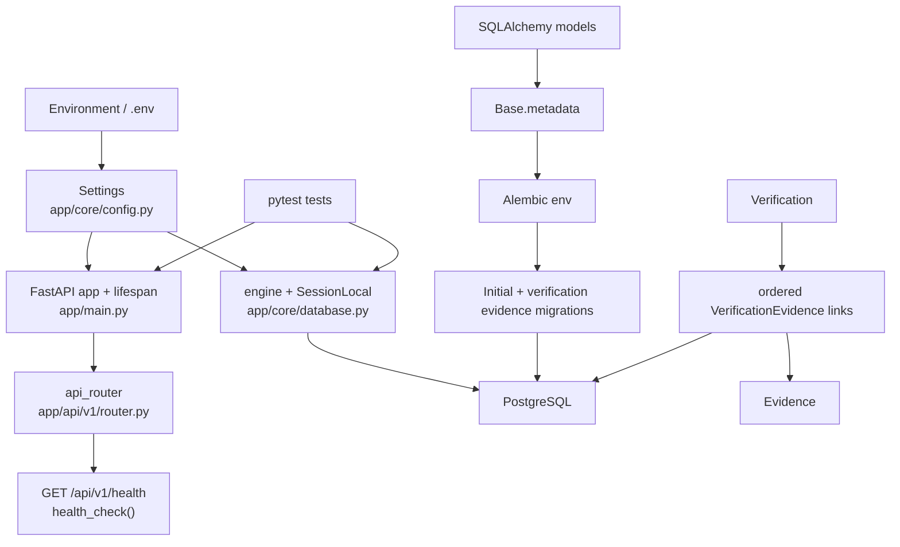
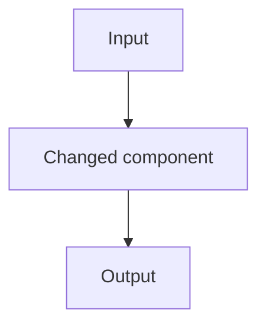

# Assam Exam AI — Workflow and Component Register

## Purpose

This file is a chronological register of committed components and their current responsibilities. Planned work is kept separate from the implemented register. The repository was inspected on 2026-09-02; tests were not run during this documentation-only task.

## Current runtime and database flow



## Chronological commit register

| Commit | Date | Confirmed responsibility |
| --- | --- | --- |
| `80ffc262d81f85daf4f9a0fb34ab6aaf9e6bb648` | 2026-08-29 | Initial repository commit |
| `d61f88d018739f4b7f772aafe488c2e4ae3f91d7` | 2026-08-30 | FastAPI application foundation commit |
| `e31f71e3c2545ef9cf8fb552aba1a3eff858f994` | 2026-08-30 | FastAPI application foundation commit |
| `3c46b45580c2ddb259ef6801fd836f7d237b828d` | 2026-08-31 | PostgreSQL, SQLAlchemy models, and Alembic migration foundation |
| `bae213e1de35ee08d3788d7b9f42e9d0d36d503f` | 2026-09-01 | Repository operating instructions in `AGENTS.md` |
| Pending | 2026-09-02 | T-002 adds ordered verification-evidence provenance; no commit created |

The register reports current responsibility based on the inspected tree. It does not claim historical test results or reconstruct uninspected function-level diffs.

## Routes

| Route | Callable | File | Responsibility |
| --- | --- | --- | --- |
| `GET /api/v1/health` | `health_check()` | `app/api/v1/routes/health.py` | Returns `{"status": "ok"}` without checking the database |

## Callable functions

| Callable | File | Responsibility |
| --- | --- | --- |
| `lifespan()` | `app/main.py` | Logs application startup and shutdown around the FastAPI lifespan |
| `setup_logging()` | `app/core/logging.py` | Configures an INFO-level stdout handler once |
| `get_db()` | `app/core/database.py` | Yields a SQLAlchemy session and closes it afterward |
| `health_check()` | `app/api/v1/routes/health.py` | Implements the health route response |
| `run_migrations_offline()` | `migrations/env.py` | Configures and runs Alembic without a live connection |
| `run_migrations_online()` | `migrations/env.py` | Connects to the configured database and runs Alembic migrations |
| `upgrade()` | `migrations/versions/774778a8bb78_create_knowledge_foundation.py` | Creates the initial knowledge tables and foreign keys |
| `downgrade()` | `migrations/versions/774778a8bb78_create_knowledge_foundation.py` | Drops the initial knowledge tables in dependency-safe order |

## Models and persistent structures

| Model or structure | File | Responsibility |
| --- | --- | --- |
| `Base` | `app/models/base.py` | Declarative metadata root for SQLAlchemy models |
| `Source` | `app/models/source.py` | Stores basic source identity, authority, location, license status, hash, and creation time |
| `Evidence` | `app/models/evidence.py` | Stores text and an optional location reference belonging to a source |
| `Claim` | `app/models/claim.py` | Stores an atomic statement, optional triple fields, current status/confidence, and timestamps |
| `Verification` | `app/models/verification.py` | Stores one verdict, confidence, reasoning, and timestamp for a claim |
| `VerificationEvidence` | `app/models/verification_evidence.py` | Records evidence used by a verification, its role, and its non-negative ordered position; referenced evidence is deletion-restricted |
| `claim_evidence` | `app/models/claim_evidence.py` | Associates claims and evidence with a composite primary key |

## Migration functions

| Function | File | Responsibility |
| --- | --- | --- |
| `run_migrations_offline()` | `migrations/env.py` | Runs the configured migration context in offline mode |
| `run_migrations_online()` | `migrations/env.py` | Runs the configured migration context through a database connection |
| `upgrade()` | `migrations/versions/774778a8bb78_create_knowledge_foundation.py` | Creates `claims`, `sources`, `evidence`, `verifications`, and `claim_evidence` |
| `downgrade()` | `migrations/versions/774778a8bb78_create_knowledge_foundation.py` | Removes those five tables |
| `upgrade()` | `migrations/versions/92b13f7c4e61_add_verification_evidence.py` | Creates `verification_evidence` with role, position, ordering constraints, restricted Evidence deletion, and cascading association cleanup for Verification deletion |
| `downgrade()` | `migrations/versions/92b13f7c4e61_add_verification_evidence.py` | Removes `verification_evidence` |

## Tests

| Test | File | Responsibility | Current result |
| --- | --- | --- | --- |
| `test_settings()` | `tests/test_config.py` | Checks baseline application setting values | Passed in full suite for T-002 |
| `test_database_connection()` | `tests/test_database.py` | Executes `SELECT 1` through the configured engine | Passed in full suite for T-002 |
| `test_health_check()` | `tests/test_health.py` | Checks health status code and JSON body | Passed in full suite for T-002 |
| `test_logging_setup()` | `tests/test_logging.py` | Checks an INFO log message is captured | Passed in full suite for T-002 |
| `test_verification_retains_ordered_evidence()` | `tests/test_verification_evidence.py` | Proves ORM traversal retains database-defined evidence order and roles | Passed for T-002 |
| `test_verification_evidence_rejects_invalid_values()` | `tests/test_verification_evidence.py` | Proves PostgreSQL rejects an invalid role and a negative position | Passed twice through parametrization for T-002 |
| `test_used_evidence_cannot_be_deleted()` | `tests/test_verification_evidence.py` | Proves PostgreSQL blocks deletion of referenced evidence and retains its audit link | Passed for T-002 |
| `test_verification_evidence_rejects_duplicate_position()` | `tests/test_verification_evidence.py` | Proves one verification cannot assign the same position to two evidence links | Passed for T-002 |

### T-002 verification results

- `uv run pytest tests/test_verification_evidence.py -q`: 5 passed in 0.61s on the final review run.
- `uv run pytest -q`: 9 passed in 0.87s with one Starlette deprecation warning from the installed FastAPI test client.
- Migration check on `assam_exam_ai_t002_test`: upgrade to head, downgrade to `774778a8bb78`, re-upgrade to head, and `alembic check` all exited 0; no new upgrade operations were detected.
- Changed-file Ruff check: passed.
- `uv run ruff check .`: failed with 12 pre-existing findings outside the T-002 changes.

## Template for future pushed changes

Copy and append this section after inspecting the pushed commit and its reported checks.

````markdown
### W-XXX — Short change title

| Field | Value |
| --- | --- |
| Task ID | `T-XXX` |
| Implementation commit | `<full SHA>` |
| Date | `<UTC date>` |
| Components changed | `<paths and concise description>` |
| Test result | Passed / Failed / Not run — `<exact command and result or blocker>` |
| Documentation review | Pending / Approved / Changes requested |

#### Changed flow



#### Component changes

| Component | File | Change | Responsibility | Tests |
| --- | --- | --- | --- | --- |
| `name()` | `path/to/file.py` | Added / changed / removed | Short responsibility | `test_name()` or Not applicable |
````
